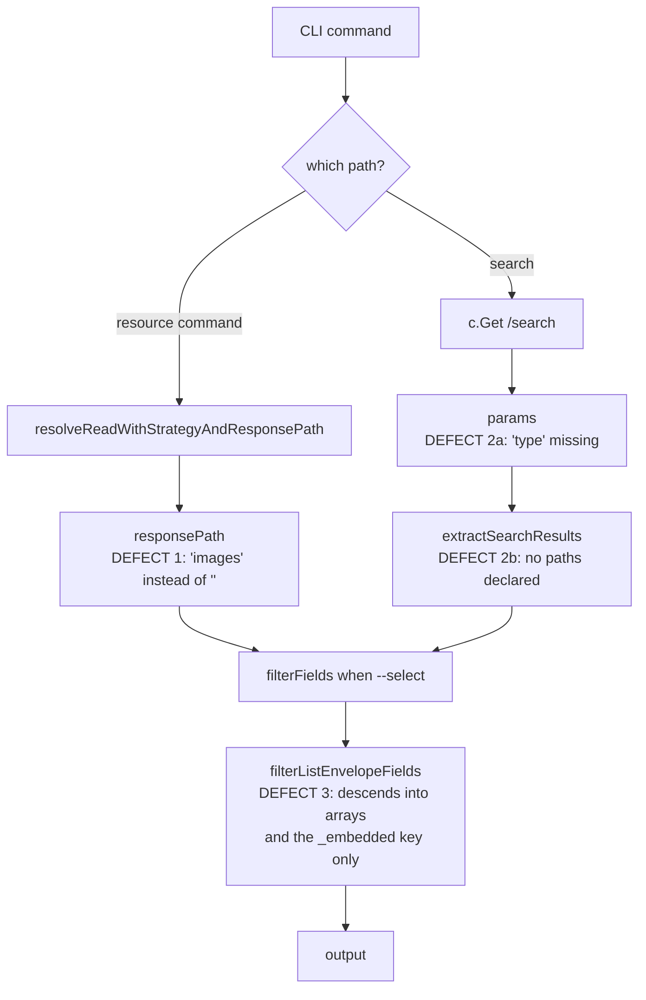

# fix(spotify): correct single-object response extraction, live search type param, and nested `--select` descent

**Target CLI:** `library/media-and-entertainment/spotify/`. Source and patch paths below are relative to that directory; paths beginning with `library/` or `.github/` are relative to the repository root.

---

## Product Contract

### Summary

Repair three defects in the published `spotify-pp-cli` 2026.7.1 that make four single-object commands return cover art instead of the requested resource, break `search` entirely against the live API, and silently empty `--select` on nested responses. Fixes land as library-side patches on the published CLI, are recorded under `.printing-press-patches/`, and end with the locally installed binary rebuilt from the corrected source.

### Problem Frame

All three defects were reproduced against the installed 2026.7.1 binary — the current published release — not against a stale checkout. None is tracked in an upstream issue for this CLI.

**Defect 1 — single-object endpoints extract a decorative nested array.** The generator selects a `responsePath` per command by finding an array in the response schema. For collection endpoints (`/albums` → `albums`) that is correct. For four endpoints returning a single object, the only array in the schema is the artwork list, so the command emits that instead of the resource. Confirmed live on the user profile and playlist-fetch commands; the remaining two share identical code shape (the category endpoint returns HTTP 403 for the current credentials and could not be exercised).

| Command | Endpoint | Extracts | Should extract |
|---|---|---|---|
| `me get-current-users-profile` | `/me` | `images` | whole object |
| `playlists get` | `/playlists/{playlist_id}` | `images` | whole object |
| `users <user_id>` | `/users/{user_id}` | `images` | whole object |
| `browse get-a-category` | `/browse/categories/{category_id}` | `icons` | whole object |

**Defect 2 — live `search` never sends the required `type` parameter.** The live call passes only `q`. Spotify rejects it with `HTTP 400 Missing parameter type`. Because the default data source is `auto` (live first, local only on *network* failure), an HTTP 400 is not a fallback case — so the bare `search` command fails outright and never reaches local FTS. Only `--data-source local` works today. A latent second defect sits behind it: `searchResponsePaths` is an empty slice, so even a repaired request would fall through `extractSearchResults` to its wrap-whole-payload fallback rather than reading the per-type item arrays.

**Defect 3 — `--select` does not descend into nested objects.** `filterFieldsRec` traverses arrays element-wise and matches keys at the current level. When nothing matches, `filterListEnvelopeFields` retries by descending into *array*-valued siblings, plus one hardcoded HAL-shaped `_embedded` object key. A response shaped `{"artists":{"items":[...]}}` matches none of those paths: no top-level key matches, no sibling is an array, and the object key is not `_embedded` — so the filter returns `{}`. This is generator-shared code; the same shape is reported open upstream for a different CLI (`mvanhorn/printing-press-library#493`, slack-pp-cli).

### Requirements

- **R1** — The four single-object commands return the requested resource, not its artwork array.
- **R2** — `spotify-pp-cli search "<query>"` succeeds against the live API with no flags, searching every Spotify catalog type in one request.
- **R3** — `--type` narrows the live search to a single Spotify catalog type; local-only resource types continue to work as a local-FTS filter and do not produce an invalid live request.
- **R4** — Live search results are read from the per-type item arrays rather than falling through to the whole-payload fallback.
- **R5** — `--select` returns the requested fields on responses whose payload is nested one or more objects deep.
- **R6** — Each code change is recorded as a separate `.printing-press-patches/<id>.json` entry per repo convention.
- **R7** — Preflight passes: `verify_skill.py`, `go build`, `go vet`, `go test`, `govulncheck`.
- **R8** — The binary on `PATH` is rebuilt from the corrected source and the three defects are verified gone against the live API.

### Scope Boundaries

**In scope.** The four commands in the Defect 1 table; the live-search request and result extraction in `internal/cli/search.go`; the nested-descent gap in `internal/cli/helpers.go`; patch records; local rebuild and install.

**Out of scope.**

- Repairing the same generator-shared `--select` gap in the other CLIs under `library/` — it is a template bug with many manifestations, and a library-wide sweep is a different piece of work.
- Fixing the generator itself in `mvanhorn/cli-printing-press`.
- `me get-queue`'s `queue` response path. `/me/player/queue` returns `{currently_playing, queue:[...]}`, so extracting `queue` drops one field but is a defensible reading of the endpoint's intent — unlike the artwork cases, it is not obviously wrong.
- Any change to `registry.json`, `cli-skills/`, `CHANGELOG.md`, `.printing-press-release.json`, or the `version` stamp — all automation-owned.

**Deferred to follow-up work.**

- Opening a PR upstream. The user has no fork of `mvanhorn/printing-press-library`; the local clone's `origin` pointed at a non-existent repo and was removed during setup. Until a PR lands, these patches must be reapplied after every upstream release that touches this CLI.
- Filing an upstream issue against the generator for Defects 1 and 3, both of which are codegen-shaped rather than Spotify-specific.

---

## Planning Contract

### Key Technical Decisions

**KTD1 — Defect 1 is fixed by emptying the response path, not by special-casing the commands.** Eighteen commands in this CLI already pass `""` to `resolveReadWithStrategyAndResponsePath`, which is the established no-extraction signal. The four broken commands become consistent with them. This is a four-token change with no new code paths.

**KTD2 — `search` with no `--type` queries all seven Spotify catalog types in one request** (`album,artist,playlist,track,show,episode,audiobook`). *(session-settled: user-directed — chosen over defaulting to `track,artist`: a narrowed default fails silently, returning nothing for a podcast or playlist query with no visible reason, and the only recovery is remembering a flag. Also chosen over requiring `--type`, which preserves today's friction.)*

A combined request is only as available as its least-available member: Spotify's `audiobook` type is market-restricted, and the plan has not verified how the API responds when a requested type is unavailable for the account's market. **The default therefore degrades rather than fails** — a type the API rejects is dropped, the remaining types still return their results, and the exclusion is named on stderr so the omission is visible rather than silent. This keeps the all-types default from being strictly worse than the narrowed one it replaced in exactly the market where it would matter most. Confirming the API's actual rejection shape is implementation-time work; the degradation contract is settled here regardless of which shape it turns out to be.

**KTD3 — `--type` is mapped, not forwarded verbatim.** The existing flag filters *local store* resource types (`albums`, `audiobooks`, `chapters`, `episodes`, `me`, `shows`) which do not match Spotify's singular search types. The flag accepts both spellings for the live path and maps to the API's vocabulary; types with no live equivalent (`me`, `chapters`) are treated as local-only and skip the live request rather than producing a guaranteed-400 call. This mirrors the established `liveType` + `isLocalOnlySearchType` pattern in `library/sales-and-crm/gorgias/internal/cli/search.go`.

**KTD4 — Defect 3 is fixed by generalizing the existing nested-descent branch, not by adding a parallel mechanism.** `filterListEnvelopeFields` already descends into a nested object for the hardcoded `_embedded` key via `filterNestedListEnvelopeFields`. The fix drops the key-name condition so any object-valued sibling is a descent candidate, keeping the existing `foundArray` guard so flat objects with no match still return `{}` as before. Recursion is bounded to prevent a pathological deep payload from walking indefinitely.

**KTD5 — Fixes land on a working branch, not directly on `main`.** `main` now tracks `upstream/main` exactly; keeping it clean preserves a trivial fast-forward on the next upstream release and makes the local delta inspectable as a diff.

### Assumptions

- The category endpoint (`browse get-a-category`) returns HTTP 403 for the current credentials, so R1 cannot be verified live for that command. Its correctness rests on code-shape identity with the three verifiable commands plus unit-level coverage.
- `govulncheck` is available locally; if it is not, R7 is satisfied by the remaining four gates and the gap is stated rather than silently dropped.

---

## High-Level Technical Design

Where each defect sits in the request path:

Defect 3 sits downstream of both other paths, which is why a `--select` on the profile command looked like two failures: the wrong payload arrived, *and* the filter could not descend into it.

---

## Implementation Units

### U1. Empty the response path on the four single-object commands

**Goal:** The four commands in the Defect 1 table return the requested resource object.

**Requirements:** R1, R6

**Dependencies:** none

**Files:**
- `internal/cli/me_get-current-users-profile.go`
- `internal/cli/playlists_get.go`
- `internal/cli/promoted_users.go`
- `internal/cli/browse_get-a-category.go`
- `internal/cli/root_test.go` (test)
- `.printing-press-patches/spotify-single-object-endpoints-take-empty-response-path.json`

**Approach:** Change the `responsePath` argument passed to `resolveReadWithStrategyAndResponsePath` from `"images"` / `"icons"` to `""` in each of the four commands. No other call-site change; the empty-path branch is already exercised by eighteen sibling commands.

**Patterns to follow:** any command already passing `""` — e.g. `internal/cli/me_get-users-saved-tracks.go`. For asserting on what a command sends and receives, extend the existing `httptest`-based harness in `internal/cli/transcendence_test.go` rather than introducing a second approach.

**Test scenarios:**
- A `/me`-shaped payload (`{"display_name":…,"id":…,"country":…,"images":[…]}`) passed through the command's extraction returns the whole object with `display_name` and `id` present, not the `images` array.
- A playlist-shaped payload with both an `images` array and a nested `tracks` object returns the playlist object, with `id` and `name` intact.
- A payload whose only array is `images` and which has no other keys still returns the object, not the array — guards against a future "unwrap when it's the only array" regression.
- Collection commands that legitimately pass a non-empty response path (e.g. `/albums` → `albums`) are unchanged — assert one still extracts its array.

**Verification:** `me get-current-users-profile --agent --select display_name,id,country,product` returns those four fields populated. `playlists get <id> --agent` returns a playlist object carrying `name` and `owner`.

---

### U2. Send the required `type` parameter on live search and read the per-type item arrays

**Goal:** `search` works against the live API with no flags and narrows correctly with `--type`.

**Requirements:** R2, R3, R4, R6

**Dependencies:** none

**Files:**
- `internal/cli/search.go`
- `internal/cli/search_test.go` (new)
- `.printing-press-patches/spotify-live-search-requires-explicit-type-param.json`

**Approach:** Add a live-type resolution step before the request: empty `--type` yields the full comma-separated type list; a supplied `--type` maps local plural spellings to Spotify's singular vocabulary; a local-only type skips the live request and goes straight to local FTS. Follow the `liveType` / `isLocalOnlySearchType` shape from the gorgias CLI rather than inventing a new one.

Result extraction must **aggregate across every populated per-type path** (`artists.items`, `tracks.items`, `albums.items`, `playlists.items`, `shows.items`, `episodes.items`, `audiobooks.items`), not merely declare them. Declaring the paths is not sufficient: `extractSearchResults` returns on the first path that unmarshals, so an all-types response — where every type key is present — would yield only the first listed type and silently drop the other six, including when that first path is an empty array. Either aggregate inside the command before handing results onward, or extend the extraction helper to concatenate across all matching paths rather than returning on first match. The chosen shape is the implementer's call; the aggregate-not-first-match behavior is not.

If the API rejects an individual type for the account's market, the search degrades rather than fails: drop the rejected type, return results for the rest, and name the exclusion on stderr (see KTD2).

Update the command's `Long` text and examples to match the new default. Neither `SKILL.md` nor `README.md` documents this command's default (they cover `spotify-web-search` instead), so no doc sync is required — but re-run `verify_skill.py` anyway, since it scans every flag token in the document.

**Execution note:** Write the multi-type aggregation test before the code. The first-match-wins behavior of the existing helper is the trap this unit exists to avoid, and a test written afterwards tends to be shaped around whatever the code already does.

**Patterns to follow:** `library/sales-and-crm/gorgias/internal/cli/search.go` (live type default and local-only guard); `library/marketing/sensortower/internal/cli/search.go` (dotted `searchResponsePaths`); `internal/cli/transcendence_test.go` (existing `httptest`-based harness for asserting on outgoing requests — extend it rather than introducing a second approach).

**Test scenarios:**
- No `--type`: the outgoing request carries all seven types and `q` equals the query.
- `--type artist`: the request carries exactly `artist`.
- `--type albums` (local plural): maps to `album` on the live request.
- `--type me` and `--type chapters`: no live request is made; the command searches locally.
- `--type bogus`: fails with a message naming the valid types, exit code 2 — not a passthrough that earns an opaque HTTP 400.
- An all-types response containing populated `artists.items` **and** `tracks.items` yields results from both, not only the first path that unmarshals.
- An all-types response where the first declared path is an empty array and a later path is populated still yields the later path's results — the empty array must not terminate extraction.
- A response where every type array is empty yields an empty result set and exit 0, not the whole-payload fallback object.
- A response rejecting one type while returning results for the others yields those results, exit 0, and a stderr line naming the excluded type — not a failed command.
- `--data-source local` still bypasses the live path entirely (regression guard on today's only working mode).

**Verification:** `search "radiohead" --agent` returns catalog results across types with `meta.source` reporting `live`. `search "radiohead" --type artist --agent` returns artists only. `search "radiohead" --data-source local --agent` still answers from the local store.

---

### U3. Let `--select` descend into nested objects

**Goal:** `--select` returns requested fields on payloads nested one or more objects deep.

**Requirements:** R5, R6

**Dependencies:** none

**Files:**
- `internal/cli/helpers.go`
- `internal/cli/root_test.go` (extend `TestFilterFields`)
- `.printing-press-patches/spotify-select-descends-nested-object-envelopes.json`

**Approach:** In `filterListEnvelopeFields`, generalize the `_embedded` special case: attempt `filterNestedListEnvelopeFields` on any object-valued sibling, not just that one key name. Preserve the existing `foundArray` contract so a flat object with no matching key still yields `{}` — the descent only reports success when it actually found an array below. Add a depth bound so a deeply or cyclically nested payload cannot walk without limit.

**Execution note:** This is shared generator code with sibling behaviors (`envelopeMetadataArrayKeys` passthrough, the JSON-null rejection, the flat-object empty result) that existing tests pin. Run `go test ./internal/cli` before touching it to confirm the green baseline, so any breakage is attributable.

**Patterns to follow:** the existing `_embedded` branch and `filterNestedListEnvelopeFields` in the same file.

**Test scenarios:**
- `{"artists":{"items":[{"id":"a","name":"x","popularity":9}]}}` with `--select id,name` returns the two fields on the nested items.
- Two nested type objects both populated (`artists.items` and `tracks.items`) each get filtered, and neither is dropped.
- Existing pinned behaviors still hold: bare array element-wise, direct top-level object match, single-array envelope, `_embedded` HAL shape, envelope metadata passthrough, JSON `null` not coerced to `[]`.
- A flat object with no matching key and no array anywhere still returns `{}` (the pre-existing contract, not a regression to "return everything").
- A nested object containing no array at any depth returns `{}` rather than the unfiltered payload.
- A pathologically deep payload terminates at the depth bound instead of recursing indefinitely.

**Verification:** `spotify-web-search --q "Radiohead" --type artist --agent --select name,id` returns populated `name` and `id`. `me get-current-users-profile --agent --select display_name,id` also returns populated fields once U1 has landed.

---

### U4. Preflight, rebuild, and install the corrected binary

**Goal:** The binary on `PATH` is built from the corrected source and the three defects are verified gone against the live API.

**Requirements:** R7, R8

**Dependencies:** U1, U2, U3

**Files:** none modified — this unit runs gates and produces the installed artifact.

**Approach:** Run the repo's documented preflight from the CLI root: `verify_skill.py --dir library/media-and-entertainment/spotify/`, then `go build ./...`, `go vet ./...`, `go test ./...`, `govulncheck ./...`. Build the binary and replace the one currently on `PATH` at `~/.local/bin/spotify-pp-cli`, keeping the previous binary aside until the live checks pass so a revert is one move. Confirm `--version` still reports the automation-owned stamp — this work must not change it.

**Execution note:** Verification here is live-API behavior, not unit coverage. Re-run the exact commands that reproduced each defect earlier and compare against the recorded broken output.

**Test scenarios:** `Test expectation: none -- this unit runs existing gates and produces a build artifact; behavioral coverage lives in U1-U3.`

**Verification:**
- All five preflight gates pass, or any that cannot run is named explicitly rather than skipped silently.
- `doctor` still reports auth configured and API reachable.
- The three original reproductions now behave: profile returns profile fields; bare `search` returns live results; `--select` on a nested response returns populated fields.
- `--version` unchanged from 2026.7.1.

---

## Verification Contract

| Gate | Command | Expectation |
|---|---|---|
| Skill/doc consistency | `python3 .github/scripts/verify-skill/verify_skill.py --dir library/media-and-entertainment/spotify/` | pass |
| Build | `go build ./...` | pass |
| Vet | `go vet ./...` | pass |
| Tests | `go test ./...` | pass, including new U1-U3 scenarios |
| Vulnerabilities | `govulncheck ./...` | pass, or unavailability stated |
| Live: defect 1 | `me get-current-users-profile --agent --select display_name,id,country,product` | four fields populated |
| Live: defect 2 | `search "radiohead" --agent` | live results across types, exit 0 |
| Live: defect 3 | `spotify-web-search --q "Radiohead" --type artist --agent --select name,id` | `name` and `id` populated |

Baseline before any change: build, vet, and `go test ./internal/cli` all pass. Any failure in those three after the change is attributable to this work.

---

## Definition of Done

- The four single-object commands return their resource, not artwork.
- Bare `search` works live across all seven catalog types; `--type` narrows correctly; local-only types do not produce invalid live requests.
- `--select` returns fields on nested payloads, with every previously pinned filter behavior intact.
- Three patch records exist under `.printing-press-patches/`, one per defect, each written as a reprint-guard rather than a changelog.
- All five preflight gates pass or are explicitly reported as unavailable.
- `~/.local/bin/spotify-pp-cli` is rebuilt from the corrected source and the three live reproductions pass.
- No change to `registry.json`, `cli-skills/`, `CHANGELOG.md`, `.printing-press-release.json`, or the `version` stamp.

---

## Risks & Dependencies

| Risk | Mitigation |
|---|---|
| U3 touches generator-shared code with several pinned sibling behaviors; a careless generalization silently changes `--select` for every command. | Green baseline recorded before the edit; the full existing `TestFilterFields` case list re-run after; the `foundArray` contract preserved explicitly rather than incidentally. |
| These patches are local-only. An upstream release touching this CLI reverts them on the next fast-forward. | Fixes live on a working branch, so the delta is inspectable and reappliable. Filing upstream is recorded as deferred follow-up, not forgotten. |
| `browse get-a-category` cannot be verified live (HTTP 403 with current credentials). | Correctness rests on code-shape identity with three verified commands plus unit coverage; the gap is stated rather than papered over. |
| Changing the `search` default is a user-facing contract change on an already-published CLI. | The current default is non-functional against the live API, so no working behavior is being replaced. Help text and examples updated in the same unit to keep docs and behavior in sync. |

---

## Sources & Research

- Defects reproduced against the installed 2026.7.1 binary — the current published release — on 2026-07-24.
- `library/sales-and-crm/gorgias/internal/cli/search.go` — live-type default and local-only guard pattern.
- `library/marketing/sensortower/internal/cli/search.go`, `library/health/peloton/internal/cli/search.go` — populated `searchResponsePaths` shape.
- `library/payments/kalshi/.printing-press-patches/` — patch-record shape, including a deferred-to-upstream entry for a structurally similar multi-array envelope defect.
- `mvanhorn/printing-press-library#493` — open upstream issue reporting the same envelope-unwrap shape as Defect 3 in a different CLI.
- Repo conventions: published-library `AGENTS.md` (patch records, generated-artifact rules, preflight gates) and the Spotify CLI's own `AGENTS.md` (release-ledger ownership).
