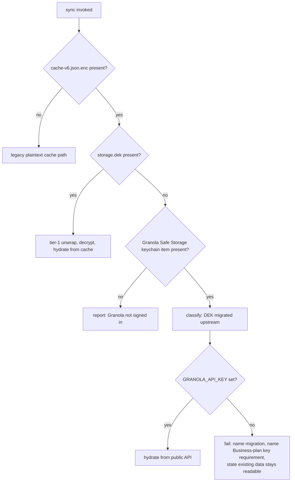
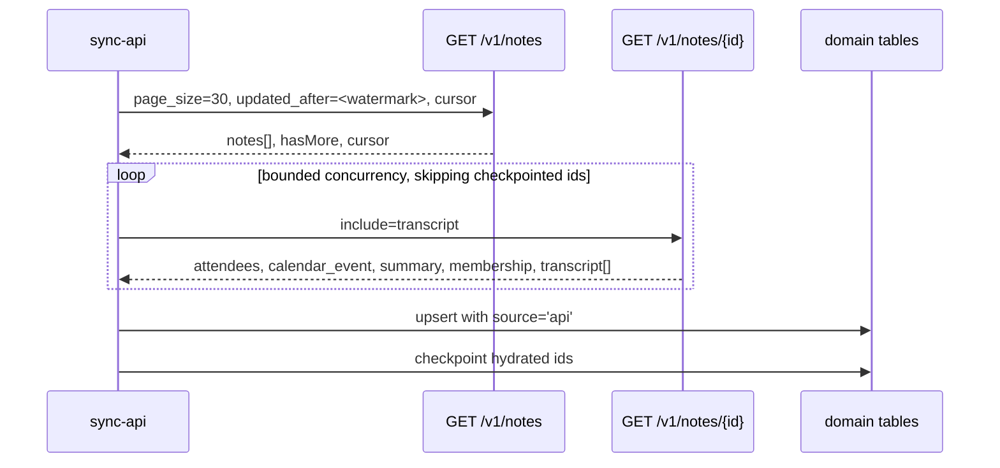
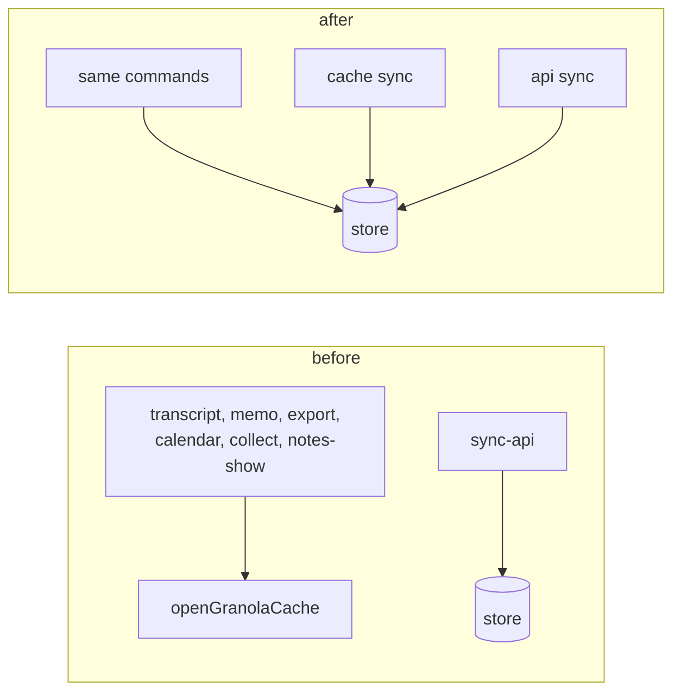

# Granola CLI Dual-Path Data Access - Plan

## Goal Capsule

- **Objective:** Restore working data access to `granola-pp-cli` on current Granola desktop by making the public API a full-capability data source, and make the local-cache path fail honestly where it can no longer work.
- **Authority hierarchy:** This plan > `library/productivity/granola/AGENTS.md` > repo root `AGENTS.md`. Where the repo's published-CLI conventions (patch ledger, contributor accrual, generated-artifact rules) conflict with convenience, the conventions win.
- **Execution profile:** Two PRs against `mvanhorn/printing-press-library`, branched from a freshly fetched `origin/main`. This is a published-CLI repair, not a reprint: do not re-run the Printing Press, do not touch `registry.json` or `cli-skills/pp-granola/SKILL.md`. The working checkout may trail `origin/main` by well over a thousand commits, so fetch before branching or the patch ledger lands in the legacy single-file shape and the build targets the wrong Go version.
- **Stop conditions:** Stop and surface if `include=transcript` returns empty across all sampled notes, or if restoring local-cache decryption appears feasible after all (that would invalidate KTD1 and change the plan's shape).
- **Tail ownership:** `ce-work` owns build, test, and commit. PR opening and the Greptile resolution loop are in scope; merging is not.

---

## Product Contract

### Summary

Make `granola-pp-cli` work on a current Granola install by hydrating the local store from Granola's public REST API, rerouting the read commands to that store, and telling users honestly what each path can and cannot reach. Keep the desktop-cache path for installs where it still functions.

### Problem Frame

Every cache-backed command in `granola-pp-cli` has been dead since a Granola desktop auto-update between 2026-06-22 and 2026-07-25. The local store holds 867 meetings ending 2026-06-22 and has not advanced since, while `sync` runs and fails on every invocation.

The cause is a Granola-side key migration. `granola-pp-cli` implements a two-tier scheme documented in `library/productivity/granola/internal/granola/safestorage/testdata/scheme.md`: a 32-byte DEK stored in `storage.dek`, unwrapped via the `Granola Safe Storage` Keychain item, then AES-256-GCM over `cache-v6.json.enc`. Granola 7.447.1 keeps tier 2 unchanged but has moved tier 1. Its bundled `keychain.node` native module now owns the DEK, and on first launch after the update the app imports the old DEK into that module and unlinks `storage.dek`.

The new key location is unreachable by design. `keychain.node` links `kSecUseDataProtectionKeychain` and `kSecAttrAccessGroup`, and carries the strings `com.granola.app.dek` and `QZ7DHHLN25.granola`. `Granola.app` is signed with `TeamIdentifier=QZ7DHHLN25` and a `keychain-access-groups` entitlement. The DEK therefore lives in the data-protection keychain inside an access group bound to Granola's Apple Team ID. Legacy Keychain APIs cannot see it, and joining the access group requires a provisioning profile only Granola can issue.

Two consequences follow. First, `supabase.json.enc` is behind the same key, so the internal-API token path is also gone; the only plaintext credential left on disk (`stored-accounts.json`) froze on 2026-05-19. Second, the new `granola.db` store is encrypted with the same DEK, so it offers no alternate route.

The public API is the remaining path, and it is far more capable than the CLI currently assumes. `sync-api` describes itself as covering "~3 endpoints" and syncs only list-level rows. Live verification against a paid-plan key shows `GET /v1/notes/{note_id}` returns `summary_markdown`, `attendees`, `calendar_event` with invitees, folder and space membership, and, with `?include=transcript`, full speaker-tagged transcript segments.

Hydration alone is not enough. Most read commands bypass the local store entirely and call `openGranolaCache()` directly, so API-sourced data would be invisible to them until those read paths are rerouted.

### Requirements

**Diagnosis and honest failure**

- R1. `safestorage` distinguishes the DEK-migrated scheme from a missing or pre-encryption Granola install, and reports it as an upstream scheme change rather than "Granola not installed".
- R2. The migrated-scheme error names the required path without sending users somewhere they cannot go: it states that an API key requires a Business or Enterprise Granola workspace, states that previously synced data remains readable, and names the last successful sync date. It does not instruct the user to re-run `sync` or click a Keychain prompt.
- R3. `doctor` reports encrypted-store health by probing current on-disk and Keychain state, not by echoing the last recorded sync outcome, and does so without triggering a Keychain authorization prompt.
- R4. `doctor` reports which data source each capability group can currently be served from, and how many notes the configured API key can reach.

**Public API parity**

- R5. `sync-api` hydrates per-note detail into the Granola domain tables, so meetings, attendees, calendar events, summaries, and folder and space membership land where the read commands look.
- R6. Transcript segments are fetched via `include=transcript` and stored in `transcript_segments` with the same shape cache-sourced segments use.
- R16. Read commands that currently open the Granola cache directly read from the local store, so API-hydrated data is reachable through the normal command surface.
- R7. API sync is incremental at the detail stage, checkpointing which notes in a page have been hydrated so an interrupted run does not re-fetch them.
- R8. API sync is rate-aware: it honors the API's 30-item page ceiling, bounds detail-fetch concurrency, and backs off on 429.
- R18. API-sourced rows survive a subsequent cache sync, and cache-sourced rows survive a subsequent API sync.

**Source selection and provenance**

- R10. `sync` selects a data source automatically: desktop cache when readable, public API when the cache is unreadable and a key is configured.
- R11. Every sync reports which source served it and why the other was not used.
- R12. Commands whose data has no public-API equivalent remain visible in help and fail with a named reason. On a migrated install that reason states the desktop cache is permanently unreachable upstream and that no user action restores it.

**Credential and agent safety**

- R17. Refresh is refused for every desktop-owned token source, including the `stored-accounts.json` fallback, so a stale token is never rotated out from under Granola desktop.
- R20. Free-text fields sourced from meetings (transcript text, summaries, attendee names, calendar event titles) are emitted to agent-facing surfaces inside an explicit untrusted-third-party-content delimiter.

**Catalog conventions**

- R13. The change is recorded as a patch entry under `library/productivity/granola/.printing-press-patches/` and the contributor is accrued across manifest, README byline, and NOTICE.
- R14. `SKILL.md` and `README.md` document the two paths, the capability split, and API key setup.
- R21. The pre-install surface carries the plan-tier prerequisite: `.printing-press.json` and `tools-manifest.json` state that `GRANOLA_API_KEY` requires a Business or Enterprise workspace, replacing the current description that presents auto-discovered desktop tokens as the default.

### Acceptance Examples

- AE1. **Given** Granola 7.447.1 with no `storage.dek` and no `GRANOLA_API_KEY`, **when** the user runs `sync`, **then** it fails naming the upstream key migration, states that an API key requires a Business or Enterprise workspace, and states that previously synced meetings remain readable through the last sync date.
- AE2. **Given** the same install with a valid `GRANOLA_API_KEY`, **when** the user runs `sync`, **then** it hydrates from the public API and reports the API as the source and the cache as unreadable.
- AE3. **Given** an API-hydrated store, **when** the user runs `transcript get` for a meeting held after the cache froze, **then** the transcript is returned from the store.
- AE4. **Given** a Granola install that still writes `storage.dek`, **when** the user runs `sync`, **then** the cache path is used and behavior is unchanged from today.
- AE5. **Given** an API-only install, **when** the user runs a panels or recipes command, **then** it fails naming the desktop cache as required and stating that it is permanently unreachable on this install.
- AE6. **Given** a migrated install with no API key, **when** the user runs a read command against previously synced data, **then** it succeeds.
- AE7. **Given** a store holding both cache-sourced and API-sourced meetings, **when** either sync runs, **then** rows owned by the other source remain intact.

### Scope Boundaries

- Fetching or deriving the DEK from Granola's data-protection keychain. Entitlement-gated; no supported route exists.
- Reading `granola.db` directly. Encrypted with the same unreachable DEK.
- Process memory inspection, SIP or hardened-runtime bypass, or any other attempt to extract Granola's key material out of band.
- Linux and Windows local-cache decryption. Still deferred, unchanged by this plan. The API path carries no platform dependency and works wherever the CLI builds.

#### Deferred to Follow-Up Work

- R9, exposing the API's `folder_id` filter on `notes list`. The API supports it and the command does not, but no stated goal asks for it and it lands only for users who already have the paid path working. Deferring keeps it out of the repair, along with the matching MCP tool binding it would require.
- Granola's OAuth MCP endpoint at `mcp.granola.ai` as a third data path.
- Webhook endpoint management (`/v1/webhook-endpoints`), which the API exposes and the CLI does not wrap.
- Mirroring upstream note deletions and transcript retention deletions into the local store. The API exposes no tombstone surface, so the store accumulates copies that outlive upstream retention.
- At-rest hardening of the local store, which is currently created world-readable. Pre-existing, but this plan increases what lands there.
- Upstream generator work in `cli-printing-press`. This defect is granola-specific, not a multi-CLI template bug.

### Sources

- Granola 7.447.1 `app.asar`, DEK acquisition path: migration-then-unlink into `keychain.node`, with tier-2 AES-256-GCM (12-byte nonce, 16-byte tag) unchanged.
- `keychain.node` symbol and string analysis: `kSecUseDataProtectionKeychain`, `kSecAttrAccessGroup`, `com.granola.app.dek`, `QZ7DHHLN25.granola`.
- `codesign` on `Granola.app`: `TeamIdentifier=QZ7DHHLN25` with `keychain-access-groups`.
- Live API verification against a paid-plan key: `/v1/notes`, `/v1/notes/{note_id}`, `?include=transcript`, `/v1/folders`, `/v1/webhook-endpoints`.
- `https://docs.granola.ai/api-reference/` OpenAPI for `list-notes` and `get-note`.
- Existing patch records that constrain this work: `keychain-access-must-be-bounded.json` (doctor must not prompt), `d6-read-only-applies-to-all-desktop-token-sources.json` (refresh refusal must cover every desktop-owned source), `sync-document-api-hydrate.json`.
- Prior art: `docs/plans/2026-05-12-001-feat-granola-encrypted-cache-plan.md`, which established the now-superseded tier-1 scheme.
- Open issue #1556, whose stated root cause (derive the key from the `Granola Safe Storage` item) is contradicted by the evidence above.

---

## Planning Contract

### Key Technical Decisions

- KTD1. **Treat local-cache decryption as unavailable on migrated installs rather than attempting recovery.** The DEK sits in an access group gated by Granola's Team ID entitlement, and an unentitled process cannot reach a data-protection keychain item under any access group Granola can set. Confidence basis: symbol and string analysis of `keychain.node`, the decompiled migrate-then-unlink flow, `codesign` entitlements, and a legacy-API lookup of `com.granola.app.dek` returning item-not-found. Independently reproduced. One nuance bounds the word "permanent": the migration **imports** the existing DEK rather than generating a new one, so a pre-migration `storage.dek` recovered from a backup still decrypts today's `cache-v6.json.enc` when supplied through `GRANOLA_SAFESTORAGE_KEY_OVERRIDE`. Unreachable is a property of the live keychain, not of the ciphertext. This is the decision issue #1556 gets wrong: its observations are all accurate, but the DEK is `randomBytes(32)` wrapped by the Safe Storage key, not derived from it, so the Safe Storage item is a key-encrypting key for a file that no longer exists.
- KTD2. **Keep both data paths rather than replacing the cache path with the API.** (session-settled: user-directed - chosen over an API-only rewrite: installs that never migrated still work, and the cache remains the only source for panels, recipes, chat, and workspaces.)
- KTD3. **Classify the scheme from observable state, not from a Granola version string.** Presence of `cache-v6.json.enc`, absence of `storage.dek`, and presence of the `Granola Safe Storage` Keychain item together identify the migrated scheme. Version sniffing would break on every Granola release.
- KTD4. **Hydrate API detail per note rather than relying on list rows.** The list endpoint returns only id, title, owner, and timestamps. Everything the read commands need requires the detail call.
- KTD8. **Route API hydration through the Granola domain tables, not the generated generic-sync tables.** `sync.go`'s `syncResource` writes to `resources` and `notes` via `UpsertBatch`; the tables the read commands consume are created by `granola.EnsureSchema` and populated by `granola.SyncFromCache`. API hydration mirrors the cache path's store surface so downstream commands and FTS indexes see one shape.
- KTD9. **Reroute cache-direct read commands to the store rather than teaching each one to call the API.** Twenty-one files call `openGranolaCache()` directly. Rerouting them to the store makes both hydration paths serve every command through one seam, and is the only way API-sourced data becomes reachable.
- KTD7. **Reuse the existing store schema, with an explicit row-ownership column.** API-sourced and cache-sourced rows share the domain tables, so a `source` column plus source-scoped deletes prevents one path from wiping the other's rows. Without it, `SyncFromCache`'s unscoped `DELETE FROM folder_memberships` destroys API-sourced membership on every cache sync.
- KTD10. **Declare command source requirements as cobra annotations enforced in one place.** `preflight.go` is a standalone command, not a per-command hook, so there is no existing mechanism to extend. An annotation read in `root.go`'s `PersistentPreRunE` gates every command uniformly, and the gate set is derived from `openGranolaCache()` call sites rather than from a hand-maintained list.
- KTD5. **Checkpoint the detail stage only.** List-stage `updated_after` watermarking and per-page cursor persistence already exist in `syncResource`. The genuinely new work is recording which note ids in the current page have been hydrated.

### High-Level Technical Design

Source resolution at sync time:

API hydration stages:

Read-path seam (the gap this plan closes):

Capability coverage by source:

| Capability group | Desktop cache | Public API |
|---|---|---|
| Meetings, titles, timestamps | yes | yes |
| Attendees, calendar event | yes | yes |
| Transcript segments | yes | yes, via `include=transcript` |
| Note summary | TipTap notes body | `summary_markdown` |
| Folders and membership | yes | yes |
| Panels, recipes, chat, workspaces | yes | no |

The desktop-cache column requires two working legs, not one. The encrypted cache supplies transcripts, folders, recipes, and panels, while meetings themselves are hydrated from the internal `/v2/get-documents` endpoint using the WorkOS token. Either leg failing degrades the cache path, and only the DEK leg is affected by the migration.

### Assumptions

- The user's API key scope covers the notes they expect to reach. Granola splits personal-notes and public-notes scopes. R4's reachable-note count is what makes a scope mismatch visible rather than presenting as data loss.
- A public-notes-scoped key on a shared workspace may return colleagues' notes, hydrating them into a local store the MCP server exposes to agents. U7's setup docs should steer users to the narrowest scope covering their own notes.
- Transcript availability follows Granola's retention policy, so a null transcript on an older note is a normal outcome, not an error.
- The public API applies rate limiting it does not advertise in response headers. Concurrency bounds and backoff should be conservative and tunable.

### Sequencing and Delivery

Two PRs, so restored access does not wait on work that does not produce it.

**PR 1, restores access:** U9, U1, U3, U8, U5, U7. U9 and U1 and U3 have no prerequisites and can start immediately in parallel. U8 follows U3. U5 follows U1 and U3. U7 closes out.

**PR 2, hardening and diagnosis:** U2, U4, U6. U2 follows U1. U4 follows U3. U6 follows U5 and U8.

---

## Implementation Units

### U9. Refuse refresh for every desktop-owned token source

**Goal:** Stop the CLI from rotating the stale `stored-accounts.json` refresh token and signing Granola desktop out.

**Requirements:** R17

**Dependencies:** none

**Files:**
- `library/productivity/granola/internal/granola/workos.go`
- `library/productivity/granola/internal/granola/workos_test.go`

**Approach:** The D6 refusal check covers `TokenSourceEncryptedSupabase` and `TokenSourcePlaintextSupabaseDesktopFallback` but not `TokenSourceStoredAccounts`, which is documented as refresh-allowed on the premise that it is "rarely populated on modern installs". The DEK migration inverted that premise: `supabase.json.enc` is now undecryptable, so the loader falls through to `stored-accounts.json` on exactly the installs this plan targets. Refuse refresh for that source whenever `supabase.json.enc` is present on disk, which preserves refresh for genuinely legacy installs while treating the fallback as desktop-owned. The existing patch record `d6-read-only-applies-to-all-desktop-token-sources.json` already states the invariant this restores: D6 applies to every desktop-owned token source.

**Execution note:** Land this first and independently. It is a live footgun today, not a consequence of the rest of the plan.

**Test scenarios:**
- Migrated support dir (`supabase.json.enc` present, no `storage.dek`) with a populated `stored-accounts.json`: refresh returns `ErrRefreshRefused` and issues no HTTP request.
- Legacy support dir with no `supabase.json.enc` and a populated `stored-accounts.json`: refresh is still permitted, preserving current behavior.
- `GRANOLA_WORKOS_TOKEN` env override set: refresh remains permitted regardless of on-disk state.
- Encrypted and plaintext-desktop-fallback sources: refusal behavior unchanged from today.
- The refusal error names the source and tells the user to open Granola desktop, matching the existing `ErrRefreshRefused` phrasing contract.

**Verification:** On a migrated install, no command path can issue a refresh against the stale token, and Granola desktop stays signed in across a full command sweep.

### U1. Classify the migrated DEK scheme in safestorage

**Goal:** Replace the "storage.dek not found (Granola not installed or pre-encryption version)" failure with an accurate classification of upstream key migration.

**Requirements:** R1, R2

**Dependencies:** none

**Files:**
- `library/productivity/granola/internal/granola/safestorage/safestorage.go`
- `library/productivity/granola/internal/granola/safestorage/safestorage_darwin.go`
- `library/productivity/granola/internal/granola/safestorage/safestorage_other.go`
- `library/productivity/granola/internal/granola/safestorage/safestorage_test.go`
- `library/productivity/granola/internal/granola/safestorage/testdata/scheme.md`
- `library/productivity/granola/internal/granola/cache.go`
- `library/productivity/granola/internal/granola/cache_test.go`

**Approach:** Add a scheme-classification result distinct from the existing `ErrKeyUnavailable` and `ErrDecryptFailed` sentinels, following KTD3's state signature. Keep the `GRANOLA_SAFESTORAGE_KEY_OVERRIDE` path ahead of classification. Add a matching stub to the non-darwin build so shared code referencing the new sentinel still compiles. Update `scheme.md` to record the tier-1 change and note that tier 2 is unchanged.

Classify the failed-migration state too. Granola unlinks `storage.dek` only after a successful import and wraps that decrypt in a five-attempt retry, so a failed migration leaves the file behind while the app has already rotated to its keychain DEK. The state signature alone reads that install as unmigrated, sends it down the cache path, and returns the generic decrypt-failure error this unit exists to replace. Treat a `storage.dek` that unwraps cleanly but whose DEK fails AES-256-GCM authentication against `cache-v6.json.enc` as the migrated scheme with a stale key file, not as a malformed envelope.

The misleading remediation text R2 targets is not only in `safestorage`. `LoadCache` in `cache.go` wraps `ErrKeyUnavailable` with its own "sign into Granola desktop or run `granola-pp-cli sync` to authorize Keychain access" message, which is unreachable advice on a migrated install, so that wrapper must branch on the new classification. Existing assertions in `cache_test.go` match on error substrings and need updating alongside. The replacement text carries what R2 requires: the Business-or-Enterprise plan requirement, the fact that previously synced data still reads, the last successful sync date, and `GRANOLA_SAFESTORAGE_KEY_OVERRIDE` as the local remedy for anyone holding a pre-migration `storage.dek` from a backup (see KTD1 on why that still works).

**Test scenarios:**
- Covers AE1. Migrated state (`.enc` present, no `storage.dek`, Keychain item resolvable): returns the migrated-scheme error; the message names the Business-plan requirement, says previously synced data remains readable, and names neither "not installed" nor "pre-encryption".
- `storage.dek` present and valid: unchanged two-tier unwrap returns a 32-byte DEK.
- Support dir absent: returns the not-installed error, distinct from migrated-scheme.
- `.enc` present but Keychain item not found: returns not-signed-in, distinct from migrated-scheme.
- `GRANOLA_SAFESTORAGE_KEY_OVERRIDE` valid while `storage.dek` is absent: override wins, no classification error.
- Override of wrong length: decode error naming the expected length.
- `storage.dek` present but body not a multiple of the AES block size: existing malformed-envelope error, not migrated-scheme.
- Failed-migration state: `storage.dek` present and unwrapping cleanly, but its DEK fails GCM authentication against `cache-v6.json.enc`: classified as migrated-with-stale-key-file, not as a generic decrypt failure.
- `LoadCache` on a migrated install surfaces the migrated-scheme guidance, not the run-sync-to-authorize text.

**Verification:** A migrated machine gets an error naming the migration, the plan requirement, and what still works. A `storage.dek` machine behaves as before.

### U3. Hydrate per-note detail into the Granola domain tables

**Goal:** `sync-api` writes meetings, attendees, calendar events, summaries, folder and space membership, and transcript segments into the tables the read commands consume.

**Requirements:** R5, R6, R18

**Dependencies:** none

**Files:**
- `library/productivity/granola/internal/cli/sync_api_hydrate.go`
- `library/productivity/granola/internal/cli/sync_api_alias.go`
- `library/productivity/granola/internal/granola/api_notes.go`
- `library/productivity/granola/internal/granola/api_notes_test.go`
- `library/productivity/granola/internal/granola/store_sync.go`
- `library/productivity/granola/internal/cli/sync_api_hydrate_test.go`

**Approach:** Do not extend generated `sync.go`. Per KTD8, mirror `runCacheSync` in `sync_cache.go`: open the store through `openGranolaStore` so `granola.EnsureSchema` runs, and write the domain tables through a new `granola.SyncFromAPI`. Reach the public API through `internal/client` via `flags.newClient()`, not through `InternalClient`; `api_documents.go` is the internal-API hydrator for the dead WorkOS path and stays untouched.

Map the detail response onto the existing shapes, normalizing where the vocabularies differ. Transcript segments carry `text`, `start_time`, `end_time`, and `speaker.source`, but the API's enum is `microphone` and `speaker` while `talktime.go:156` matches `"system", "speakers"`. The API's `speaker` matches neither case, so an unnormalized write makes `talktime` silently report zero seconds for the other party while U3's own tests pass. Translate `speaker` to the store's `system` before writing. `summary_markdown` maps onto the meeting summary column; `folder_membership` and `space_membership` map onto `folder_memberships`.

Reconcile attendees from both the `attendees` array and `calendar_event.invitees` on email, which is the store's key (`attendees` is `PRIMARY KEY (meeting_id, email)`). Invitees carry email only; attendees carry name and email, so prefer the attendee record's name when both are present.

Add nullable `speaker_name` and `diarization_label` columns to `transcript_segments`, populated only from the API path. The API resolves speaker identity that the cache never carried, which is why `talktime` refuses to disambiguate meetings with more than two attendees today. Leaving the columns NULL for cache-sourced rows keeps downstream commands source-agnostic while preserving the capability rather than discarding it at the schema boundary.

Per KTD7, add a `source` column to `meetings`, `attendees`, `transcript_segments`, and `folder_memberships` in `EnsureSchema`, and scope every `DELETE` in `SyncFromCache` to `WHERE source = 'cache'`. The unscoped `DELETE FROM folder_memberships` in `store_sync.go` currently destroys API-sourced membership on every cache sync, and the auto-refresh dispatcher fires both syncs when both surfaces are configured.

Replace `sync-api`'s "~3 endpoints" help text, which now badly understates the path.

**Test scenarios:**
- A note with a populated transcript hydrates segments whose count, ordering, and speaker sources match the response.
- A note with `transcript: null` hydrates successfully with zero segments and is not treated as a failure.
- A note with a populated `summary_markdown` hydrates that field, and it is readable by the existing summary-consuming command.
- A note with a `calendar_event` hydrates event title, scheduled times, and invitees.
- A note's `folder_membership` entries produce folder membership rows.
- Attendees present in both `attendees` and `calendar_event.invitees` produce a set deduplicated on email, with the named record's name retained.
- `talktime` on an API-hydrated two-attendee meeting returns non-zero system-source seconds, proving the `speaker` to `system` normalization landed.
- An API-hydrated segment carrying a resolved speaker populates `speaker_name`; a cache-hydrated segment leaves it NULL.
- Covers AE7. An API-hydrated meeting and its folder memberships survive a subsequent cache sync; a cache-hydrated meeting survives a subsequent API sync.
- Detail fetch returns 404 for one note id in a page: that note is skipped with a recorded warning and the rest hydrate.
- Detail fetch returns 401: sync aborts with an auth error rather than producing a partial store.
- Hydration writes to the domain tables, not to the generic `resources` table.

**Verification:** After `sync-api` against a live key, the domain tables carry a post-freeze meeting with attendees, summary, membership, and transcript, and a following cache sync leaves those rows intact.

### U8. Reroute cache-direct read commands to the local store

**Goal:** Make API-hydrated data reachable through the normal command surface.

**Requirements:** R16

**Dependencies:** U3

**Files:**
- `library/productivity/granola/internal/cli/transcript.go`
- `library/productivity/granola/internal/cli/notes_show.go`
- `library/productivity/granola/internal/cli/calendar.go`
- `library/productivity/granola/internal/cli/collect.go`
- `library/productivity/granola/internal/cli/export.go`
- `library/productivity/granola/internal/cli/export_all.go`
- `library/productivity/granola/internal/cli/memo.go`
- `library/productivity/granola/internal/cli/meetings.go`
- `library/productivity/granola/internal/cli/talktime.go`
- `library/productivity/granola/internal/cli/duplicates.go`
- `library/productivity/granola/internal/cli/granola_helpers.go`
- `library/productivity/granola/internal/cli/store_read_test.go`

**Approach:** This is the unit that makes the rest of the plan observable. Twenty-one files call `openGranolaCache()`; the ones listed above are the read commands whose data the store already carries. Route them through a store-read seam in `granola_helpers.go`, falling back to `openGranolaCache()` only for fields the store schema does not carry. Commands whose data is genuinely cache-only (panels, recipes, chat, workspaces) are not rerouted here; U6 gates those instead.

Derive the work list from the `openGranolaCache()` call sites rather than from this file list, and classify each call site as reroute, cache-only, or already-store-backed so none is silently missed.

**Execution note:** Start with a failing end-to-end test that hydrates from an API fixture and asserts `transcript get` returns segments. That test is the plan's central promise and currently cannot pass.

**Test scenarios:**
- Covers AE3. Store hydrated from an API fixture with no readable cache: `transcript get` returns the segments.
- Same conditions: `notes show`, `calendar`, `export`, and `memo` each return the hydrated meeting rather than a safestorage error.
- Covers AE6. Migrated install, no API key, store holding previously synced meetings: read commands succeed against existing data.
- Cache-hydrated store: the same commands return identical output to today, proving the reroute is source-agnostic.
- A field the store schema does not carry falls back to the cache path when a cache is readable, and reports a named gap when it is not.
- A test enumerates `openGranolaCache()` call sites and fails when one is neither rerouted, gated, nor explicitly allowlisted as cache-only.

**Verification:** On the reporting machine with no readable cache, a meeting held after 2026-06-22 is retrievable with its transcript through `transcript get`.

### U5. Automatic source selection and provenance reporting

**Goal:** `sync` picks the working source on its own and always says which one it used.

**Requirements:** R10, R11

**Dependencies:** U1, U3

**Files:**
- `library/productivity/granola/internal/cli/sync.go`
- `library/productivity/granola/internal/cli/sync_cache.go`
- `library/productivity/granola/internal/cli/data_source.go`
- `library/productivity/granola/internal/cli/autorefresh.go`
- `library/productivity/granola/internal/cli/sync_source_test.go`

**Approach:** Implement the source-resolution flow from the technical design in the top-level `sync`: attempt the cache path, and on the U1 migrated-scheme classification fall through to the API path when a key is configured. Report the chosen source and why the other was not used. The existing `--data-source` flag governs live-versus-local reads and is a separate axis; do not overload it. Auto-refresh currently retries every invocation against a permanently unavailable key, so it should treat the migrated classification as terminal for the cache path.

The "~3 endpoints" and "thin slice of features" claims are now false and appear in three files: `root.go:206`, `sync_api_alias.go:13`, and `sync_cache.go:47` and `:55`. U3 owns the alias text; correct the other two here.

Model the cache path as two legs, not one. A readable DEK is necessary but not sufficient: meetings are hydrated from the internal `/v2/get-documents` endpoint using the WorkOS token, and that hydrate failure is treated as non-fatal. A user with a working DEK and an expired token therefore gets a sync that reports the cache as its source and records decrypt-OK while hydrating zero meetings, which is the stale-OK failure this plan exists to kill. Provenance must name which leg failed rather than reporting the cache as the serving source when document hydration returned nothing.

**Patterns to follow:** The `DataProvenance` envelope in `internal/cli/data_source.go` and the `printProvenance` helper in `internal/cli/helpers.go`, already used by the read commands.

**Test scenarios:**
- Covers AE2. Migrated scheme with an API key: sync uses the API and reports the cache as unreadable due to upstream migration.
- Covers AE1. Migrated scheme with no API key: sync fails with the R2 message and attempts no unauthenticated API call.
- Covers AE4. Working `storage.dek`: sync uses the cache and does not call the API.
- Working cache and an API key both available: cache wins; the report names the API as available but unused.
- Auto-refresh on a migrated install does not re-attempt cache decryption on every invocation.
- Cache path fails with a transient error rather than the migrated classification: that failure is not masked by an API fallback.
- Readable DEK but expired WorkOS token: sync reports the internal-API leg as the failure and does not claim the cache served it.
- Provenance output contains no API key material.

**Verification:** A bare `sync` succeeds via the API on the reporting machine and states why. A `storage.dek` machine is unchanged.

### U7. Documentation, catalog metadata, patch ledger, and contributor accrual

**Goal:** Ship the change with the catalog conventions the repo requires, and stop the pre-install surface from advertising a dead path.

**Requirements:** R13, R14, R21

**Dependencies:** U1, U3, U5, U8

**Files:**
- `library/productivity/granola/SKILL.md`
- `library/productivity/granola/README.md`
- `library/productivity/granola/NOTICE`
- `library/productivity/granola/.printing-press.json`
- `library/productivity/granola/manifest.json`
- `library/productivity/granola/tools-manifest.json`
- `library/productivity/granola/.printing-press-patches/dek-migrated-to-entitlement-gated-keychain.json`

**Approach:** Document both paths, the capability split, and API key setup, including that key creation requires a Business or Enterprise workspace and that users should choose the narrowest scope covering their own notes. Steer users toward the `GRANOLA_API_KEY` environment variable over persisting the key into `config.toml`, since backup and dotfile-sync tooling does not reliably preserve file modes.

`.printing-press.json` and `tools-manifest.json` feed the generated catalog listing and the agent-facing credential description, and both currently present auto-discovered desktop tokens as the default with the API key as optional on a Personal plan. Correct both, since the catalog listing is what a stranger reads before installing.

Write the patch entry at reprint-guard altitude: the durable lesson is that Granola's local key location is a moving target now owned by a signed native module, and that the public API is the supported path.

Accrue the contributor across manifest, README byline, and NOTICE. Manifest-only accrual is the documented recurring miss on this CLI.

**Test expectation:** none - documentation and catalog metadata carry no behavioral change. `verify_skill.py` is the applicable gate.

**Verification:** `verify_skill.py` passes, the patch file validates as JSON, the contributor appears on all three surfaces, and no diff touches `registry.json` or `cli-skills/pp-granola/SKILL.md`.

### U2. Make doctor probe live state without prompting

**Goal:** `doctor` reports current reality instead of replaying the last sync outcome, and stays prompt-free.

**Requirements:** R3, R4

**Dependencies:** U1

**Files:**
- `library/productivity/granola/internal/cli/doctor_encrypted_store.go`
- `library/productivity/granola/internal/cli/doctor.go`
- `library/productivity/granola/internal/cli/doctor_encrypted_store_test.go`

**Approach:** `collectEncryptedStoreReport` reads `sync_state` and reports whatever the last sync recorded, so its verdict can lag the on-disk truth. Derive the verdict from live state instead, and keep the recorded outcome as supplementary context.

Do not route `doctor` through U1's full classification path unmodified. `fetchKeychainEntry` requests the secret value, which raises the macOS Keychain prompt and stalls headless agent runs until timeout. The patch record `keychain-access-must-be-bounded.json` exists to protect that property. Classify from on-disk state plus a non-prompting Keychain existence check that never requests the secret.

Add the reachable-note count from R4, which is the plan's only mitigation for a scope-narrowed key presenting as data loss.

**Test scenarios:**
- Migrated scheme, no API key: reports the store unavailable, names the migration, and gives the Business-plan hint.
- Migrated scheme with an API key: reports the cache unavailable and the API active, including the reachable-note count.
- Working `storage.dek` install: reports OK with last-sync context.
- `storage.dek` removed since the last recorded sync: the verdict flips without an intervening sync, proving live derivation.
- No Granola support dir: reports not-installed, unchanged.
- The full doctor run issues no secret-returning Keychain request, asserted by the Keychain call seam.
- Per-capability-group source lines are present for both cache-only and API-reachable groups.

**Verification:** `doctor` reflects on-disk state immediately, reports reachable notes, and completes on a headless machine with no prompt and no timeout.

### U4. Checkpoint the detail stage and bound API request rate

**Goal:** An interrupted API sync does not re-fetch notes it already hydrated, and a full sync does not trip rate limits.

**Requirements:** R7, R8

**Dependencies:** U3

**Files:**
- `library/productivity/granola/internal/cli/sync_api_hydrate.go`
- `library/productivity/granola/internal/granola/syncstate.go`
- `library/productivity/granola/internal/cli/sync_api_incremental_test.go`

**Approach:** List-stage incrementality already exists and must not be rebuilt: `syncResource` reads `lastSynced` from `db.GetSyncState`, applies it as `updated_after` via `syncResourceSinceParam("notes")`, and saves the cursor after each page. The genuinely new work is the detail stage, which has no checkpoint at all. Record which note ids in the current page have been hydrated so an interrupted run resumes mid-page.

Bound detail-fetch concurrency using the existing `internal/cliutil/fanout.go` and `ratelimit.go`, with backoff on 429. Clamp `page_size` to the API's documented ceiling of 30 rather than passing a larger value through.

Derive the `updated_after` watermark from the maximum server-reported `updated_at` across fetched notes, minus a small overlap window, never from the client's wall clock. A clock-derived watermark permanently skips any note updated during the run or on a skewed clock, because the watermark only moves forward and that note never resurfaces in a later page.

Note that two distinct mechanisms are both called sync state: the JSON file behind `internal/granola/syncstate.go` (cache-path state) and the store's `sync_state` table (generic-sync cursors). Name which one the detail checkpoint uses.

**Test scenarios:**
- An interrupted detail pass resumes without re-fetching already-hydrated ids from the same page.
- The checkpoint clears once a page completes, so it does not grow without bound.
- A `page_size` above 30 is clamped before the request is issued.
- A 429 response triggers backoff and retry rather than aborting the sync.
- Concurrency stays within the configured bound under a multi-page fixture.
- A full sync followed by an immediate second sync issues materially fewer detail calls.
- A note updated mid-run is still fetched on the following sync, proving the watermark comes from server timestamps rather than the client clock.

**Verification:** Killing a sync mid-run and rerunning it resumes rather than restarting, and a full 867-note sync completes without a rate-limit abort.

### U6. Gate cache-only commands with named-source errors

**Goal:** Commands whose data the API cannot supply fail with an explanation instead of a raw decryption error.

**Requirements:** R12, R20

**Dependencies:** U5, U8

**Files:**
- `library/productivity/granola/internal/cli/source_gate.go`
- `library/productivity/granola/internal/cli/source_gate_test.go`
- `library/productivity/granola/internal/cli/root.go`
- `library/productivity/granola/internal/mcp/tools.go`
- `library/productivity/granola/internal/cli/panel.go`
- `library/productivity/granola/internal/cli/recipes.go`
- `library/productivity/granola/internal/cli/chat.go`
- `library/productivity/granola/internal/cli/workspaces.go`

**Approach:** Per KTD10, declare each command's required source as a cobra `Annotations` key and enforce it in `root.go`'s `PersistentPreRunE`, immediately after the existing `runAutoRefresh` call. Do not extend `preflight.go`; it is a standalone command, not a hook.

Derive the gate set from `openGranolaCache()` call sites rather than from the coverage table, so commands like `duplicates`, `talktime`, `tiptap`, `folder-stream`, and `recipe-coverage` are classified rather than left surfacing raw safestorage errors. Commands U8 rerouted are store-backed and need no gate.

On a migrated install the gate message states that the desktop cache is permanently unreachable upstream and that no user action restores it, per R12.

R20 lands here too: transcript text, summaries, attendee names, and calendar titles are attacker-influenceable content, since anyone who joins a meeting or names an invite supplies those bytes. `granola-pp-mcp` serves them to agents, so wrap them in an explicit untrusted-third-party-content delimiter on agent-facing output.

**Test scenarios:**
- Covers AE5. API-hydrated store, panels command: fails naming the desktop cache as required and permanently unreachable, with a non-zero exit.
- API-hydrated store, meetings command: succeeds, proving the gate is scoped to cache-only capabilities.
- Cache-hydrated store, panels command: succeeds unchanged.
- Empty store with no sync yet: the gate does not fire; existing run-sync-first guidance applies.
- Gated commands still appear in `--help`.
- A test fails when any command calling `openGranolaCache()` carries no source-requirement annotation.
- MCP output containing transcript text carries the untrusted-content delimiter around the third-party span.

**Verification:** On an API-only install, `panel` explains the permanent gap, `meetings` works, and no cache-reading command surfaces a raw safestorage error.

---

## Verification Contract

Run from `library/productivity/granola/` unless noted. The module requires Go 1.26.5 as of `origin/main`.

| Gate | Command | Applies to |
|---|---|---|
| Skill and doc consistency | `python3 .github/scripts/verify-skill/verify_skill.py --dir library/productivity/granola/` (from repo root) | U7, any flag change |
| Build | `go build ./...` | all |
| Vet | `go vet ./...` | all |
| Unit tests | `go test ./...` | all code units |
| Vulnerability scan | `govulncheck ./...` | all |
| Fixture PII scan | Confirm no recorded fixture body carries real names, addresses, or transcript text | U3, U4, U8 |

Live verification requires `GRANOLA_API_KEY` from a Business-plan Granola account.

Credential and PII handling is a gate, not a footnote. The key must never appear in provenance output, sync reports, error text, or debug logging, and `doctor` may report whether a key is configured and what it reaches, never its value or a recoverable prefix. Recorded API fixtures are the larger exposure: a captured `include=transcript` response body carries real meeting transcripts, attendee names, and email addresses, and this repo is public with permanent git history. Every recorded fixture must be de-identified before commit, substituting synthetic names, `@example.com` addresses, and paraphrased transcript text across `attendees`, `calendar_event.invitees`, `summary_markdown`, and transcript `text`. Scrubbing `Authorization` headers alone is insufficient because it covers only the request side. The publish-flow PII polish recorded in `.printing-press-pii-polish.json` does not run on a hand-authored library PR.

Generated-artifact rule: `registry.json` and `cli-skills/pp-granola/SKILL.md` must not appear in the diff. CI hard-fails on either.

---

## Definition of Done

**Global**

- On a migrated install with an API key, `sync` hydrates from the public API and `transcript get` returns a post-freeze meeting's transcript.
- On a migrated install without a key, failure text names the migration, the Business-plan requirement, and what still reads.
- On an install that still writes `storage.dek`, behavior is unchanged.
- No code path can rotate a desktop-owned refresh token.
- `doctor` reflects live state, reports reachable notes, and prompts for nothing.
- All Verification Contract gates pass.
- Dead-end and experimental code from any abandoned approach is removed, not left in the diff.
- PRs open against a freshly fetched `origin/main`, with every Greptile P0 and P1 resolved and every P2 either fixed or answered with a concrete deferral reply.
- When the first PR opens, the DEK-migration evidence is posted to issue #1556 and the PR body links that comment, so the existing claimer and any reviewer see why the suggested fix cannot work.

**Per unit**

| Unit | Done signal |
|---|---|
| U9 | Refresh refused for stored-accounts on migrated installs; desktop stays signed in |
| U1 | Migrated scheme classified distinctly; error carries plan tier and what still reads |
| U3 | Domain tables carry API-sourced detail; cache sync leaves those rows intact |
| U8 | `transcript get` returns segments from an API-hydrated store with no readable cache |
| U5 | Source chosen automatically and reported on every run |
| U7 | Verifier passes; catalog metadata names the plan tier; contributor on all three surfaces |
| U2 | Verdict changes with on-disk state, reports reachable notes, issues no Keychain prompt |
| U4 | Interrupted detail pass resumes mid-page; full sync survives rate limits |
| U6 | Every `openGranolaCache()` caller is rerouted, gated, or allowlisted; MCP output delimited |
