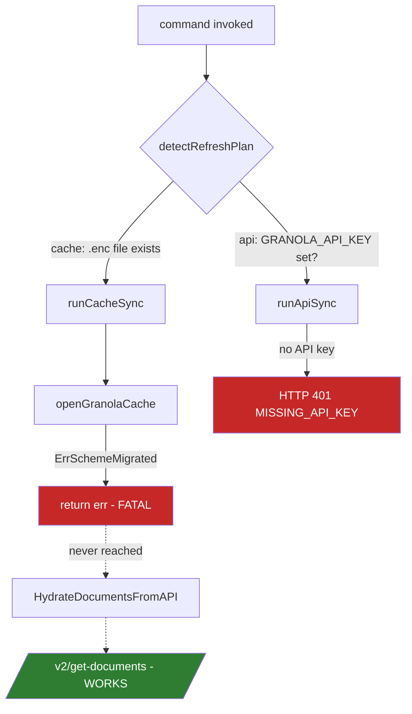
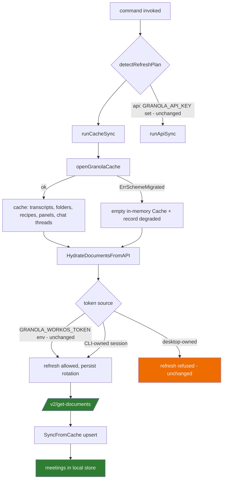
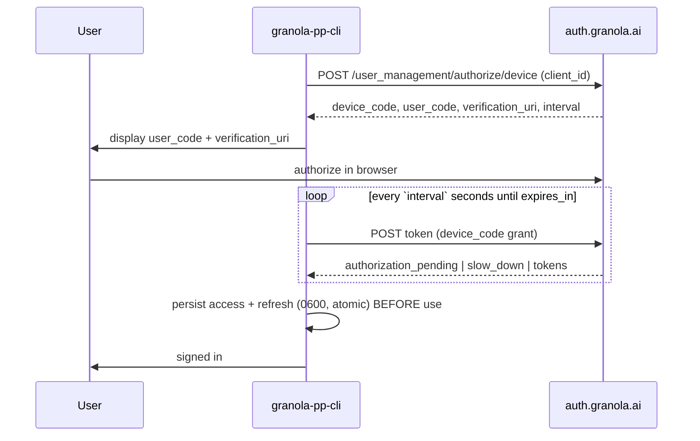

# fix(granola): restore data access with CLI-owned auth and an ungated API sync path

## Product Contract

### Summary

The Granola CLI has returned no meetings recorded after 2026-07-25 because the only data path that still works — Granola's internal `/v2/get-documents` API — is unreachable on a post-migration install: it sits behind a cache decrypt that can no longer succeed, and the WorkOS token it needs can no longer be obtained. This plan gives the CLI its own device-code login and lets the API document sync run without a readable cache.

### Problem Frame

PR #1598 (merged 2026-07-25) responded to Granola 7.447.1 moving the data encryption key (DEK) into an entitlement-gated macOS keychain access group. It established a dual path: decrypt the local desktop cache, or use the public REST API with a `GRANOLA_API_KEY`. On a workspace without a Business/Enterprise plan there is no API key, so the public path is unavailable, and the local path is permanently dead. The CLI therefore kept serving its last successful sync (2026-07-25) and silently returned nothing newer.

Three separate Granola changes combine to produce the failure:

1. **The DEK moved** (7.447.1, already documented). Local decrypt of `cache-v6.json.enc` is dead for third parties. `.printing-press-patches/dek-migration-classified-from-state-not-version.json` records this.

2. **The local store moved to an encrypted database** (new, observed on 7.465.0). Granola now writes `~/Library/Application Support/Granola/granola.db`, a 50 MB SQLCipher database. Verified from the app bundle: it depends on `better-sqlite3-multiple-ciphers`, and opens the file with `pragma cipher='sqlcipher'`, `pragma legacy=4`, `pragma key="x'<hex>'"`. The key is the same DEK — the app logs `sqlite-encryption-key-dek-unavailable` when it cannot resolve it. The file has no SQLite magic bytes and high entropy throughout, while its `-wal` sidecar retains a plaintext SQLite WAL header, which is the standard SQLCipher signature. This closes the door on local reads permanently rather than opening a new one; the CLI must not chase it.

3. **Granola stopped writing plaintext auth files.** `supabase.json` and `stored-accounts.json` were last written 2026-05-04 and 2026-05-19; only the `.enc` variants are current. The CLI's plaintext fallback therefore reads fossils whose access tokens expired in May.

The resulting chain in the current code:

- `runCacheSync` (`internal/cli/sync_cache.go`) returns fatally when `openGranolaCache()` fails, so the `HydrateDocumentsFromAPI` call on the next line never runs. That call is the only code path that *discovers* new meetings.
- `loadTokensRaw` (`internal/granola/workos.go`) cannot read the live token from `supabase.json.enc` without the DEK, falls back to the May plaintext fossil, and gets an expired token.
- `refreshRefusalFor` then refuses to refresh it, because desktop-owned token chains must not be rotated. That refusal is **correct and must be preserved**: WorkOS refresh tokens are single-use (verified — a second exchange returns `invalid_grant: "Refresh token already exchanged."`), so refreshing the desktop's token would sign the user out of the Granola desktop app.

The remedy the code currently prints for this state — *"open Granola desktop briefly to refresh, then retry"* (`internal/granola/api_documents.go:64`) — no longer works, because the desktop refreshes only the encrypted file the CLI cannot read.

### Evidence

Gathered on this machine, 2026-08-03, against Granola desktop 7.465.0 and `granola-pp-cli 2026.7.2`:

| Check | Result |
|---|---|
| `granola-pp-cli sync` (cache path) | Fails with `ErrSchemeMigrated`, as designed |
| `granola-pp-cli sync-api` (public path) | HTTP 401 `MISSING_API_KEY` on `/v1/folders` and `/v1/notes` — no API key configured |
| Local store freshness | Oldest resource age 210h (last sync 2026-07-25); newest meeting 2026-07-24 |
| Refresh a fossil WorkOS token | Succeeds against `https://auth.granola.ai/user_management/authenticate` |
| Re-use the same refresh token | HTTP 400 `invalid_grant` — single-use rotation confirmed |
| `POST /v2/get-documents` with a fresh token | HTTP 200; returns 18 meetings dated 2026-07-27 to 2026-08-02, the exact window reported missing |
| Client version header `7.299.0` vs `7.465.0` | Both HTTP 200 — the CLI's hardcoded version is **not** the cause |
| WorkOS device authorization endpoint | HTTP 200 with `device_code`, `user_code`, `verification_uri: https://mcp-auth.granola.ai/device` |

The last two rows are the load-bearing ones. The stale client identity is a red herring for this failure, and a CLI-owned login is available, so the fix does not depend on borrowing desktop credentials.

### Requirements

- **R1.** On an install where the desktop cache cannot be decrypted, and given a valid CLI-owned session (R2), the CLI must discover and sync meetings recorded after the last successful sync, without a `GRANOLA_API_KEY`. With no session and no API key, sync must fail with a message naming `auth login` — not silently return nothing.
- **R2.** The CLI must be able to obtain and maintain a WorkOS session it owns, independently of the Granola desktop app's session.
- **R3.** The CLI must never consume, rotate, or invalidate a refresh token belonging to the desktop app. The existing `refreshRefusalFor` guard stays intact for desktop-owned sources.
- **R4.** A CLI-owned refresh token must be persisted on every rotation, so a single-use exchange never strands the session.
- **R5.** Credentials the CLI owns must be stored with owner-only file permissions and must never appear in command output, logs, or error text.
- **R6.** `doctor` and sync error messages must describe the actual state and a remedy that works. The current "open Granola desktop briefly" and "approve the Keychain prompt" hints are unreachable on a migrated install.
- **R7.** Data already synced to the local store must remain readable throughout, and an install that still has a working cache must keep using it.

### Key Decisions

- **KD1: Add a CLI-owned device-code login rather than harvesting desktop credentials.** *(Governs R2, R3, R4.)* The device-code endpoint is available and returns a token chain the CLI can rotate freely. Every alternative fails: reading `supabase.json.enc` needs the inaccessible DEK; refreshing the desktop's chain signs the user out of the desktop app; scraping `granola.db` needs the same DEK. The smallest candidate — ungating the sync (U5) and having the user supply `GRANOLA_WORKOS_TOKEN` by hand — also fails, because a migrated install has no user-accessible way to obtain that token (both fossil chains on this machine were consumed during diagnosis), and a bare access token expires in hours with no rotatable chain behind it. U5 without a session restores nothing durable, which is why the auth work is not separable into a smaller first PR.
- **KD2: Treat `granola.db` as permanently unreadable and do not implement SQLCipher support.** *(Governs R1.)* Its key is the same entitlement-gated DEK. Adding a SQLCipher dependency would buy nothing and would imply a capability the CLI cannot deliver.
- **KD3: Leave the hardcoded client identity alone in this change.** Both `7.299.0` and `7.465.0` are accepted by the API today. `.printing-press-patches/granola-current-client-identity.json` already flags it as a moving target; bumping it here would add churn without fixing anything and would muddy the change's evidence story.

### Scope Boundaries

In scope: CLI-owned device-code auth, token persistence and rotation, ungating the API document sync from cache decrypt, and correcting the operator-facing messaging for the migrated state.

Out of scope:

- Reading or decrypting `granola.db` (KD2).
- Changing the public REST API path (`public-api.granola.ai`) or `GRANOLA_API_KEY` behavior. It works as designed for workspaces that have a key.
- Bumping the hardcoded client version (KD3).

#### Deferred to Follow-Up Work

- The ungated live fallbacks in `internal/cli/meetings.go:225-235` and `internal/cli/export.go:61,78` reach `NewInternalClient()` without the `hasCache()` guard used in `internal/cli/transcript.go:125-137`. After this change they will succeed when a CLI session exists, so they are no longer failure-producing; tightening them for consistency is a separate tidy-up.
- The generic `resources`/`notes` tables written by the stage-1 public sync are read by nothing (`internal/cli/sync_api_hydrate.go:15-20`). Unrelated dead weight.

---

## Planning Contract

### Key Technical Decisions

- **KTD1: Auth via OAuth 2.0 device authorization grant, polled at the server-specified interval.** Verified live: `POST https://auth.granola.ai/user_management/authorize/device` with `client_id=client_01JZJ0XBDAT8PHJWQY09Y0VD61` returns `device_code`, `user_code`, `verification_uri`, `expires_in: 300`, `interval: 5`. The CLI prints the user code and URI, then polls the token endpoint. This suits a terminal tool and needs no local callback listener or browser redirect handling.

- **KTD2: CLI-owned credentials live in the CLI's own data directory, not in Granola's.** A new file beside the existing store at `~/.local/share/granola-pp-cli/` keeps the two sessions physically separate, which is what makes R3 enforceable by construction rather than by discipline. Written `0600` in a `0700` directory, via write-temp-then-rename so a crash mid-rotation cannot truncate the chain.

- **KTD3: A new token source sits at the top of `loadTokensRaw`'s precedence, below only the env override.** Order becomes: `GRANOLA_WORKOS_TOKEN` env, **CLI-owned session**, `supabase.json.enc`, plaintext `supabase.json`, `stored-accounts.json`. The new source is exempt from `refreshRefusalFor` — it is the one chain the CLI may rotate. Every existing desktop-owned arm of that function is untouched (R3).

- **KTD4: Rotation persists durably before the new access token is used.** Because a WorkOS exchange invalidates the presented refresh token immediately, the write must be durable before the CLI acts on the response. Losing the rotated token after a successful exchange strands the session with no recovery except signing in again — which is exactly what happened to the two fossil chains on this machine during diagnosis.

  Temp-file-then-rename alone is not sufficient here. It guarantees the file is never *torn*, but not that the new record survives a crash between the remote exchange and the local commit — and that window is unrecoverable, because the old refresh token is already dead at the server. Durable commit means: write the temp file, `fsync` it, rename, then `fsync` the parent directory, and only then treat the refresh as successful. Because the exchange and the commit still cannot be made atomic with each other, an in-flight rotation marker written before the exchange lets startup detect an interrupted rotation and say so, instead of failing later with a misleading "invalid token" error.

- **KTD5: When the cache cannot be decrypted, hydrate documents into an empty in-memory `Cache` rather than aborting.** `HydrateDocumentsFromAPI` (`internal/granola/api_documents.go:41`) uses its `cache` argument purely as a destination for `cache.Documents`; it reads nothing out of it. So the API document path has no real dependency on decrypted content — only an incidental structural one. This is the smallest change that satisfies R1.

  **The upsert path is not reused unchanged — `SyncFromCache` must run in a degraded mode.** `SyncFromCache` treats an absent row as "deleted upstream" and performs owner-scoped retirement: the table-wide `DELETE FROM folder_memberships WHERE row_source='cache'` (`internal/granola/store_sync.go:441`) runs unconditionally, and `prepareSegmentRewrite`'s zero-incoming branch (`store_sync.go:596-603`) retires cache-owned transcript segments for every meeting the API hydrate returns. On a degraded run the cache is *unreadable*, not empty-because-deleted, so both clears would permanently destroy rows that can never be re-synced once the DEK path is closed — a direct R7 violation. The `row_source` scoping protects each path from the *other* path's deletes; it does not protect the cache path from its own. Degraded mode must therefore suppress both own-source retirement steps and upsert only.

  **Restrict degraded continuation to classified migration states.** Only `ErrSchemeMigrated` (and an explicitly classified decrypt failure) degrades. A plain `ErrKeyUnavailable` on a non-migrated install still has a working remedy — signing into Granola desktop — and must stay fatal so that remedy is not hidden behind a silently thinner sync.

  Surfaces not hydrated on this path: transcripts, folders, recipes, panels, and chat threads. Recipes and chat threads live only in the cache and are genuinely unreachable without the DEK. Transcripts, panels, and folder lists are **not** DEK-bound — the internal API this plan already authenticates exposes `GetDocumentTranscript`, `GetDocumentPanels`, and `GetDocumentLists` (`internal/granola/internalapi.go:247,277,371`) — they are simply out of scope for this change. The summary must state what was not hydrated rather than implying a complete sync, and must not claim the DEK is the reason for surfaces that a follow-up could restore.

- **KTD6: The decrypt failure stops being fatal to the sync run, but stays visible.** It becomes a recorded, reported condition — consistent with the existing partial-failure posture in `.printing-press-patches/partial-failure-must-not-discard-the-run.json` — instead of a hard return that discards a run which could still fetch every meeting.

### Assumptions

- The device-code `client_id` observed in the desktop app's token payloads is valid for the device grant. The probe returning a well-formed device code supports this, but the full exchange has not been completed end-to-end; U1 must confirm the polling half before the rest of the auth work is built on it.
- Granola's device-authorization verification page (`mcp-auth.granola.ai/device`) authorizes the same account scope the desktop app uses. If the granted scope turns out narrower than `/v2/get-documents` requires, U1 surfaces that before U2-U4 are written.

---

## High-Level Technical Design

Current state on a post-migration install. Both paths terminate before reaching the API that works:



After this change. The decrypt failure degrades the run instead of ending it, and the token comes from a chain the CLI owns:



Device-code login sequence for U1 and U2:



---

## Implementation Units

### U1. Confirm the device-code exchange end to end

**Goal.** Establish that the device grant completes and yields a token accepted by `/v2/get-documents`, before any code is written against it.

**Requirements.** R2. Validates the two entries under Assumptions.

**Dependencies.** None.

**Files.** No production files. Record findings in `library/productivity/granola/internal/granola/safestorage/testdata/scheme.md` under a new dated section.

**Approach.**

1. Request a device code; complete the browser authorization.
2. Poll the token endpoint and capture the response envelope: exact field names, `expires_in`, whether a `refresh_token` is returned, and the error codes emitted while pending (`authorization_pending`, `slow_down`).
3. Call `POST /v2/get-documents` with the resulting access token and confirm a document list comes back.
4. **Capture the refresh contract for this chain.** The device grant is minted under a different WorkOS client than the desktop's hardcoded `WorkOSClientID` (`workos.go:26`), and `RefreshAccessToken` posts a bare refresh token to Granola's own proxy (`GranolaRefreshEndpoint`, `workos.go:32`) with no `client_id`. Determine which endpoint and request shape actually rotates a device-grant chain — test Granola's proxy explicitly, and the WorkOS token endpoint with `client_id` + `grant_type` — and record the working shape. U4 implements what this step records; it must not assume the desktop exchange transfers.
5. Exchange the refresh token once and confirm rotation semantics match what the fossil chains showed.
6. Record whether the session also authenticates the transcript-bearing internal endpoints (`/v1/get-document-transcript`, `/v1/get-document-panels`, `/v1/get-document-lists`). This does not gate this change, but it determines whether a follow-up can restore those surfaces and keeps KTD5's scope claim honest.
7. Probe whether a session/token revocation endpoint is reachable for this grant. The answer decides whether `auth logout` can be more than a local file delete (see Open Questions).

**Execution note.** This is a discovery unit against a live third-party service. Its output is written findings, not code. Two hard gates: if step 3 fails on scope, stop and reopen KD1; if step 4 finds no working refresh shape, stop — a session that cannot rotate is not a session, and U2-U4 must not be built on the assumption that it can.

**Secret-handling rule.** `scheme.md` is tracked in git. Record request and response *shapes*, field names, and error codes only. Access tokens, refresh tokens, device codes, account identifiers, and meeting content must never be written to that file or to any test fixture.

**Test scenarios.** `Test expectation: none -- discovery unit; its deliverable is the recorded scheme note that U2 is built against.`

**Verification.** `scheme.md` carries a dated section stating the exact device-grant request and response shapes, the pending-state error codes, and confirmation that the resulting token is accepted by `/v2/get-documents`.

---

### U2. CLI-owned token store with atomic rotation

**Goal.** A persistence layer for a WorkOS session the CLI owns, safe against the single-use rotation semantics.

**Requirements.** R2, R4, R5.

**Dependencies.** U1.

**Files.**
- `library/productivity/granola/internal/granola/clisession.go` (new)
- `library/productivity/granola/internal/granola/clisession_test.go` (new)

**Approach.**

1. Define the on-disk record: access token, refresh token, expiry, obtained-at, and the account identifier the session belongs to.
2. Resolve its path with the same XDG-aware resolution `SyncStatePath` uses (`internal/granola/syncstate.go:45-55`), which honors `XDG_DATA_HOME` and already ships an env override. Do **not** follow `defaultDBPath` (`internal/cli/helpers.go:1420-1423`): it hardcodes `~/.local/share`, and it lives in `internal/cli`, which this file cannot import — `internal/cli` imports `internal/granola`, not the reverse. Following `SyncStatePath` keeps the session file, sync state, and store co-located for XDG users.
3. Write via temp-file-then-rename within the same directory, creating the temp file at `0600` (rename preserves its mode) and the directory at `0700`. `MkdirAll` is a no-op on an existing directory, and `~/.local/share/granola-pp-cli/` already exists at `0755` on every machine that has ever synced — so explicitly `chmod` the directory to `0700` when it exists with broader permissions, or the control silently never applies. Apply the same enforcement to the env-override path, and refuse to load a session file that is group- or world-readable or not owned by the current user. Never log or return token material; the record's string representation must redact both tokens.
4. Implement durable commit per KTD4: `fsync` the temp file, rename, `fsync` the parent directory, and write an in-flight rotation marker before an exchange so an interrupted rotation is detectable at startup.
5. Expose load, save, and clear. `clear` is what `auth logout` will call.

**Patterns to follow.** Mirror the temp-file-then-rename atomic-write *shape* used for `sync_state.json` (`internal/granola/syncstate.go`) — but **not** its permissions: `WriteSyncState` creates its directory `0755` and writes the temp file `0644`, and `os.Rename` preserves the temp file's mode, so copying it verbatim would land the credential file world-readable. This file must be `0600` in a `0700` directory per KTD2. Match the `Err…` sentinel style of `internal/granola/safestorage/safestorage.go:35-65` for a missing or malformed session.

**Test scenarios.**
- Saving then loading a session round-trips every field intact.
- Loading when no session file exists returns the "no session" sentinel, not a hard error.
- The session file is created with mode `0600` and its parent directory with `0700`.
- **When the parent directory already exists at `0755`** (pre-created in the test, as it is on every real install), saving tightens it to `0700`. This is the scenario that catches the `MkdirAll` no-op.
- The env-override path gets the same permission enforcement as the default path.
- Loading a session file that is group- or world-readable, or not owned by the current user, returns a typed error instead of a session.
- A save that fails partway (simulated by making the target directory read-only) leaves any previously saved session readable and uncorrupted.
- Loading a truncated or malformed session file returns a typed error rather than panicking.
- The record's formatted output contains neither the access token nor the refresh token substring.
- An in-flight rotation marker left behind by an interrupted rotation is detected on load and reported as such, not as a malformed session.
- `clear` removes the file, and a subsequent load returns the "no session" sentinel.

**Verification.** `go test ./internal/granola/ -run CLISession` passes, and the permission and redaction scenarios are asserted rather than assumed.

---

### U3. `auth login` device-code flow

**Goal.** A command that signs the CLI in on its own account and persists the resulting session.

**Requirements.** R2, R5.

**Dependencies.** U1, U2.

**Files.**
- `library/productivity/granola/internal/cli/auth_login.go` (new)
- `library/productivity/granola/internal/cli/auth_login_test.go` (new)
- `library/productivity/granola/internal/cli/auth.go` (register `login` inside `newAuthCmd`, alongside the existing auth subcommands, and extend `status` / `logout`)
- `library/productivity/granola/SKILL.md`, `library/productivity/granola/README.md`

**Approach.**

1. Add `auth login` beside the existing `logout`, `set-token`, `setup`, `status` subcommands.
2. Request a device code, then display the user code and verification URI. Under `--no-input`/`--agent`, emit them as structured output and still poll — the flow needs no TTY interaction on this side.
3. Poll at the server-supplied `interval`, backing off on `slow_down`, until authorization completes or `expires_in` elapses. Honor context cancellation so Ctrl-C exits cleanly.
4. On success, persist through U2 **before** reporting success.
5. Extend `auth status` to report which session is in use and its expiry, and `auth logout` to clear the CLI-owned session.

**Execution note.** Drive the tests against an `httptest` server standing in for the WorkOS endpoints; the polling loop and its timing behavior are the parts worth proving, and they must not depend on the live service.

**Test scenarios.**
- A device-code response followed by a pending poll and then a success response results in a persisted session.
- `authorization_pending` is treated as "keep waiting", not as a failure.
- `slow_down` lengthens the poll interval rather than aborting.
- The flow gives up once `expires_in` elapses, with an error naming expiry as the cause.
- Context cancellation mid-poll returns promptly without writing a partial session.
- A persistence failure after a successful token exchange surfaces as an error rather than reporting a successful login.
- Neither the access nor the refresh token appears in command output on success or on any error path.
- `auth status` with a CLI-owned session reports it as the active source; with none, it reports the desktop fallback state.
- `auth logout` clears the session and `auth status` then reports none.

**Verification.** `go test ./internal/cli/ -run AuthLogin` passes; running `auth login` against the live service produces a session that `auth status` reports and that U4 can refresh.

---

### U4. Wire the CLI-owned session into token resolution

**Goal.** Make the new session the preferred token source and the only one the CLI is permitted to rotate.

**Requirements.** R2, R3, R4.

**Dependencies.** U2, U3.

**Files.**
- `library/productivity/granola/internal/granola/workos.go`
- `library/productivity/granola/internal/granola/workos_test.go`
- `library/productivity/granola/internal/cli/sync_cache.go` (the `tokenSourceLabel` change in step 5)
- `library/productivity/granola/internal/cli/sync_cache_test.go`

**Approach.**

1. Add a `TokenSource` constant for the CLI-owned session.
2. Insert it into `loadTokensRaw` (`workos.go:268-288`) directly after the `GRANOLA_WORKOS_TOKEN` env check and before the `supabase.json` probes. Leave every existing arm as-is.
3. In `refreshRefusalFor` (`workos.go:215-225`), return no refusal for the new source. Do not touch the `TokenSourceEncryptedSupabase`, `TokenSourcePlaintextSupabaseDesktopFallback`, or `TokenSourceStoredAccounts` arms.
4. In `RefreshAccessToken`, implement the refresh shape U1 recorded for the CLI-owned chain (it may differ from the desktop proxy exchange), then persist the rotated pair through U2 before returning. A persistence failure must fail the refresh loudly rather than returning a token whose refresh half has been lost (KTD4).

   **Serialize the whole exchange, not just the write.** The current code releases `tokenMu` before the network call and reacquires it only for the in-process cache update, so two concurrent callers both perform an exchange today. Under single-use rotation the loser gets `invalid_grant` and the session is stranded. For the CLI-owned source, hold `tokenMu` (or a dedicated refresh lock / singleflight) across exchange **and** durable persist. This is a restructure of the existing locking, not a drop-in.
5. Add the new source to `tokenSourceLabel` (`internal/cli/sync_cache.go:241-253`), and while there, add the missing `TokenSourcePlaintextSupabaseDesktopFallback` case that currently reports `"unknown"`.

**Patterns to follow.** The existing `TokenSource` enum and `refreshRefusalFor` structure. `.printing-press-patches/d6-stored-accounts-is-desktop-owned.json` and `d6-read-only-applies-to-all-desktop-token-sources.json` record why the desktop arms exist — this unit must not weaken them.

**Test scenarios.**
- With a CLI-owned session present, `loadTokensRaw` returns it and reports the new source.
- `GRANOLA_WORKOS_TOKEN` still wins over a CLI-owned session.
- With no CLI-owned session, resolution falls through to the existing desktop probes in their current order and with their current sources.
- `refreshRefusalFor` returns no refusal for the CLI-owned source.
- `refreshRefusalFor` still returns `ErrRefreshRefused` for each desktop-owned source, including the `stored-accounts` case gated on `supabase.json.enc` being present.
- A successful refresh of a CLI-owned session writes the rotated refresh token before returning, and a reload observes the new value.
- A refresh whose persistence step fails returns an error and does not report success.
- Concurrent refresh attempts serialize under `tokenMu` and produce exactly one exchange.
- `tokenSourceLabel` returns a distinct non-`"unknown"` label for the new source and for `TokenSourcePlaintextSupabaseDesktopFallback`.

**Verification.** `go test ./internal/granola/ -run 'Token|Refresh'` and `go test ./internal/cli/ -run TokenSourceLabel` pass. Every pre-existing refusal test still passes unmodified — if one needed editing, R3 has been violated.

---

### U5. Run the API document sync without a readable cache

**Goal.** Let a decrypt failure degrade the sync run instead of ending it, so meetings are fetched on a migrated install.

**Requirements.** R1, R7.

**Dependencies.** U4.

**Files.**
- `library/productivity/granola/internal/cli/sync_cache.go`
- `library/productivity/granola/internal/cli/sync_cache_test.go` (new)
- `library/productivity/granola/internal/granola/store_sync.go`
- `library/productivity/granola/internal/granola/store_sync_test.go`
- `library/productivity/granola/internal/cli/autorefresh.go`

**Approach.**

1. Add a degraded mode to `SyncFromCache` (`internal/granola/store_sync.go`) that suppresses the cache path's **own-source retirement**: skip the cache-scoped `DELETE FROM folder_memberships` (`store_sync.go:441`) and skip `prepareSegmentRewrite`'s zero-incoming own-source segment retirement (`store_sync.go:596-603`). In degraded mode the function upserts only. This is the load-bearing step — without it the first degraded sync destroys every previously synced transcript and folder membership (see KTD5).
2. In `runCacheSync` (`sync_cache.go:151-215`), replace the fatal return on `openGranolaCache()` failure with a degraded path, gated on classification:
   - Keep `recordSyncDecryptStatus(err)` so `doctor` still sees the real classification.
   - Degrade **only** when the error classifies as `ErrSchemeMigrated` or an explicitly classified decrypt failure. Any other cache-open error stays fatal, so the non-migrated remedy is not hidden.
   - Construct an empty in-memory `Cache` and mark the result degraded, carrying the decrypt error.
   - Continue into `HydrateDocumentsFromAPI`, then call `SyncFromCache` in degraded mode.
   - Return an error only if the API hydrate *also* fails — that is the case where the run genuinely produced nothing.
3. Extend `CacheSyncResult` with the degraded marker and the underlying decrypt error so callers can report accurately.
4. Have the sync summary state plainly which surfaces were not hydrated and that only API-derived meetings were synced. Do not report a degraded run as a clean one.
5. In `autorefresh.go:293-318`, render the degraded state distinctly from both success and failure in the provenance line.
6. Add the missing `ErrSchemeMigrated` arm to the classification switch at `sync_cache.go:226-235` so the state is recorded as its own class rather than collapsing into `key_unavailable`.

**Execution note.** Write the data-preservation test first, before the feature test: seed the store with cache-owned transcript segments and folder memberships, run a degraded sync, and assert every seeded row survives. That test is what stands between this unit and permanent data loss, and it fails against the naive implementation.

**Test scenarios.**
- **A degraded run preserves seeded cache-owned rows.** With transcript segments and folder memberships already in the store from a prior successful sync, a degraded run leaves every one of them intact — including for meetings the API hydrate returns with no transcript.
- Cache decrypt fails with `ErrSchemeMigrated` and the API hydrate succeeds: meetings land in the store, the result is marked degraded, and no error is returned.
- Cache decrypt fails and the API hydrate also fails: an error is returned and it names the hydrate failure, not only the decrypt failure.
- A cache-open error that is **not** a classified migration or decrypt failure stays fatal and does not enter degraded mode.
- Cache decrypts successfully: behavior is byte-for-byte what it is today, including all cache-derived surfaces and both retirement steps.
- A degraded run records the decrypt classification for `doctor` exactly as the current fatal path does.
- A degraded run's summary reports zero transcripts, folders, recipes, panels, and chat threads, and a non-zero document count.
- The provenance line distinguishes degraded from clean success and from outright failure.
- `ErrSchemeMigrated` is recorded as its own class, not as `key_unavailable`.

**Verification.** `go test ./internal/cli/ -run 'CacheSync|Autorefresh'` passes. On this machine, after `auth login`, `granola-pp-cli sync` followed by `meetings list` shows meetings dated after 2026-07-25.

---

### U6. Correct the operator-facing messaging

**Goal.** Stop printing remedies that cannot work on a migrated install.

**Requirements.** R6.

**Dependencies.** U3, U5.

**Files.**
- `library/productivity/granola/internal/granola/safestorage/safestorage.go` (the `migratedSchemeRemedy` constant)
- `library/productivity/granola/internal/cli/doctor_encrypted_store.go`
- `library/productivity/granola/internal/cli/doctor.go` (the `"not configured"` auth check)
- `library/productivity/granola/internal/granola/workos.go` (no-token and `ErrRefreshRefused` messages)
- `library/productivity/granola/internal/granola/api_documents.go`
- `library/productivity/granola/internal/cli/doctor_encrypted_store_test.go`
- `library/productivity/granola/SKILL.md`, `library/productivity/granola/README.md`

**Approach.**

1. Rewrite the remedy text at its source: the migrated-state message is the `migratedSchemeRemedy` constant baked in by `newMigratedSchemeError` (`safestorage.go:93-110`). `cache.go:474-482` deliberately passes that string through untouched, so editing `cache.go` cannot change the remedy — the rewrite must happen in `safestorage.go`. Lead with `auth login`; keep `GRANOLA_SAFESTORAGE_KEY_OVERRIDE` as the secondary route for anyone holding a pre-migration `storage.dek`; drop the claim that fetching new meetings requires a Business/Enterprise API key, which this change makes false.
2. In `doctor_encrypted_store.go:85-86`, stop advising the user to approve a Keychain prompt when the state is `ErrSchemeMigrated` — no prompt will appear. Point at `auth login` instead.
3. In `api_documents.go:64`, replace *"open Granola desktop briefly to refresh, then retry"* with `auth login`. The desktop no longer writes a file the CLI can read, so that remedy is dead. Do the same for the `ErrRefreshRefused` sentinel text and the no-token messages in `workos.go` — a fresh install with no fossil auth files hits those first, and they still name dead remedies.
4. Have `doctor` report the CLI-owned session as its own check (the `"not configured"` string lives in `doctor.go`, not in `doctor_encrypted_store.go`), so "Auth: not configured" no longer appears when a valid session exists. That message currently refers only to `GRANOLA_API_KEY` and reads as a total auth failure.
5. Have `auth status` and auth-failure messages detect an active `GRANOLA_WORKOS_TOKEN` override and say to unset it — it outranks the CLI-owned session in `loadTokensRaw`, so a stale value makes a successful `auth login` look like it did nothing.
6. Update `SKILL.md` and `README.md`:
   - Document `auth login`, and correct the standing claim that a current install is *"permanently unreadable by this CLI"* — the local files are, but the CLI is not without data.
   - Explain **why** a second sign-in is needed while Granola desktop is already signed in: desktop refresh tokens are single-use, so rotating one would sign the desktop app out. State what credential the CLI stores, where, at what permissions, and that `auth logout` removes it. This has to live in the shipped docs, not only the PR body — catalog users never see the PR.
   - Extend the SKILL.md **Capability split** with the CLI-owned-session tier: which surfaces it hydrates and which stay empty. Agents consult this section to decide whether an empty result means "no data" or "not synced on this tier"; without it, `talktime`, `memo run`, `attendee brief`, and `folder stream` return empty and read as authoritative answers.

**Test scenarios.**
- With `ErrSchemeMigrated` recorded, `doctor` names `auth login` and does not mention approving a Keychain prompt.
- With a valid CLI-owned session, `doctor` reports auth as healthy rather than "not configured".
- **Combined acceptance state:** with `ErrSchemeMigrated` recorded *and* a valid CLI-owned session, `doctor` simultaneously reports healthy auth, a migrated-but-degraded store, and no Keychain-prompt remedy. Testing these three separately can pass while the combined output still reads as a bare failure.
- With no session and no API key, `doctor` still reports the actionable state and names `auth login`.
- The `ErrRefreshRefused` message from the document hydrate names `auth login` and no longer instructs the user to open Granola desktop.
- On a fresh install with no session, no API key, and no plaintext desktop fossils, the no-token message from `workos.go` names `auth login`.
- With `GRANOLA_WORKOS_TOKEN` set and a CLI-owned session present, `auth status` reports that the env override is active and outranks the session.
- The `ErrKeyUnavailable` (non-migrated) message is unchanged — that state's existing remedy is still correct.

**Verification.** `go test ./internal/cli/ -run Doctor` passes, and `python3 .github/scripts/verify-skill/verify_skill.py --dir library/productivity/granola/` passes after the doc edits.

---

### U7. Record the patches and ship

**Goal.** Land the change with the reprint-guard metadata this repo requires.

**Requirements.** All.

**Dependencies.** U1-U6.

**Files.**
- `library/productivity/granola/.printing-press-patches/cli-owned-workos-session.json` (new)
- `library/productivity/granola/.printing-press-patches/api-sync-survives-unreadable-cache.json` (new)
- `library/productivity/granola/.printing-press-patches/granola-local-store-is-sqlcipher.json` (new)
- `library/productivity/granola/.printing-press-patches/device-grant-flow-is-a-moving-target.json` (new)
- `library/productivity/granola/.printing-press.json` (contributors)
- `library/productivity/granola/README.md`, `library/productivity/granola/NOTICE` (byline and contributor rows)

**Approach.**

1. Write one patch file per durable lesson, at reprint-guard altitude per this repo's conventions — the behavioral contract, not the diff:
   - *CLI-owned session*: the CLI maintains its own WorkOS chain because desktop-owned refresh tokens are single-use and rotating one signs the user out of the desktop app.
   - *Degraded sync*: an unreadable desktop cache must degrade the sync run rather than end it, because the API document path has no real dependency on decrypted cache content.
   - *SQLCipher store*: `granola.db` is SQLCipher keyed with the entitlement-gated DEK; a regen must not attempt to read it.
   - *Device-grant flow is a moving target*: the endpoint, `client_id`, and verification host are an unofficial dependency, minted through a Granola auth surface not issued to this CLI. Granola has closed three third-party access routes in roughly three months, so `auth login` failures should be triaged first as drift in that flow, not as a CLI regression. Same treatment `granola-current-client-identity.json` already gives the client version.
2. Set `schema_version: 2`, and copy `base_run_id` and `base_printing_press_version` from `.printing-press.json`.
3. Add the contributor entry across all three surfaces — manifest, README byline, and NOTICE. The manifest-only miss is this repo's documented recurring gap (it happened on granola #1022 and flight-goat #1008).
4. Draft the PR body's security-posture statement (the Definition of Done requires it): what credential the CLI now stores, where, at what permissions, why the desktop's session is untouched, that the session is minted through a Granola auth surface not issued to this CLI and can be revoked upstream, and what `auth logout` does and does not invalidate.
5. Do not touch `registry.json`, `cli-skills/pp-granola/SKILL.md`, `CHANGELOG.md`, or `.printing-press-release.json` — all are owned by post-merge automation and CI hard-fails on the first two.

**Test scenarios.** `Test expectation: none -- metadata and attribution unit; correctness is enforced by the preflight checks below.`

**Verification.** From `library/productivity/granola/`: `go build ./...`, `go vet ./...`, `go test ./...`, and `govulncheck ./...` all pass; `python3 .github/scripts/verify-skill/verify_skill.py --dir library/productivity/granola/` passes; `git diff --name-only origin/main` shows no generated artifacts.

---

## Verification Contract

Before opening the PR, from `library/productivity/granola/`:

```
go build ./...
go vet ./...
go test ./...
govulncheck ./...
```

From the repo root:

```
python3 .github/scripts/verify-skill/verify_skill.py --dir library/productivity/granola/
```

End-to-end on a migrated install, which is the acceptance case this plan exists for:

1. `granola-pp-cli auth login` completes and persists a session.
2. `granola-pp-cli doctor` reports auth healthy and the encrypted store as migrated-but-degraded, not as a bare failure. Assert this combined state in one test — classification, auth health, and remedy text are otherwise only checked separately, and the combination is what a real user sees.
3. `granola-pp-cli sync` reports a degraded run with a non-zero document count.
4. `granola-pp-cli meetings list` shows meetings recorded after 2026-07-25.
5. Meetings and transcripts already in the local store before the run are all still there afterward. This is the R7 check and the P0 this plan's review caught.
6. The Granola desktop app remains signed in throughout. This is the R3 check and it is not optional.

Also verify the **fresh-install** path, which is the catalog's dominant audience and is not exercised by the upgraded machine above: with an empty local store and no plaintext desktop fossils, every message the CLI emits before `auth login` names `auth login` as the remedy — no "sign into the Granola desktop app", no "open Granola desktop briefly", no "needs a Business or Enterprise workspace".

## Definition of Done

- R1-R7 are satisfied, each traceable to at least one unit.
- U1's two hard gates cleared: the session reaches `/v2/get-documents`, and a working refresh shape is recorded. Neither is assumed.
- Every pre-existing test passes unmodified. An edited refusal test means R3 was violated.
- The degraded-run data-preservation test passes. No previously synced row is lost on a degraded sync.
- Four patch files are recorded and the contributor entry appears on all three surfaces.
- No generated artifact appears in the PR diff.
- The PR body states the security posture explicitly: what credential the CLI now stores, where, at what permissions, why the desktop's session is untouched, that the grant comes from a Granola auth surface not issued to this CLI and may be revoked or re-scoped upstream, and what `auth logout` does and does not invalidate.

## Open Questions

- **Blocking on U1:** whether the device grant returns a refresh token at all, and by what endpoint and request shape it rotates. If there is no refreshable chain, `auth login` cannot promise a maintained session and KD1 must be reopened before U2-U4 are built.
- **Needs a decision before U3 ships:** whether `auth logout` revokes server-side. If U1 finds a reachable revocation endpoint, logout should call it — otherwise a leaked copy of the refresh token stays valid after the user believes they signed out. If revocation is unavailable, that residual has to be stated in the shipped docs rather than left implicit.
- **Needs a decision before U3 ships:** whether to request a reduced scope for the CLI session. The device grant currently yields a desktop-equivalent chain; if the provider supports a narrower scope covering `/v2/get-documents`, taking it bounds the blast radius of a leaked credential.
- **Deferred to implementation:** whether a CLI-owned session should be per-account when a user has several Granola accounts. Single-session is correct for this fix, but `auth login` and `auth status` should at minimum display the bound account identifier so a session pointed at a second account cannot silently look like missing data.
- **Deferred to follow-up:** whether the CLI-owned session can hydrate transcripts, panels, and folder lists through the internal API's existing `GetDocumentTranscript` / `GetDocumentPanels` / `GetDocumentLists`. U1 step 6 records the answer. If yes, that restores most of the CLI's advertised value on migrated installs and is the natural next PR.

## Sources & Research

- PR #1598, `fix(granola): restore data access after Granola's DEK migration`, merged 2026-07-25 — establishes the dual-path design this plan extends.
- `docs/plans/2026-07-25-001-fix-granola-dual-path-data-access-plan.md` — prior plan.
- `library/productivity/granola/internal/granola/safestorage/testdata/scheme.md` — the empirical encryption note, including the 2026-07-25 tier-1 update. U1 extends it.
- Granola desktop 7.465.0 bundle inspection: `better-sqlite3-multiple-ciphers` dependency; `pragma cipher='sqlcipher'` / `legacy=4` / `key="x'<hex>'"`; the `sqlite-encryption-key-dek-unavailable` log path establishing the SQLCipher key as the DEK.
- Live API probes, 2026-08-03, recorded in the Evidence table above.
