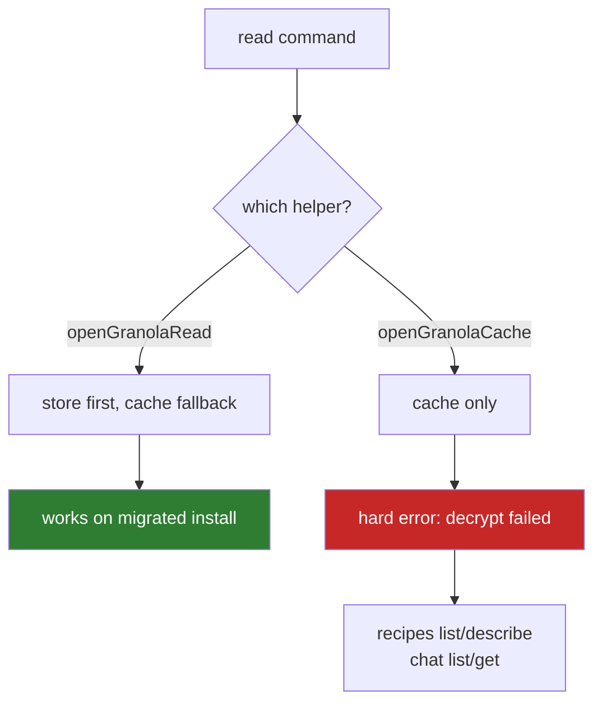
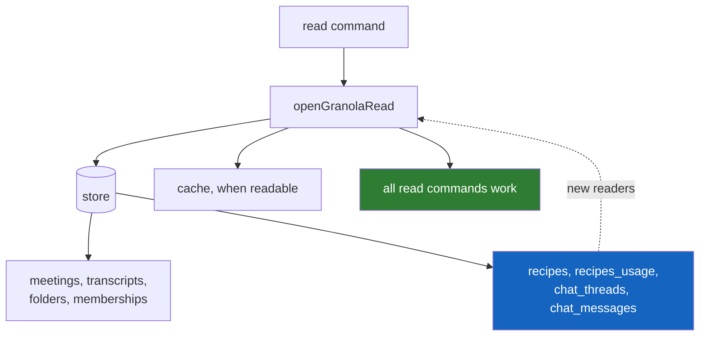
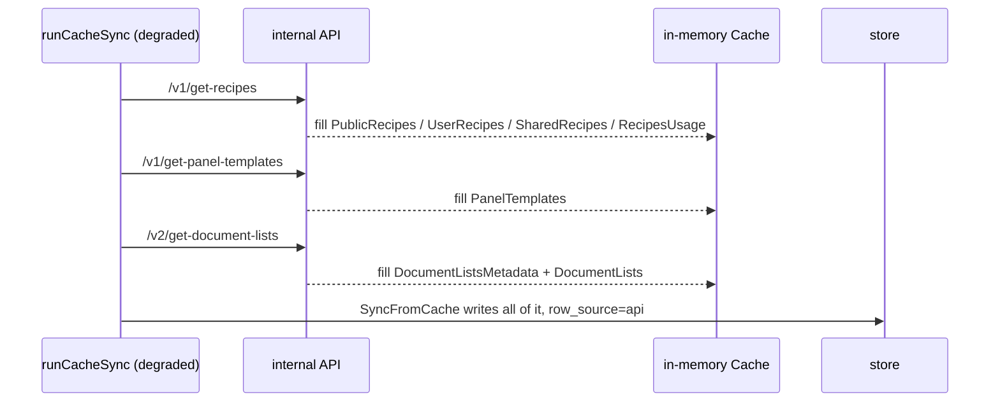

# fix(granola): serve recipes and chats from the store on a migrated install

## Product Contract

### Summary

`recipes list`, `recipes describe`, `chat list` and `chat get` abort on a cache decrypt that can never succeed, even though the local store already holds 57 recipes and 225 chat threads. This plan routes them through the store-first read seam the working commands already use, builds the store readers those tables never got, and refreshes recipes, panel templates and folder metadata from the internal API so the data stays current.

### Problem Frame

The prior plan (`docs/plans/2026-08-03-001-fix-granola-cli-owned-auth-plan.md`) gave the CLI its own session and restored meetings, attendees and transcripts on installs where Granola's DEK moved out of reach. Four surfaces were left listed as "cache-only, therefore unavailable". Probing them showed that framing was wrong in three different ways, only one of which needs a fix here.

**Recipes and chats fail on a decrypt that will never succeed.** `recipes.go:37`, `recipes.go:124`, `chat.go:34` and `chat.go:101` all call `openGranolaCache()`, which returns a hard error when the cache cannot be decrypted. Every other read command goes through `openGranolaRead()`, which serves the store first and treats an unreadable cache as the steady state rather than a failure. These four sites were simply never migrated. The store meanwhile holds 57 recipes and 225 chat threads from pre-migration syncs, so the data is present and the command refuses to show it.

Fixing the routing alone is not enough: the `recipes` and `recipes_usage` tables have **no reader at all** (`grep "FROM recipes"` across `internal/` returns nothing). They have been written on every sync since the CLI shipped and read by nothing. Chat threads are in the same position. So the store-first path has to be built, not just called.

**Panels already work, on one precondition.** `panel get` returns a full AI panel today. It never consulted the store — `panel.go:41-48` calls `GetDocumentPanels` live — so the session from the prior PR fixed it as a side effect. The precondition is that the session stays valid: `panel get` is the only read command with no store or cache fallback at all, so a lapsed session makes it fail hard where every other command degrades to stored data. This plan does not change that (KD2), but the tradeoff should be recorded rather than left implied by "nothing is required here".

**Folders mostly work, with one gap.** `folder list` and `folder stream` are store-backed and functional. But the cache write path drops `description` and the favourite flag — there are no columns for them — so `folder list` reports those empty for every folder, which U3 repairs. The separate top-level `folders` command is generator-produced and calls the public REST `/v1/folders`, which 401s without a `GRANOLA_API_KEY`. That is a different command on a different API, and rerouting it changes behavior for key-holding users, so it is deferred rather than folded in.

**Workspaces are already covered and were mis-listed.** `workspaces.go` falls back to the internal API's `GetWorkspaces()` when the cache is unreadable, the same live path that makes `panel get` work. The shipped capability docs list workspaces alongside chats as unavailable, which is wrong for the same reason the panels bullet is wrong. U5 corrects both rather than rewriting around them.

**What is genuinely unreachable is chat content, not chat reads.** Seven endpoint namings were probed for chat threads on 2026-08-03 against Granola 7.465.0, all returning 404: `/v1/get-chat-threads`, `/v1/get-document-chats`, `/v1/get-chats`, `/v2/get-chat-threads`, `/v1/get-threads`, `/v1/get-document-thread`, `/v1/chat-threads`. Chats can be read from what the store already has, but cannot be refreshed. That distinction has to reach the docs, because "cache-only" currently implies a fix is coming.

### Evidence

Gathered 2026-08-03 against Granola 7.465.0 with a CLI-owned session.

| Surface | Command today | Store rows | Internal API |
|---|---|---|---|
| Recipes | aborts on decrypt | 57 recipes, usage for 57 | `/v1/get-recipes` returns 200, full set in one call |
| Chats | aborts on decrypt | 225 threads (newest 2026-06-22) | no endpoint found (7 namings, all 404 — listed in the Problem Frame) |
| Panel templates | not read by any command | 31 templates | `/v1/get-panel-templates` returns 200, 31 items |
| Panels | `panel get` works live | no table exists | `/v1/get-document-panels` returns 200 per document |
| Folders | `folder list` works | 5 folders, 153 memberships | `/v2/get-document-lists` returns 200 with membership embedded |

Two findings that change the work:

- **`/v2/get-document-lists` carries membership.** Each list in the response has a `documents` array alongside `id`, `title`, `parent_document_list_id` and `preset`. The Go type `DocumentListMetadata` has no field for it, so `GetDocumentLists` currently discards the edges and the code comments assume membership must come from `APINote.FolderMembership`. Adding one field makes folders and memberships a single call.
- **`RecipeUsage.TotalCount` is a string.** Both the store write (`store_sync.go:547`) and `recipes list --top-usage` (`recipes.go:67`) parse it with `Sscanf`. An API mapper that supplies a number will silently yield zero counts on both paths.

### Requirements

- **R1.** `recipes list`, `recipes describe`, `chat list` and `chat get` must return the store's data on an install where the cache cannot be decrypted, instead of erroring.
- **R2.** Those commands must keep their current behavior on an install with a readable cache, including the cache-only fields the store does not carry.
- **R3.** Recipes, recipe usage and panel templates must refresh from the internal API on a degraded sync, so the store does not stay frozen at whatever the last cache sync left.
- **R4.** Rows written by the API must be distinguishable from cache-written rows, so a later change can retire stale rows of one origin without destroying the other's.
- **R5.** Documentation must distinguish "not synced on this tier" from "unreachable". Chat content is unreachable; recipes and panel templates are not.
- **R6.** A command serving store data on an install with an unreadable cache must surface how current that data is, at the point of use rather than only in the docs. Replacing a visible error with a silently frozen result is not an improvement. This binds hardest on chats, which can never be refreshed, but applies to recipes too on any install where U4 has not landed.
- **R7.** Folder metadata (description, favourite flag) and folder membership must be complete in the store after a degraded sync, so `folder list` stops reporting empty fields for folders that have them.

### Key Decisions

- **KD1: Fix the read path before the write path.** *(Governs R1, R2.)* Routing four call sites through the existing seam makes three commands work against data already on disk. Hydration only keeps that data current, and is worthless until something reads it. This ordering also means U1 and U2 deliver user-visible value even if U3 slips.
- **KD2: Do not persist panel content.** *(Governs the scope boundary.)* `panel get` already works live against the CLI session, so there is no broken behavior to repair — persisting panels would buy offline reads nobody has asked for, at the cost of a new table and a new per-document backfill with its own budget and fetch-state. Deferred, not rejected. Note the schema-version bump is *not* the differentiator: U3 needs one anyway (KTD6).
- **KD3: Treat chats as read-only, and disclose the staleness boundary.** *(Governs R5, R6.)* No chat endpoint exists on the internal API as of Granola 7.465.0, probed 2026-08-03 across the seven namings listed in the Problem Frame. State it that way in the docs rather than as permanence: an absent endpoint today is a dated observation, and the plan is already correcting the opposite error of implying a fix is coming. Practically, the store's threads are frozen at whatever the last cache sync captured and will only age. On the probe machine that boundary is already six weeks behind the newest meeting. Serving that silently would trade a loud failure for a quiet wrong answer, so `chat list` must state how current its data is rather than presenting a frozen set as complete.

### Scope Boundaries

In scope: the four cache-only read sites, store readers for recipes and chat threads, API refresh for recipes and panel templates, folder metadata completeness, and `row_source` provenance on the four tables that lack it.

Out of scope:

- Persisting panel content or adding a panels table (KD2).
- Any change to the public REST path or `GRANOLA_API_KEY` behavior.
- Chat hydration (KD3 — no endpoint exists).

#### Deferred to Follow-Up Work

- The top-level `folders` command (`promoted_folders.go`) still calls public `/v1/folders` and 401s without a key. Rerouting it to the store would change what key-holding users get from it, so it needs its own decision.
- `cache.ListRules` is parsed and written nowhere and read by nothing. Dead weight this plan does not touch.
- `recipe_coverage.go:51` discards the error from `GetDocumentPanels`, so a client failure reports every meeting as missing its recipe. A real defect, but in the panel path this plan leaves alone.

---

## Planning Contract

### Key Technical Decisions

- **KTD1: Extend the `granolaRead` view rather than adding a parallel accessor.** The seam at `internal/cli/granola_helpers.go` already merges store and cache for documents, folders and memberships, with the established precedent that store values overwrite only non-empty fields. Recipes and chat threads should join that same view so the merge semantics stay in one place.

- **KTD2: Add `row_source` to `folders`, `panel_templates`, `recipes` and `recipes_usage` before any API writer touches them.** They currently have zero DELETEs — pure `INSERT OR REPLACE` — so the two paths would blend with no way to tell them apart, which is the situation that made the transcript retirement bug possible.

  **`DEFAULT 'cache'` is accurate for only three of the four.** `folders` already has an API writer: `upsertAPIMemberships` (`store_sync.go:952`) creates stub folder rows during the API note-sync path. On any install that has run an API sync, the backfill will therefore stamp API-created folders as cache-owned. That mislabeling is unrecoverable — nothing distinguishes those stubs after the fact — so U3 must additionally stamp the `upsertAPIMemberships` insert with API ownership going forward, and no cache-scoped DELETE may ever target `folders` until the mislabeled generation has aged out. The default is genuinely historically accurate for `panel_templates`, `recipes` and `recipes_usage`, which have no API writer.

  **Seven granola tables lack `row_source`, not four.** `chat_threads`, `chat_messages` and `workspaces` also lack it and are deliberately excluded: no API writer for them exists or is planned (KD3 forecloses chats entirely). Revisit if one is ever added — `workspaces` is the likeliest, since it already has an `INSERT OR REPLACE` writer.

- **KTD3: Recipes and panel templates hydrate with no budget machinery.** Each is a single call returning the full set, unlike transcripts and panels which are per-document. Reusing the transcript hydrator's fetch-state and budget design here would add a table and a flag to protect against a cost that does not exist.

- **KTD4: Add a `Documents` field to `DocumentListMetadata` and take membership from the same call.** The API already returns the edges; only the Go type omits them. This removes the need for a second membership source and closes the gap the existing comments call out.

- **KTD5: Map `RecipeUsage.TotalCount` as a string.** The field is a string in the cache type and both existing consumers parse it with `Sscanf`. An API mapper must stringify the numeric count rather than change the type, or the two readers silently report zero.

- **KTD7: Convert the four catalog writes from `INSERT OR REPLACE` to `ON CONFLICT DO UPDATE`, and thread the write origin through `SyncFromCache`.** These are one decision because they share a cause. SQLite's `REPLACE` deletes the row and inserts a new one, so every column the incoming payload omits is blanked and `row_source` is rewritten to whatever the current run stamps. On a degraded sync the API returns the full recipe set, which would flip every pre-existing cache row to API ownership and blank the cache-only fields — the exact opposite of what R4 and U4's own test scenarios require. The codebase already solved this for `meetings`: `ON CONFLICT(id) DO UPDATE` with `row_source` deliberately excluded from the SET list, so the creating path keeps ownership.

  The origin itself needs a seam. U3 stamps cache ownership at the call sites and U4 needs those same loops to stamp API ownership, so a literal at each write leaves U4 nowhere to hook in. Add an origin field to `SyncOptions` defaulting to `RowSourceCache`, following the `TranscriptOwner` precedent the prior plan established, and have the degraded path set it.

- **KTD6: U3 bumps `StoreSchemaVersion` from 3 to 4.** The constant's own contract requires it — "bump this whenever a migration changes table shape — adding columns" — and the precedent is exact: it went 2 to 3 for the previous round of `row_source` columns. The hazard is the same one that bump was for. These four tables are written with `INSERT OR REPLACE`, so a pre-bump binary opening a migrated database omits `row_source`, falls back to the column default, and silently reassigns every API-owned row to the cache path. Refusing to open is the only safe downgrade. Do not treat the absence of DELETEs on these tables as making the bump optional; ownership corruption does not need a DELETE.

### Assumptions

- The store's 225 chat threads and 57 recipes are representative enough to be worth reading. If a user's store predates chat threads entirely, these commands return empty rather than erroring, which is still the correct outcome.

---

## High-Level Technical Design

Current state. Two read paths exist; four call sites are on the wrong one.



After. The four sites join the existing seam, and the seam gains readers for four tables that never had one.



Refresh path on a degraded sync. Single-call surfaces, no budget.



---

## Implementation Units

### U1. Store readers for recipes and chat threads

**Goal.** Give the read seam the ability to serve recipes, recipe usage, chat threads and chat messages from SQLite.

**Requirements.** R1, R2.

**Dependencies.** None.

**Files.**
- `library/productivity/granola/internal/cli/granola_helpers.go`
- `library/productivity/granola/internal/cli/granola_read_test.go`

**Approach.**

1. Add store-backed accessors to the `granolaRead` view mirroring the existing `Folders()` / `FolderMeetings()` shape: recipes with their usage, and chat threads with their messages.
2. Merge with the same precedence the folder accessors use — cache entries first, store rows overwriting only non-empty fields — so a readable-cache install keeps the richer cache values (notably `RecipeConfig.Instructions`, which the store does not carry).
3. Preserve the derived fields `LoadCache` stamps: `Recipe.Source` (`public`/`user`/`shared`) and `Recipe.Name` defaulting to `Slug`. Store rows must arrive with these already populated or the readers must recompute them. Panel templates need no reader here — nothing reads them — so their slug derivation belongs to U4's write path, not this unit.
4. Convert `recipes_usage.total_count` on read: the column is `INTEGER` while `RecipeUsage.TotalCount` is a string that both consumers parse with `Sscanf` (KTD5).

**Patterns to follow.** `granola_helpers.go`, but note the two precedents differ and this unit needs both. `Folders()` does a field-level merge where store values overwrite only non-empty fields — use that for recipes, so cache-only fields like `Config.Instructions` survive. `FolderMeetings()` does an all-or-nothing fallback where an empty store result defers to the cache — use that for chat threads and messages, which have no field-level merge to do.

**Test scenarios.**
- With rows in the store and no readable cache, the recipes accessor returns them with `Source` and `Name` populated.
- With both a readable cache and store rows, cache-only fields (`Config.Instructions`) survive the merge rather than being blanked by the store row.
- A store row with an empty title does not overwrite a non-empty cache title.
- With neither source, the accessors return empty slices, not nil-pointer panics.
- Chat messages come back ordered by turn index for a given thread.
- A chat thread whose messages are absent returns the thread with an empty message list rather than an error.

**Verification.** `go test ./internal/cli/ -run 'GranolaRead|Recipes|Chat'` passes, and the accessors return data from a store-only fixture.

---

### U2. Route the four cache-only commands through the read seam

**Goal.** Stop `recipes` and `chat` erroring on an unreadable cache.

**Requirements.** R1, R2, R6.

**Dependencies.** U1.

**Files.**
- `library/productivity/granola/internal/cli/recipes.go`
- `library/productivity/granola/internal/cli/chat.go`
- `library/productivity/granola/internal/cli/granola_read_test.go` (retire two allowlist entries)
- `library/productivity/granola/internal/cli/recipes_test.go`
- `library/productivity/granola/internal/cli/chat_test.go`

**Approach.**

1. Replace `openGranolaCache()` with `openGranolaRead(cmd.Context())` at `recipes.go:37`, `recipes.go:124`, `chat.go:34` and `chat.go:101`.
2. Re-point the bodies at the U1 accessors instead of `c.RecipesAll()` and the cache's chat maps.
3. Keep the existing not-found semantics: `recipes describe` on an unknown slug still returns `notFoundErr`, and must not degrade into an empty success.
4. Preserve `--top-usage` ordering, which reads `RecipeUsage.TotalCount` through `Sscanf` (KTD5).
5. Retire the `chat.go` and `recipes.go` entries from the `cacheOnlyCallSites` allowlist in `granola_read_test.go`. That test fails on a stale entry as well as a missing one, so leaving them makes `go test ./...` fail the moment this unit lands. The allowlist's own comment sets the bar — an entry means "the data simply is not in the store" — which stops being true once U1 builds the readers.
6. Surface the store's last-sync timestamp on `recipes list`, `recipes describe` and `chat list` when serving from the store (R6). This ships in the same unit that removes the hard error, so no release ever trades a loud failure for an undated one.
7. Disclose the chat staleness boundary per R6. On an install where the cache is unreadable, `chat list` reports the newest thread timestamp it holds and states that threads cannot be refreshed — chats have no API endpoint, so the set is frozen wherever the last cache sync left it. Carry the same field in the JSON envelope so an agent consuming the output can tell a frozen set from a current one.

**Execution note.** Write the migrated-install test first: with a store fixture and a deliberately unreadable cache, `recipes list` should return rows. That assertion is the unit's whole point and fails against the current code.

**Test scenarios.**
- Cache unreadable, store populated: `recipes list` returns the store's recipes and exits zero.
- Cache unreadable, store populated: `chat list` returns threads and exits zero.
- Cache unreadable, store empty: both return an empty result and exit zero, not an error.
- `recipes describe` with an unknown slug still returns not-found.
- `recipes describe` with a known slug returns the recipe, including instructions when a cache is readable.
- `recipes list --top-usage` orders by usage count, and a string count of `"12"` sorts above `"3"` rather than lexically.
- `chat list` anchored to a meeting id filters to that meeting's threads.
- Cache unreadable, store populated: `chat get` on a known thread id returns its messages and exits zero.
- Cache unreadable: `recipes list`, `recipes describe` and `chat list` each report the store's last-sync timestamp.
- Cache unreadable: `chat list` reports the newest thread timestamp it holds and states the set cannot be refreshed.
- The `cacheOnlyCallSites` allowlist no longer names `chat.go` or `recipes.go`, and `TestOpenGranolaCacheCallSites_AllAccountedFor` passes.
- With no database at all, the commands still return the existing no-local-data error rather than an empty success — the store-empty case above assumes a database that exists with zero rows.
- The same staleness field appears in the JSON envelope, not only in human output.
- Readable-cache install: output is unchanged from current behavior, including no staleness notice.

**Verification.** All four commands succeed against a store-only fixture; `go test ./internal/cli/ -run 'Recipes|Chat'` passes.

---

### U3. Provenance columns on the four unmarked tables

**Goal.** Let API-written and cache-written rows be told apart before any API writer exists.

**Requirements.** R4, R7.

**Dependencies.** None technically; land after U2 and before U4 per KD1.

**Files.**
- `library/productivity/granola/internal/granola/store_sync.go`
- `library/productivity/granola/internal/granola/store_sync_test.go`
- `library/productivity/granola/internal/store/store.go` (`StoreSchemaVersion` 3 to 4)
- `library/productivity/granola/internal/store/schema_version_test.go`

**Approach.**

1. Add `row_source TEXT NOT NULL DEFAULT 'cache'` to `folders`, `panel_templates`, `recipes` and `recipes_usage` via `granolaAddedColumns`, alongside the existing four entries.
2. Add the folder metadata columns the write path currently drops and `folder list` reports empty: description and favourite flag.
3. Add an origin field to `SyncOptions` defaulting to `RowSourceCache` and thread it through the four catalog writes, rather than hard-coding a literal at each one (KTD7). U4 has no seam to hook into otherwise.
4. Stamp the existing `upsertAPIMemberships` folder insert (`store_sync.go:952`) with API ownership. That path already creates folder rows today, so without this the very first backfill mislabels them (KTD2).
5. Convert the four catalog writes from `INSERT OR REPLACE` to `ON CONFLICT(<pk>) DO UPDATE`, with `row_source` excluded from the SET list so the creating path keeps ownership (KTD7). Follow the `meetings` upsert, which solved this exact problem.
6. Bump `StoreSchemaVersion` to 4 and extend its comment with this round's reason, following the existing entry's shape (KTD6). This is what stops an older binary from silently reassigning API-owned rows to the cache path through an `INSERT OR REPLACE` that omits the new column.

**Approach note.** Do not add retirement DELETEs to these tables in this unit — an unscoped clear is precisely the failure the prior plan's P0 was about. Steps 3 through 5 are not additive and are the reason this unit must land before U4: without them U4's writes blank columns and rewrite ownership.

**Patterns to follow.** `granolaAddedColumns` in `store_sync.go` and its comment explaining why `DEFAULT 'cache'` is historically correct rather than a guess.

**Test scenarios.**
- A database created by an older binary gains the columns on `EnsureSchema` without data loss.
- Pre-existing rows read back as `row_source = 'cache'`.
- `EnsureSchema` run twice is a no-op the second time.
- A cache sync writes `folders` rows carrying description and favourite flag rather than empty strings.
- No DELETE executes against these four tables on any sync path.
- A database stamped at version 4 is refused by a binary compiled at version 3, with the existing upgrade-the-binary message.
- A folder row created by the API membership path reads back as API-owned, not the cache default.
- A catalog upsert of a row that already exists leaves its `row_source` unchanged and does not blank columns the incoming payload omits.
- A fresh database is stamped 4, and a version-3 database migrates to 4 in place.

**Verification.** `go test ./internal/granola/ -run 'Schema|Migrat'` passes; a v3 database opens and migrates cleanly.

---

### U4. Refresh recipes, panel templates and folders from the internal API

**Goal.** Keep the store current on a degraded sync instead of frozen at the last cache sync.

**Requirements.** R3, R4, R7.

**Dependencies.** U3.

**Files.**
- `library/productivity/granola/internal/granola/api_catalog.go` (new)
- `library/productivity/granola/internal/granola/api_catalog_test.go` (new)
- `library/productivity/granola/internal/granola/internalapi.go`
- `library/productivity/granola/internal/granola/store_sync.go`
- `library/productivity/granola/internal/cli/sync_cache.go`

**Approach.**

1. Add internal-API methods for `/v1/get-recipes` and `/v1/get-panel-templates`, following `GetDocumentLists`'s shape-tolerant parsing.
2. Add a `Documents` field to `DocumentListMetadata` so `/v2/get-document-lists` yields membership edges in the same call (KTD4), and populate `cache.DocumentLists` from it.
3. Write a hydrator that fills `cache.PublicRecipes`, `cache.UserRecipes`, `cache.SharedRecipes`, `cache.RecipesUsage`, `cache.PanelTemplates`, `cache.DocumentListsMetadata` and `cache.DocumentLists`, then lets the existing `SyncFromCache` loops persist them — the same "hydrator writes nothing itself" rule the transcript hydrator follows.
4. Replicate the cache-load derivations the API response lacks: `Recipe.Source` per bucket, `Recipe.Name` from `Slug`, `PanelTemplate.Slug` from `slugify(Title)`, and `RecipeUsage.TotalCount` as a string (KTD5).
5. Call it from `runCacheSync` on the degraded path, alongside the transcript hydrate, setting the `SyncOptions` origin field U3 added to API ownership (KTD7).

**Approach note.** No budget or fetch-state table (KTD3). Each surface is one call for the whole set.

**Test scenarios.**
- A recipes response fills all three recipe buckets and usage, with `Source` stamped per bucket.
- `RecipeUsage.TotalCount` arrives as a string, and `recipes list --top-usage` orders correctly against it.
- A panel-template response with a blank slug gets one derived from the title.
- A document-lists response populates both folder metadata and membership edges from the single call.
- A folder present in the API response but absent from the store is inserted; one present in both keeps its cache-supplied `parent_id` and `preset` rather than being blanked.
- Rows written by this path carry API ownership, and pre-existing cache rows keep theirs.
- A 401 from any of the three calls surfaces as a non-fatal warning and leaves the rest of the sync intact.
- An unrecognized response shape returns a typed error naming the endpoint rather than panicking.
- A healthy-cache sync does not invoke this hydrator.

**Verification.** `go test ./internal/granola/ -run 'Catalog|Recipes|PanelTemplate'` passes. On a migrated install, `sync` followed by `recipes list` shows recipes with non-zero usage counts.

---

### U5. Correct the capability documentation and record the patches

**Goal.** Stop the docs implying that chats are a pending fix and that recipes are unreachable.

**Requirements.** R5.

**Dependencies.** U2 for the read-path wording (step 3), U4 for the refresh-tier wording.

**Files.**
- `library/productivity/granola/SKILL.md`
- `library/productivity/granola/README.md`
- `library/productivity/granola/.printing-press-patches/read-path-store-first-for-recipes-and-chats.json` (new)
- `library/productivity/granola/.printing-press-patches/catalog-surfaces-hydrate-without-budget.json` (new)
- `library/productivity/granola/NOTICE`
- `library/productivity/granola/.printing-press.json`

**Approach.**

1. Rewrite the capability split. The shipped list has four bullets under "unavailable on a migrated install": panels, recipes and panel templates, chats, and workspaces. Three of those four are wrong. Recipes, panel templates and folders are available and refreshable; panels and workspaces already work live; only chats are genuinely unrefreshable, and they are still readable from the store.
2. State that `panel get` and `workspaces list` work against a live CLI session, and that `panel get` is the one read command with no local fallback — a lapsed session makes it fail hard rather than degrade.
3. Land the read-path half of this rewrite with U2 rather than waiting on U4. U2 alone changes what these commands do, and KD1 explicitly sanctions shipping it without the refresh work; docs that still say "unavailable" while the command returns rows are worse than the original error.
4. Record two reprint guards at reprint-guard altitude: that read commands must use the store-first seam rather than the cache-only loader, and that single-call catalog surfaces deliberately carry no budget machinery unlike the per-document ones.
5. Confirm the contributor entry is present across manifest, README byline and NOTICE. This CLI has a recorded history of manifest-only contributor adds leaving the byline and NOTICE stale.

**Test scenarios.** `Test expectation: none -- documentation and metadata; correctness is enforced by the verifier in the Verification Contract.`

**Verification.** `verify_skill.py` passes; no generated artifact appears in the diff.

---

## Verification Contract

From `library/productivity/granola/`:

```
go build ./...
go vet ./...
go test ./...
govulncheck ./...
```

From the repo root:

```
python3 .github/scripts/verify-skill/verify_skill.py --dir library/productivity/granola/
```

End to end on a migrated install, which is the acceptance case:

1. `recipes list` returns recipes instead of a decrypt error.
2. `chat list` returns threads instead of a decrypt error.
3. `recipes describe <slug>` returns a known recipe.
4. `sync` refreshes recipes and panel templates, and `recipes list --top-usage` shows non-zero counts.
5. `folder list` reports a non-empty description and favourite flag for a folder that has them (U3's columns), and a non-zero meeting count for a folder with members (U4's membership edges).
6. `panel get` still works, unchanged.
7. A database written by the previous binary opens and migrates without data loss.

## Definition of Done

- R1-R5 satisfied, each traceable to a unit.
- The four `openGranolaCache()` call sites in `recipes.go` and `chat.go` are gone.
- Every pre-existing test passes, apart from the two `cacheOnlyCallSites` allowlist entries U2 retires — that test fails on a stale entry by design, so retiring them is the intended outcome, not a weakened assertion.
- No DELETE was added to `folders`, `panel_templates`, `recipes` or `recipes_usage`.
- Two patch files recorded; no generated artifact in the diff.

## Open Questions

- **Confirm-or-override before U4 ships:** U4 already implements the conservative default — cache-supplied `parent_id` and `preset` are preserved, following `upsertAPIMemberships` — and asserts it in its test scenarios. The open decision is only whether to override that default, since the API response now carries those fields and preserving them discards real data. It does not block U4; it decides whether one test scenario inverts.
- **Deferred:** whether the top-level `folders` command should reroute off the public REST API. It changes behavior for key-holding users, so it is not a silent fix.
- **Deferred:** whether to persist panel content. Needs a new table and a per-document backfill with its own budget and fetch-state, for a command that already works live (KD2). U3 already carries the schema-version bump, so that is no longer a reason to defer.

## Sources & Research

- `docs/plans/2026-08-03-001-fix-granola-cli-owned-auth-plan.md` — the prior plan; this work is its deferred follow-up.
- Live probes against Granola 7.465.0 with a CLI-owned session, 2026-08-03, recorded in the Evidence table.
- `library/productivity/granola/internal/granola/api_transcripts.go` — the hydrator pattern U4 follows, and the budget machinery KTD3 deliberately omits.
