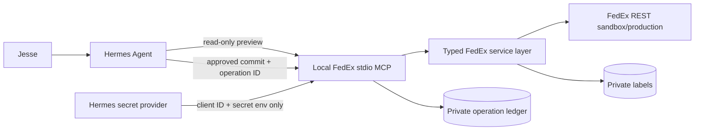

# fix(fedex): harden the FedEx CLI and MCP for Hermes shipping operations

## Goal Capsule

- **Objective:** Reuse the existing FedEx REST client and CLI while making label creation and pickup management safe enough for controlled Hermes use.
- **Primary workflows:** Quote rates, validate shipment inputs, create and cancel shipments/labels, check pickup availability, schedule pickups, and cancel pickups.
- **Authority hierarchy:** This plan > `library/commerce/fedex/AGENTS.md` > repository-root `AGENTS.md`.
- **Execution model:** Patch the existing published CLI in narrow, reviewable PRs. Record each code-level customization in `library/commerce/fedex/.printing-press-patches/`. Do not reprint the CLI or edit generated mirrors such as `registry.json` or `cli-skills/pp-fedex/SKILL.md`.
- **Security posture:** Local stdio MCP only; least-privileged tool surface; explicit approval for every billable or state-changing operation; no secrets or shipping PII committed to Git.
- **Stop condition:** Do not configure production credentials or make production FedEx mutations until Phases 0-5 pass and a human explicitly authorizes Phase 6.

## Current Status

- [x] Fork cloned to `/home/jesse/Git/printing-press-library`.
- [x] Fork points to `git@github.com:jesseraasch/printing-press-library`.
- [x] Audited revision checked out: `c500760614814ccbc0c3e2ce0aebba3d8414e053`.
- [x] Source builds and unit/race tests passed during the pre-adoption audit.
- [x] `govulncheck ./...` found no reachable known vulnerabilities during the audit.
- [x] CLI and MCP behavior probed against a local mock FedEx server; no live FedEx mutation was performed.
- [x] Added `upstream` and created `fix/fedex-mutation-transport`.
- [x] Completed Phase 0 baseline evidence in this clone; the five pre-existing README verifier errors were repaired during the documentation phase.
- [x] Implemented and locally verified Phase 1 transport encoding and mutation retry safety without FedEx credentials or live API calls.
- [x] Implemented and independently reviewed Phase 2 request-bound approvals and the exact eight-tool MCP surface.
- [x] Implemented and independently reviewed Phase 3 private storage, token-cache controls, raw-response removal, and output redaction.
- [x] Implemented and fully validated Phase 4 typed label/pickup workflows, operational ledgers, production routing controls, and reconciliation; no live FedEx call was made.

## Product Contract

### Requirements

#### Safety and approval

- **R1.** Every shipment creation, shipment cancellation, pickup creation, and pickup cancellation must require a separate explicit approval.
- **R2.** The approved payload must be cryptographically bound to the preview the user reviewed; a changed payload requires a new preview and approval.
- **R3.** Preview and dry-run paths must perform no billable or state-changing FedEx request and must not mint credentials unless explicitly documented as an authentication check.
- **R4.** Mutating requests must not be retried automatically after network errors, timeouts, HTTP 429, or HTTP 5xx unless FedEx documents an idempotency mechanism for that exact operation.
- **R5.** Ambiguous mutation failures must return `outcome_unknown` and retain enough local state for reconciliation before another attempt.

#### Least privilege

- **R6.** The default MCP surface must not expose arbitrary FedEx endpoints, SQL, arbitrary local-file paths, imports, exports, or unrestricted webhook destinations.
- **R7.** Read-only and mutating MCP tools must have accurate MCP annotations; mutating tools must remain approval-gated in Hermes.
- **R8.** Hermes integration must use stdio. HTTP MCP transport must be disabled by default; if retained for development, it must bind loopback only and require an explicit opt-in.
- **R9.** MCP sampling must be disabled for this server.

#### Secrets and local data

- **R10.** Credentials supplied through environment variables or Hermes secrets must never be copied into a configuration file.
- **R11.** OAuth access tokens may be cached only when necessary, with owner-only permissions and automatic expiry; client secrets must remain in the configured secret provider.
- **R12.** State directories must be `0700`; configuration, SQLite databases, ledgers, labels, and operation records must be `0600`, including pre-existing paths that need tightening.
- **R13.** Secrets, authorization headers, label payloads, recipient PII, and full upstream error bodies must not enter normal logs or model-visible errors.
- **R14.** Labels and operational state must default to a private local directory outside OneDrive or other synchronized storage.

#### Functional correctness

- **R15.** Single-shipment creation must produce a usable label file and persist the tracking number, service, charge, shipment reference, label path, and FedEx transaction identifiers.
- **R16.** Pickup creation must persist the confirmation number, carrier, scheduled date, and Express location code when returned, because those values are required for cancellation.
- **R17.** Production authentication must persist or derive the production API base URL consistently; obtaining a production token must never result in later requests falling back to sandbox.
- **R18.** The CLI, skill, README, and MCP tool manifests must describe commands and flags that exist at runtime.
- **R19.** Account-rate queries must request both account and list rates and clearly identify the returned rate type.

#### Supply chain and verification

- **R20.** Internal releases must be built from an immutable commit/module version and accompanied by SHA-256 checksums, an SBOM, build metadata, and test results.
- **R21.** Tests must cover request construction, OAuth routing, mutation retry policy, confirmation binding, label handling, pickup persistence, permissions, redaction, and MCP registration.
- **R22.** FedEx sandbox contract tests must pass before production enablement, with the limitations of virtualized sandbox responses documented.

### Scope Boundaries

In scope:

- `library/commerce/fedex` CLI, client, MCP, state store, tests, README, and source `SKILL.md`.
- Narrow installer corrections needed to install the audited FedEx module reproducibly.
- Baicells-private Hermes deployment artifacts in a separate private repository.

Out of scope for the initial release:

- Reimplementing the FedEx REST client or OpenAPI surface.
- Freight/LTL, consolidations, Open Ship, ETD, returns, Ground end-of-day close, tracking daemons, SQL analytics, bulk imports, or webhooks in the Hermes tool surface.
- A shared or Internet-accessible FedEx MCP service.
- Automatic printing; label generation and printer submission remain separate side effects.
- Combining label creation with pickup scheduling into one operation.
- Production mutations before the Phase 6 gate.

## Key Technical Decisions

- **KTD1: Reuse the upstream client and CLI.** This remains a repair/hardening project, not a new FedEx integration.
- **KTD2: Make CLI/service logic the source of truth.** Named MCP handlers call shared typed service functions rather than shelling out or duplicating request construction.
- **KTD3: Remove the generic executor from the default MCP registration.** A normal Hermes tool allowlist cannot constrain `fedex_execute` by endpoint argument, so its broad endpoint reach is incompatible with least privilege.
- **KTD4: Use two-phase mutations.** A read-only preview creates a short-lived local operation record containing a canonical request hash and human-readable summary. The separately approved commit consumes that operation ID once. The digest prevents payload substitution; the Hermes approval prompt supplies the human authorization boundary.
- **KTD5: Fail closed on ambiguous mutations.** Do not blindly retry POST/PUT shipment and pickup mutations. Record `outcome_unknown`, surface reconciliation instructions, and prevent reuse of the same operation until resolved.
- **KTD6: Use environment-backed client credentials.** Hermes injects the client ID and secret only into the stdio subprocess. The CLI may cache a short-lived access token but must not persist environment-provided client secrets.
- **KTD7: Keep state local and private.** Use XDG-aware state/data roots with explicit mode enforcement. The Baicells deployment points them outside synchronized directories.
- **KTD8: Preserve upstreamability.** Generic fixes are made in the public fork and proposed upstream. Baicells addresses, account defaults, operational policy, and Hermes configuration live only in the private deployment repository.

## Target Architecture

### Proposed MCP Surface

Read-only:

- `fedex_get_rates`
- `fedex_get_service_options`
- `fedex_validate_address`
- `fedex_validate_shipment`
- `fedex_pickup_availability`
- `fedex_preview_create_label`
- `fedex_preview_cancel_shipment`
- `fedex_preview_schedule_pickup`
- `fedex_preview_cancel_pickup`
- `fedex_get_operation`

Mutating and approval-gated:

- `fedex_create_label`
- `fedex_cancel_shipment`
- `fedex_schedule_pickup`
- `fedex_cancel_pickup`

Not registered by default:

- `fedex_execute`
- arbitrary import/export/SQL tools
- webhook delivery
- ETD and unrestricted file-upload tools
- bulk shipping until its confirmation and idempotency design is separately reviewed

## Implementation Phases and Tasks

### Phase 0 — Repository and baseline controls

**Goal:** Establish a reproducible baseline before modifying source.

- [x] Added the canonical repository as `upstream`; `upstream/main` matched the audited commit.
- [x] Searched upstream issues and PRs; opened and claimed issue `mvanhorn/printing-press-library#1909` for the Phase 1 defects.
- [x] Created `fix/fedex-mutation-transport`; implementation is not occurring on `main`.
- [x] Recorded baseline commit `c500760614814ccbc0c3e2ce0aebba3d8414e053` and Go `1.27.1`.
- [x] Ran `go mod verify`, `go build ./...`, `go vet ./...`, `go test -race ./...`, and `govulncheck ./...` from `library/commerce/fedex`; all passed with no reachable vulnerabilities.
- [x] Ran the repository skill verifier against `library/commerce/fedex`; it exposed five pre-existing README failures (three bulk-command positional examples and two unquoted secret variables) to repair in U13.
- [x] Captured current MCP `tools/list`, CLI `--help`, versions, hashes, and MCP initialization responses under `/tmp/fedex-baseline/`.
- [x] Added no credentials; Phase 0 used only local builds and MCP initialization.

**Exit criteria:** The clean baseline is reproducible, and failures introduced later can be attributed to the changes.

### Phase 1 — P0 mutation transport and retry safety

**Goal:** Eliminate defects that can malformed or duplicate billable requests.

#### U1. Correct MCP request-body handling

- [x] Added regression tests covering MCP shipment writes plus structured POST/PUT/PATCH client bodies; sabotage runs reproduced the base64-string failure.
- [x] Removed the double marshal between `internal/mcp/code_orch.go` and `internal/client/client.go`.
- [x] Verified GET query encoding remains unchanged with a reserved-character test.
- [x] Recorded the customization in `.printing-press-patches/mcp-request-body-single-json-encoding.json`.

#### U2. Introduce method- and operation-aware retry policy

- [x] Classified GET/HEAD/OPTIONS as safe reads and allowlisted exact read-only FedEx POST paths; all other methods and unknown POST paths fail closed as non-idempotent mutations because no supported FedEx idempotency-key contract is available here.
- [x] Retained bounded backoff for safe reads.
- [x] Disabled automatic retries for shipment create, pickup create, cancellations, return creation, consolidation confirmation, and other unverified mutations.
- [x] Returned a typed `OutcomeUnknownError` after ambiguous transport/5xx failures.
- [x] Tested that one mutation invocation emits at most one upstream mutation request; sabotage runs reproduced the prior four-attempt behavior.
- [x] Recorded the customization in `.printing-press-patches/non-idempotent-mutations-never-blind-retry.json`.

**Exit criteria:** Mock tests prove correctly encoded bodies and a maximum of one upstream request for non-idempotent mutations.

### Phase 2 — P0 approval boundary and narrow MCP

**Goal:** Make the exposed tool surface least-privileged and explicitly approved.

#### U3. Implement preview records and confirmation binding

- [x] Define a canonical mutation payload and SHA-256 digest.
- [x] Persist pending operations with random operation IDs, creation/expiry timestamps, action type, environment, account suffix, request hash, and redacted review summary.
- [x] Exclude credentials and full labels from pending records.
- [x] Give pending operations a short TTL and one-time consumption semantics.
- [x] Reject expired, already-consumed, mismatched, or modified requests.
- [x] Ensure `--dry-run` and preview issue no FedEx mutation.
- [x] Stop `--agent` from implicitly authorizing write commands.
- [x] Require `--yes` plus the matching operation ID and confirmation digest for direct CLI writes; bare `--yes` cannot authorize any state-changing client path.

#### U4. Register only named MCP tools

- [x] Add fixed endpoint handlers for the proposed read-only and mutating tools; deeper request typing remains in Phase 4.
- [x] Give all four read tools operation-specific required schemas and deep server-side request validation, including official rate controls/grouped-package semantics, country-conditional nonblank address minima with empty optional fields accepted where permitted, resolution controls, required shipment pickup/total-weight/payment/payor/label fields, and a shared pickup-availability validator used by both direct reads and scheduling preflight. The pickup validator covers every modeled address field, conditionally requires dimensions for `YOUR_PACKAGING`, and preserves FedEx's inch default when dimension units are blank, null, or omitted. Scheduling accepts the official minimum availability-address projection and binds every supplied address field to the scheduled pickup.
- [x] Apply accurate `readOnlyHint`, `destructiveHint`, `idempotentHint`, and `openWorldHint` annotations.
- [x] Do not register `fedex_execute` in the production/default MCP profile.
- [x] Do not mirror import, export, SQL, webhook, arbitrary file, ETD, bulk, or tracking-daemon commands into the default MCP surface.
- [x] Add a manifest test asserting the exact allowed tool-name set, annotations, and complete nested request-schema parity for all eight tools.
- [ ] Disable sampling in the deployment configuration.
- [x] Record narrow-tool and approval customizations in separate patch-ledger entries.

#### U5. Restrict transport

- [x] Keep stdio as the supported deployment transport.
- [x] Change HTTP mode to explicit opt-in and loopback-only by default.
- [x] Add a test that the default invocation does not open a TCP listener.

**Exit criteria:** An automated MCP protocol test confirms the exact tool set, read-only previews work without approval, and each mutation requires a valid pending operation plus Hermes approval.

### Phase 3 — P0 secrets, PII, and filesystem hardening

**Goal:** Prevent credential and shipment-data leakage.

#### U6. Separate secret providers from persisted configuration

- [x] Refactor credential resolution so environment/Hermes-provided client secrets are never serialized or accepted through argv.
- [x] Cache only short-lived access tokens with bounded expiry when explicitly enabled.
- [x] Make logout clear all cached tokens and legacy authorization headers; do not report credentials cleared while reusable secrets remain.
- [x] Redact credentials and authorization headers from errors, debug output, dry runs, and MCP responses.
- [x] Add tests with sentinel secret strings and assert they never appear in outputs.

#### U7. Enforce private local storage

- [x] Create and tighten state/data directories to `0700`.
- [x] Create and tighten config, database, ledger, pending-operation, and label files to `0600`.
- [x] Refuse unsafe symlinks and unexpected non-regular target files using descriptor-relative operations.
- [x] Use atomic same-directory writes where files are replaced.
- [x] Avoid storing full raw API responses when parsed operational fields are sufficient; scrub legacy raw-response columns.
- [x] Add permission tests for new and pre-existing permissive paths, including live SQLite sidecars.
- [x] Add `FEDEX_DATA_DIR` as the explicit private label/state root; Phase 6 will bind it to the Cabby profile path.

#### U8. Redact model-visible errors and logs

- [x] Parse FedEx error envelopes into allowlisted fields.
- [x] Remove or redact recipient address, phone, email, labels, credentials, and upstream echo bodies.
- [x] Reduce MCP read responses to operation-specific allowlists instead of returning complete decoded FedEx responses.
- [x] Treat dry-run output as sensitive and return a redacted structured summary rather than the complete request body by default.

**Exit criteria:** Automated tests prove owner-only modes and that sentinel secrets/PII do not appear in normal output, errors, or logs.

### Phase 4 — Functional completion for labels and pickups

**Goal:** Make the four approved write workflows complete and recoverable.

#### U9. Single-shipment label workflow

- [x] Add a typed single-shipment service independent of CSV bulk shipping.
- [x] Validate required shipper, recipient, package, service, account, and label-format fields.
- [x] Support PDF first; add ZPLII only after a printer requirement is confirmed.
- [x] Decode and atomically write the label to the private label directory.
- [x] Persist tracking number, service, reference, charge, currency, label path, FedEx transaction ID, request hash, and status.
- [x] Keep label creation separate from printing and pickup scheduling.
- [x] Test malformed, missing, and oversized label payloads.

#### U10. Shipment cancellation workflow

- [x] Preview the exact tracking number, account suffix, and deletion-control mode.
- [x] Persist cancellation status and transaction ID.
- [x] Handle already-cancelled and outcome-unknown states without blind retries.

#### U11. Pickup ledger and scheduling workflow

- [x] Add a pickup table or operation subtype with confirmation number, carrier, scheduled date, Express location code, cutoff/access times, request hash, transaction ID, and status.
- [x] Make pickup availability a required preflight for scheduling unless explicitly overridden with a documented reason.
- [x] Validate the official availability request shape and bind exactly one response option matching the scheduled carrier and date.
- [x] Persist the cancellation identifiers immediately after successful creation.
- [x] Test Ground and Express response variants.

#### U12. Pickup cancellation workflow

- [x] Resolve required cancellation identifiers from the local pickup record.
- [x] Require explicit entry only when a legacy pickup was not created by this tool.
- [x] Mark the record cancelled only after an unambiguous FedEx success response.
- [x] Preserve `outcome_unknown` for ambiguous failures.

#### U13. Production routing and documentation correctness

- [x] Make `auth login --env prod` persist or consistently derive the production base URL.
- [x] Add a guard preventing production tokens from being sent to sandbox and sandbox tokens from being sent to production.
- [x] Correct `fedex` examples to `fedex-pp-cli`.
- [x] Remove unsupported flags and claims from README/SKILL or implement them with tests.
- [x] Update only `library/commerce/fedex/SKILL.md`; do not edit its generated `cli-skills` mirror.

**Exit criteria:** Local integration tests cover successful and failed label create/cancel and pickup create/cancel workflows with persisted recovery identifiers.

### Phase 5 — Reproducible build and FedEx sandbox qualification

**Goal:** Produce an auditable candidate artifact and validate it without production impact.

- [ ] Pin the exact reviewed commit/module version; do not use `main`, `latest`, or `fedex-current` in deployment.
- [ ] Build in a container pinned by image digest with a supported Go patch release.
- [ ] Use deterministic flags such as `CGO_ENABLED=0`, `-trimpath`, and explicit version metadata.
- [ ] Run module verification, unit tests, race tests, `go vet`, `govulncheck`, license scan, and secret scan.
- [ ] Generate SHA-256 checksums, CycloneDX or SPDX SBOM, and build metadata.
- [ ] Rebuild in a second clean environment and compare outputs.
- [ ] Configure FedEx sandbox credentials through the private Hermes secret provider.
- [ ] Run sandbox contract tests for rates, address validation, shipment validation, label creation/cancellation, pickup availability, scheduling, and cancellation.
- [ ] Document which sandbox responses are virtualized and cannot prove production behavior.
- [ ] Verify no label, ledger, config, or credential data lands in OneDrive or Git.

**Exit criteria:** A pinned candidate artifact and sandbox evidence bundle satisfy R1-R22, with known sandbox limitations documented.

### Phase 6 — Hermes integration and controlled production validation

**Goal:** Enable Cabby only after the hardened artifact passes qualification.

- [ ] Create or update the private Baicells deployment repository.
- [ ] Install the pinned local stdio MCP binary for profile `cabby`.
- [ ] Configure Hermes using supported CLI/config commands rather than hand-editing YAML.
- [ ] Inject only the necessary FedEx credentials into the MCP subprocess.
- [ ] Apply the exact MCP tool allowlist and `untrusted` trust posture for write tools.
- [ ] Disable sampling for the FedEx server.
- [ ] Confirm secret redaction remains enabled and Hermes approvals are not set to `off`/YOLO.
- [ ] Verify FedEx project products, account association, negotiated-rate access, and label-certification/BAG prerequisites.
- [ ] Obtain explicit human authorization for the production-validation window.
- [ ] Quote and validate one known low-risk shipment.
- [ ] Create one test label after reviewing the exact preview.
- [ ] Verify tracking number, negotiated rate, label readability, ledger record, and file permissions.
- [ ] Cancel the test shipment if operationally appropriate.
- [ ] Schedule and cancel one controlled pickup after separate approvals.
- [ ] Verify audit and cancellation identifiers, then close the validation window.

**Exit criteria:** The complete production workflow is proven with bounded scope, explicit approvals, correct records, and no duplicate or unintended operations.

### Phase 7 — Upstreaming and lifecycle maintenance

**Goal:** Reduce long-term fork divergence while retaining deployment control.

- [ ] Split work into reviewable upstream PRs using conventional commits.
- [ ] Check and claim upstream issues before beginning each implementation PR.
- [ ] Add one `.printing-press-patches/<id>.json` reprint guard per code-level customization.
- [ ] Add Jesse as a contributor only when code is contributed, following manifest/README/NOTICE conventions.
- [ ] Do not edit release ledgers or generated skill/registry artifacts manually.
- [ ] Resolve all CI and Greptile findings before considering a PR ready.
- [ ] Track upstream acceptance and remove local patches only after equivalent upstream behavior is verified.
- [ ] Schedule periodic dependency, `govulncheck`, FedEx API-change, and sandbox regression reviews.
- [ ] Document credential rotation, incident response, operation reconciliation, and rollback procedures in the private deployment repository.

## Proposed PR Sequence

1. **PR 1 — Transport correctness and mutation retry policy**
   U1-U2, tests, and patch records. No public API shape change beyond safer error behavior.
2. **PR 2 — Confirmation model and narrow MCP surface**
   U3-U5, exact tool manifest tests, and transport restrictions.
3. **PR 3 — Secret and local-data hardening**
   U6-U8, permission migrations, redaction, and logout correctness.
4. **PR 4 — Typed label/pickup workflows, production routing, and documentation alignment**
   U9-U13 with local integration tests and README/SKILL verifier evidence.
5. **Private deployment change — Reproducible artifact and Cabby sandbox integration**
   Phases 5-6; contains no upstream credentials or Baicells shipping data.
6. **Optional upstream installer/release PRs**
   Fix immutable nested-module installation and publish checksummed, attestable release artifacts.

PRs may be split further if review size becomes large. Do not combine unrelated catalog-wide generator fixes with FedEx-specific changes.

## Verification Matrix

| Layer | Required verification |
|---|---|
| Unit | Canonical digest, operation TTL/consumption, retry classification, request mapping, label parsing, pickup persistence, redaction, permissions |
| HTTP client | `httptest` FedEx server covering OAuth, GET, POST, PUT, 429, 5xx, timeout, malformed JSON, and transaction IDs |
| MCP protocol | Initialize, exact `tools/list`, annotations, preview, rejected unapproved mutation, accepted approved mutation, no generic executor |
| CLI | Help/flag consistency, dry run, `--yes` behavior, `--agent` not authorizing writes, exit codes |
| State | New and existing permission modes, migrations, atomic writes, no raw secret/label retention |
| Sandbox | Rates, service/address/shipment validation, label create/cancel, pickup availability/create/cancel |
| Supply chain | Pinned source, module verification, SBOM, checksums, vulnerability scan, clean rebuild comparison |
| Production | One bounded shipment and one separately approved pickup workflow with reconciliation evidence |

## Definition of Done

- [ ] All R1-R22 requirements are covered by implementation and tests.
- [ ] Every code customization has a durable `.printing-press-patches/` record.
- [ ] `go build ./...`, `go vet ./...`, `go test -race ./...`, and `govulncheck ./...` pass.
- [ ] The skill verifier passes against `library/commerce/fedex`.
- [ ] The default MCP tool list contains only the approved named tools.
- [ ] No write tool succeeds without a valid preview record and an approval-gated invocation.
- [ ] No ambiguous mutation is automatically retried.
- [ ] Credentials and shipping PII are absent from Git, normal logs, and model-visible errors.
- [ ] State and labels are owner-only and outside synchronized storage.
- [ ] Sandbox qualification passes and limitations are documented.
- [ ] Production validation is explicitly authorized, bounded, and reconciled.
- [ ] The deployment can be disabled by removing one Hermes MCP configuration entry and revoking the FedEx project credentials.

## Immediate Next Actions

- [x] Added `upstream` and fetched current upstream state.
- [x] Created the PR 1 branch from the chosen baseline.
- [x] Re-ran and recorded the Phase 0 baseline checks in this clone.
- [x] Opened and claimed upstream issue `#1909` for the MCP body-encoding and mutation-retry defects.
- [ ] Implement the failing MCP body-encoding and mutation-retry tests before production code changes.
