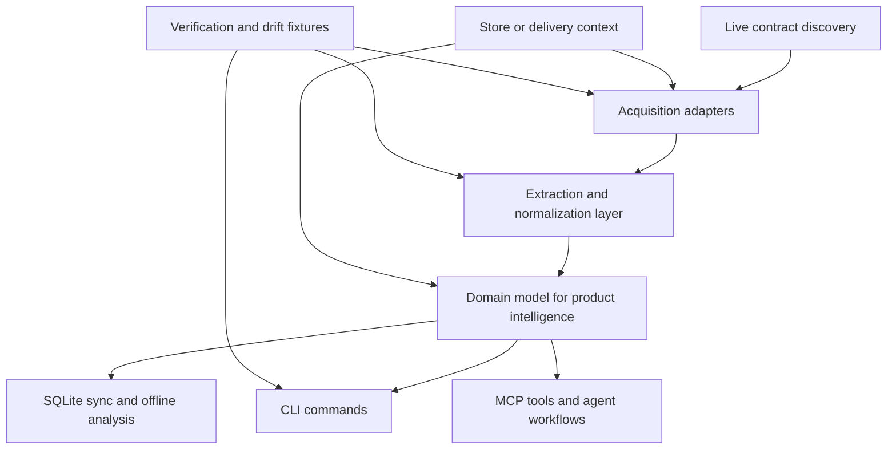
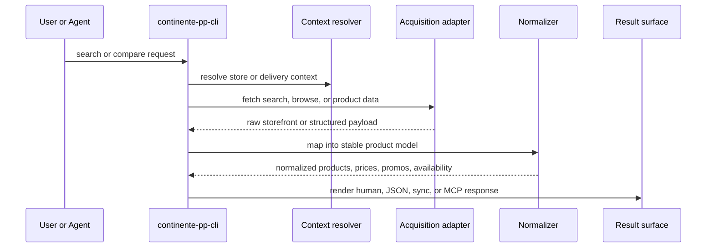

# feat: Continente shopping intelligence CLI

## Summary

Turn `continente-pp-cli` from a useful storefront query prototype into a high-confidence shopping intelligence CLI for `continente.pt`: robust search and browse, structured product detail, normalized price comparison, alternatives, store-aware availability context, offline analysis, and agent-grade MCP ergonomics.

The plan keeps the product read-only and treats the current HTML-parsing surface as a transitional implementation detail rather than the end-state contract.

---

## Problem Frame

The current CLI is good enough to prove value but not good enough to deserve trust as a primary shopping tool. It can search, suggest, and fetch product detail from the live storefront, but it still depends on brittle HTML parsing, exposes only a thin slice of the product model, does not normalize pricing, has no first-class alternatives/comparison surface, and does not yet exploit the generated local store and MCP capabilities to make product analysis genuinely excellent.

The target quality bar is not "more commands." It is a CLI that reliably answers the real shopping questions a user or agent asks:

- What products match this intent?
- What are the best alternatives?
- What is cheaper in a meaningful way?
- What differs by brand, unit size, dietary filter, or store context?
- What can I trust when the storefront contract changes?

Because the target sits on top of an external Salesforce B2C Commerce storefront, the core risk is contract brittleness. The roadmap therefore needs to improve both user-facing capability and contract resilience at the same time.

---

## Assumptions

- The product remains read-only. Cart, checkout, account, order mutation, and payment flows are out of scope for this plan.
- "10/10" includes location-sensitive shopping reality where available: store/delivery context, availability signals, and price differences that may vary by shopper context.
- The primary target is grocery and household product intelligence, not broad storefront feature completeness.
- The best available contract may evolve during implementation from HTML fragments to better structured storefront or Salesforce Commerce API surfaces; the plan should make that migration straightforward rather than freeze the current parser shape.

---

## Requirements

### Search And Discovery

- R1. The CLI must support high-quality product discovery across typed search, suggestion, category browsing, and filter-driven exploration.
- R2. Search results must expose enough structured data to compare products without opening each product page individually.
- R3. The CLI must support pagination and result-window traversal explicitly, rather than implicitly returning only the first storefront page.
- R4. The CLI must expose category, brand, and relevant storefront refinements in a structured way suitable for both humans and agents.

### Product Intelligence

- R5. Product detail must expose a stable normalized product model that goes beyond the current fields of name, brand, category, and raw price.
- R6. The CLI must surface meaningful price intelligence, including pack-vs-unit interpretation when available and clear handling of ambiguous storefront pricing.
- R7. The CLI must support first-class alternative finding and product comparison for a given intent or anchor product.
- R8. The CLI must expose promotions, discount context, and shopper-relevant merchandising signals when the storefront contract makes them available.

### Store And Context Awareness

- R9. The CLI must support store-aware or delivery-aware context where the storefront exposes it, including availability-sensitive shopping outputs.
- R10. Context selection must be explicit and inspectable so users and agents know which store or delivery context shaped the output.

### Reliability And Analysis

- R11. The live query layer must be resilient to storefront markup drift by isolating extraction logic and by preferring more structured contracts whenever available.
- R12. The local SQLite store and MCP surface must become useful for offline search, structured comparison, and agent workflows instead of remaining mostly generic scaffold.
- R13. Verification must cover both behavioral correctness and contract drift risks using live smoke coverage plus parser-focused tests.

---

## Scope Boundaries

### In Scope

- Search, suggestions, browse, filters, pagination, and product detail
- Alternatives, comparison, and normalized pricing
- Promotions and shopper-facing merchandising signals where recoverable
- Store or delivery context selection and context-aware outputs
- Contract discovery and migration toward more structured surfaces
- Local sync/store improvements for offline analysis
- MCP and agent-facing ergonomics for the product intelligence surface
- Documentation and verification needed to trust the CLI

### Deferred to Follow-Up Work

- Meal planning, pantry management, or recipe workflows built on top of product data
- Personalized ranking or recommendation heuristics beyond deterministic comparison and alternatives
- Historical price tracking across repeated crawls if it requires a larger retention model than the current local store shape

### Outside This Product's Identity

- Checkout, basket mutation, authentication-heavy shopper account flows
- Order history, loyalty workflows, payment, or delivery-slot booking
- General-purpose storefront automation unrelated to product discovery and comparison

---

## High-Level Technical Design

The plan separates capability work into four layers:

1. **Contract discovery and acquisition**: identify the best available live surfaces for search, browse, detail, promotions, and context.
2. **Normalization and extraction**: convert mixed storefront responses into a stable domain model.
3. **User-facing intelligence commands**: search, browse, compare, alternatives, price intelligence, context selection.
4. **Offline and agent interfaces**: sync/store, SQL/search analysis, MCP tools, and docs.





---

## Output Structure

The plan likely introduces a clearer product-intelligence layout under `internal/` so contract acquisition, normalization, and command behavior stop living in a single parsing file.

```text
internal/
  acquisition/
    storefront/
    structured/
  domain/
    product.go
    price.go
    context.go
    comparison.go
  normalize/
    products.go
    pricing.go
    promotions.go
  cli/
    promoted_*.go
    context_*.go
    compare_*.go
    browse_*.go
  mcp/
  store/
```

The exact file names may shift during implementation, but the architectural split should remain.

---

## Key Technical Decisions

- KTD1. Prefer structured commerce surfaces over HTML fragments whenever they are live-accessible without private shopper credentials.
  - Rationale: Salesforce guidance favors SCAPI for new work, and a structured surface materially lowers drift risk versus scraping controller-rendered HTML. If structured surfaces are not accessible from the current storefront context, the implementation still isolates HTML extraction behind the same acquisition boundary so a later migration is cheap.

- KTD2. Introduce a stable internal product-intelligence domain model before adding more user-facing commands.
  - Rationale: capabilities like alternatives, comparison, normalized pricing, and offline analysis all depend on a richer shared model. Continuing to bolt features directly onto ad hoc parsing guarantees duplication and inconsistent semantics.

- KTD3. Treat pricing as a first-class subsystem, not a field on the product tile.
  - Rationale: current raw storefront price values are insufficient for trustworthy comparison. The CLI needs explicit handling of display price, pack price, unit price when available, discount context, and ambiguity flags.

- KTD4. Make context selection explicit and reusable.
  - Rationale: location-sensitive shopping output is meaningless if the user cannot inspect or control the store or delivery context. Context should be a named surface in both CLI and MCP flows, not an invisible side effect.

- KTD5. Use dual verification: deterministic parser fixtures plus live smoke checks.
  - Rationale: fixture-only testing misses storefront drift; live-only testing is too flaky and too opaque for development. Both are required to keep the contract trustworthy.

- KTD6. Keep the product read-only and optimize for shopping intelligence.
  - Rationale: read-only scope is what allows rapid capability expansion without dragging in authentication, transactional state, and high-risk mutation semantics.

---

## System-Wide Impact

- The command surface will expand from three promoted reads to a coherent shopping toolkit, which affects CLI discoverability, MCP tool taxonomy, README guidance, and agent context output.
- The local store will stop being a generic scaffold and become a durable analysis surface, which may require schema changes and better sync resource definitions.
- Contract handling will move from "parse the current markup" to "choose and normalize the best available contract," which affects client behavior, drift testing, and failure semantics across the whole repo.
- Store-context handling may introduce configuration, profile, and local-state concerns that affect `doctor`, `profile`, `sync`, and MCP context reporting.

---

## Risks & Dependencies

- **External contract volatility:** current storefront HTML and controller endpoints can change without notice.
  - Mitigation: acquisition adapter boundary, structured-surface discovery, parser fixtures, live smoke checks.

- **Price ambiguity:** storefront fields may reflect pack prices, promotions, or shopper-context pricing in ways that are not yet normalized.
  - Mitigation: explicit price model with confidence/ambiguity fields and test fixtures from multiple product shapes.

- **Store-context complexity:** availability and pricing may depend on delivery or store selection that is not currently modeled in the CLI.
  - Mitigation: add context resolution early and make all context-dependent outputs explicit.

- **Sync mismatch:** the generated sync/store layer is generic and may not align naturally with the product-intelligence domain model.
  - Mitigation: evolve sync resources only after the domain model is defined, and keep domain normalization reusable by both live and offline paths.

- **Agent surface fragmentation:** raw generated MCP tools and promoted CLI commands can diverge in semantics.
  - Mitigation: define shopping-intelligence MCP tools that mirror the promoted command contract rather than exposing only raw generated endpoints.

---

## Sources / Research

- Local code patterns:
  - `internal/cli/storefront_parsing.go`
  - `internal/cli/promoted_suggest.go`
  - `internal/cli/promoted_pesquisa.go`
  - `internal/cli/promoted_produto.go`
  - `internal/cli/sync.go`
  - `internal/store/store.go`
  - `internal/mcp/tools.go`
  - `internal/client/client.go`

- External references:
  - Salesforce SCAPI guidance: https://developer.salesforce.com/docs/commerce/commerce-api/guide/why-use-scapi.html
  - Salesforce SCAPI getting started: https://developer.salesforce.com/docs/commerce/commerce-solutions/guide/scapi-get-started.html
  - Salesforce OCAPI overview: https://developer.salesforce.com/docs/commerce/commerce-solutions/guide/get-started-with-ocapi.html
  - Salesforce search and navigation considerations: https://developer.salesforce.com/docs/commerce/commerce-api/guide/b2c-search-and-navigation-implementation-considerations.html

---

## Implementation Units

### U1. Establish the acquisition and domain-model foundation

- **Goal:** replace the current one-file parsing strategy with explicit acquisition and normalization boundaries plus a richer internal product domain model.
- **Requirements:** R5, R6, R11, R12
- **Dependencies:** none
- **Files:** `internal/cli/storefront_parsing.go`, `internal/client/client.go`, `internal/types/types.go`, `internal/domain/product.go`, `internal/domain/price.go`, `internal/domain/context.go`, `internal/normalize/products.go`, `internal/normalize/pricing.go`, `internal/normalize/products_test.go`
- **Approach:** introduce a stable product-intelligence model that can represent product identity, brand, hierarchy, display price, normalized price, promo fields, availability, and confidence or ambiguity markers. Move current regex and embedded-JSON extraction behind an acquisition-to-normalization seam so later structured-surface adapters can slot in without rewriting commands.
- **Patterns to follow:** keep request behavior aligned with `internal/client/client.go`; preserve the agent-friendly response and provenance behavior already shaped in the promoted command layer.
- **Test scenarios:**
  - Happy path: parsing a known search tile yields product identity, brand, category path, canonical URL, and image.
  - Happy path: parsing a known product page yields normalized detail with base product identity, availability, and product metadata.
  - Edge case: missing brand or image does not fail normalization; the output marks the missing fields explicitly.
  - Edge case: storefront payload includes malformed or partial embedded JSON; normalization fails with a targeted extraction error rather than silent truncation.
  - Error path: unsupported contract shape is surfaced as an adapter or parser failure distinct from network failure.
  - Integration scenario: the promoted commands can consume the new normalized model without changing the generic client request flow.
- **Verification:** the repo has deterministic parser tests for the normalized model and the promoted commands still emit valid structured responses for existing live smoke cases.

### U2. Discover and adopt better live contract surfaces

- **Goal:** identify the best available live surfaces for search, browse, detail, promotions, and context, and migrate off HTML-only assumptions where possible.
- **Requirements:** R1, R4, R8, R9, R11
- **Dependencies:** U1
- **Files:** `internal/acquisition/storefront/search.go`, `internal/acquisition/storefront/product.go`, `internal/acquisition/structured/search.go`, `internal/acquisition/structured/product.go`, `internal/cli/doctor.go`, `internal/acquisition/contracts_test.go`, `README.md`
- **Approach:** perform a structured discovery pass over the storefront and any accessible Salesforce Commerce APIs or structured endpoints, then codify an acquisition strategy hierarchy: structured primary when available, storefront fragment fallback when not. Surface contract health and chosen adapter in `doctor` so users can see whether the CLI is running in a resilient or degraded mode.
- **Patterns to follow:** mirror the client transport and no-cache patterns already used for live reads; preserve read-only semantics.
- **Test scenarios:**
  - Happy path: when a structured search surface is configured or discoverable, the search path uses it and returns normalized output.
  - Happy path: when only storefront fragments are available, the CLI falls back cleanly and still returns normalized output.
  - Edge case: structured surface is partially available for detail but not browse; per-capability adapter selection remains coherent.
  - Error path: adapter discovery failure is visible in `doctor` with a clear degraded-mode explanation.
  - Integration scenario: promoted commands and MCP tools report consistent behavior regardless of which adapter is active.
- **Verification:** the repo documents the selected contract strategy, and live smoke coverage proves both the preferred path and the fallback path when available.

### U3. Build first-class search, browse, filter, and pagination commands

- **Goal:** make product discovery excellent, not merely possible.
- **Requirements:** R1, R2, R3, R4
- **Dependencies:** U1, U2
- **Files:** `internal/cli/promoted_suggest.go`, `internal/cli/promoted_pesquisa.go`, `internal/cli/browse.go`, `internal/cli/filters.go`, `internal/cli/pagination.go`, `internal/mcp/tools.go`, `internal/cli/browse_test.go`, `internal/cli/filters_test.go`
- **Approach:** expand the query surface from the current `suggest` and `pesquisa` flows into a structured browse-and-filter toolkit. Add explicit commands or flags for category browsing, brand or dietary filters, sort options, and page traversal. Normalize result metadata so users can inspect available refinements before applying them.
- **Execution note:** implement the user-facing command contract test-first at the promoted-command level, then fill in adapter and normalization support beneath it.
- **Patterns to follow:** preserve promoted-command ergonomics from `internal/cli/promoted_*.go`; keep MCP parity through `internal/mcp/tools.go`.
- **Test scenarios:**
  - Happy path: `pesquisa --q <term>` returns multiple normalized products with stable ordering and count metadata.
  - Happy path: category browse returns products plus structured category or refinement metadata.
  - Happy path: applying brand or dietary filters changes the result set and echoes the active filters in the response.
  - Edge case: pagination requests past the available range return an empty-but-valid result envelope rather than an unclassified parser error.
  - Edge case: the storefront exposes new or unknown refinements; the CLI preserves them structurally instead of dropping them.
  - Error path: invalid filter combinations return a clear usage or contract error.
  - Integration scenario: MCP clients can invoke the same discovery capabilities without falling back to raw generated `on_*` endpoint tools.
- **Verification:** a user can discover products through query, browse, and refinement flows without manually reverse-engineering storefront parameters.

### U4. Add normalized pricing and promotion intelligence

- **Goal:** make product prices trustworthy and comparable.
- **Requirements:** R2, R5, R6, R8
- **Dependencies:** U1, U2
- **Files:** `internal/domain/price.go`, `internal/normalize/pricing.go`, `internal/normalize/promotions.go`, `internal/cli/compare.go`, `internal/cli/promoted_produto.go`, `internal/normalize/pricing_test.go`, `internal/cli/compare_test.go`
- **Approach:** define a price model that distinguishes raw storefront display price, effective price, unit price when derivable, pack quantity, discount context, and ambiguity. Extract promo badges and discount signals into structured fields rather than burying them in images or free text. Add comparison-friendly output so command consumers can sort or filter by meaningful price views.
- **Patterns to follow:** keep domain-model logic separate from command rendering; reuse structured output helpers already in `internal/cli/storefront_parsing.go`.
- **Test scenarios:**
  - Happy path: a standard product with a simple price yields both display price and normalized comparison fields.
  - Happy path: a discounted product yields promo metadata and a clear effective-price representation.
  - Edge case: multi-pack or bundle-style products expose ambiguity markers when unit math is incomplete.
  - Edge case: products without promo data still normalize cleanly with empty promo fields.
  - Error path: contradictory storefront price signals are surfaced as structured ambiguity, not silent math.
  - Integration scenario: `produto` and comparison outputs agree on price semantics for the same product.
- **Verification:** comparison outputs can answer "which is cheaper?" with explicit semantics and ambiguity where needed.

### U5. Introduce alternatives and comparison as first-class capabilities

- **Goal:** let users find substitutes and evaluate tradeoffs directly from the CLI.
- **Requirements:** R2, R5, R6, R7
- **Dependencies:** U3, U4
- **Files:** `internal/domain/comparison.go`, `internal/cli/alternatives.go`, `internal/cli/compare.go`, `internal/mcp/tools.go`, `internal/cli/alternatives_test.go`, `internal/cli/compare_test.go`, `README.md`
- **Approach:** define deterministic alternative-finding rules driven by query intent, category proximity, brand diversity, price range, and relevant shopper filters. Add comparison commands that can anchor on a product slug or on a search result set, returning sortable structured output.
- **Patterns to follow:** keep ranking or grouping logic explicit and inspectable rather than opaque. Follow the existing JSON-first output discipline in the promoted command surface.
- **Test scenarios:**
  - Happy path: alternatives for a known product return same-category comparable items with enough fields to choose between them.
  - Happy path: comparison across multiple product IDs or URLs returns side-by-side structured pricing and category data.
  - Edge case: exact-brand duplicates or pack variants are grouped or labeled distinctly rather than misrepresented as independent alternatives.
  - Edge case: sparse result sets return a minimal valid alternatives response instead of pretending richer confidence than exists.
  - Error path: unknown anchor product or malformed input returns a targeted not-found or usage error.
  - Integration scenario: alternatives can be generated from live search results and from synced local data using the same domain model.
- **Verification:** a user can ask for meaningful substitutes and comparisons without manually copying results into external tooling.

### U6. Add explicit store or delivery context and availability awareness

- **Goal:** make outputs reflect the shopper context that actually shapes availability and price.
- **Requirements:** R8, R9, R10
- **Dependencies:** U1, U2
- **Files:** `internal/domain/context.go`, `internal/cli/context.go`, `internal/cli/profile.go`, `internal/cli/doctor.go`, `internal/acquisition/storefront/context.go`, `internal/cli/context_test.go`, `internal/cli/profile_test.go`
- **Approach:** model store or delivery context as explicit CLI state with inspection and profile support. Teach live acquisition paths to resolve or apply context safely, and ensure outputs always expose which context was active. Where the storefront exposes availability or location-sensitive merchandising, normalize it into the product model.
- **Patterns to follow:** reuse profile and doctor patterns already present in `internal/cli/profile.go` and `internal/cli/doctor.go`.
- **Test scenarios:**
  - Happy path: selecting a context changes subsequent live queries and the output declares the active context.
  - Happy path: a saved profile preserves context for repeated shopping queries.
  - Edge case: no context is configured; the CLI uses a clear default and reports it explicitly.
  - Edge case: a previously valid context becomes unavailable and the CLI surfaces a recoverable error.
  - Error path: invalid context selection is rejected before a live query is sent.
  - Integration scenario: context-aware live queries and context-aware offline records share the same identifiers and reporting shape.
- **Verification:** users and agents can trust that the reported availability and pricing reflect a named shopper context.

### U7. Turn sync and SQLite into a real offline product-analysis surface

- **Goal:** make offline search and analysis a first-class strength rather than a generated promise.
- **Requirements:** R12, R13
- **Dependencies:** U1, U3, U4, U5, U6
- **Files:** `internal/cli/sync.go`, `internal/store/store.go`, `internal/store/extras.go`, `internal/cli/search_local.go`, `internal/mcp/tools.go`, `internal/store/store_test.go`, `internal/cli/sync_test.go`
- **Approach:** define sync resources and storage tables around the normalized product model instead of the generic generated resource abstraction alone. Ensure synced records support offline discovery, alternatives, pricing analysis, and ad hoc SQL. Add explicit local search behavior where it materially improves speed or offline usability.
- **Patterns to follow:** preserve WAL and concurrency safeguards in `internal/store/store.go`; keep sync warning and anomaly semantics coherent with the existing generated sync engine.
- **Test scenarios:**
  - Happy path: a sync run populates normalized product records that can be queried offline for search and comparison.
  - Happy path: local search or SQL can answer category, brand, and price questions without live API calls after sync.
  - Edge case: partial sync failures preserve usable prior data and emit structured warnings.
  - Edge case: schema upgrades preserve prior synced records or fail with an explicit migration path.
  - Error path: unsupported incremental behavior for a resource is surfaced clearly rather than silently producing stale data.
  - Integration scenario: a product retrieved live and the same product retrieved from local sync share the same comparison semantics.
- **Verification:** offline analysis becomes materially useful for agents and human users, not just theoretically possible.

### U8. Harden MCP, docs, and verification for a 10/10 surface

- **Goal:** make the expanded product-intelligence surface discoverable, testable, and trustworthy for both humans and agents.
- **Requirements:** R11, R12, R13
- **Dependencies:** U3, U4, U5, U6, U7
- **Files:** `internal/mcp/tools.go`, `internal/cli/agent_context.go`, `internal/cli/which.go`, `internal/cli/doctor.go`, `README.md`, `SKILL.md`, `tools-manifest.json`, `internal/mcp/tools_test.go`, `internal/cli/root_test.go`
- **Approach:** replace raw generated endpoint emphasis with task-level MCP tools and command discovery around shopping intelligence. Update docs so the CLI advertises its real strengths and known limits. Add live smoke fixtures, parser fixtures, and command-level tests that make contract drift visible early.
- **Patterns to follow:** follow the existing agent-context and which-command patterns so agents can discover capability without reading README prose.
- **Test scenarios:**
  - Happy path: MCP tool discovery surfaces search, browse, compare, alternatives, and context flows clearly.
  - Happy path: `which` and `agent-context` reflect the promoted shopping-intelligence surface rather than mostly generated endpoint names.
  - Edge case: degraded contract mode is reflected in docs or doctor output without breaking tool discovery.
  - Error path: live smoke failures produce actionable diagnostics rather than opaque command failures.
  - Integration scenario: README examples, CLI behavior, and MCP tool descriptions all agree on the supported product-intelligence workflows.
- **Verification:** a new user or agent can discover and trust the CLI without prior repository context.

---

## Alternative Approaches Considered

- **Stay on HTML parsing and simply add more commands**
  - Rejected because it front-loads user-visible capability while deepening contract brittleness and duplicate parsing logic.

- **Jump immediately to SCAPI or OCAPI and discard storefront parsing**
  - Rejected as the first move because the accessible contract surface for `continente.pt` may not allow that cleanly from the current public context. The plan instead creates an acquisition boundary that can adopt structured surfaces where available and degrade gracefully where not.

- **Invest only in offline sync and defer live-query quality**
  - Rejected because the CLI needs to be trustworthy in its primary interactive mode first. Offline analysis is valuable, but not if the live contract and normalized domain model remain weak.

---

## Phased Delivery

- **Phase 1:** U1-U2 foundation and contract discovery
- **Phase 2:** U3 search and browse excellence
- **Phase 3:** U4-U5 pricing, comparison, and alternatives
- **Phase 4:** U6 context awareness and U7 offline analysis
- **Phase 5:** U8 MCP, docs, and verification hardening

This phasing keeps the early work focused on the shared model and contract seams so later user-facing capabilities do not need to be reworked.

---

## Documentation And Operational Notes

- README examples should evolve from raw search to full shopping workflows: search, compare, alternatives, context selection, and offline analysis.
- `doctor` should become the user-facing place to inspect contract health, active adapter choice, local-store readiness, and context status.
- Live smoke coverage should use a small stable set of known products and queries so failures indicate contract drift rather than random merchandising variation.

