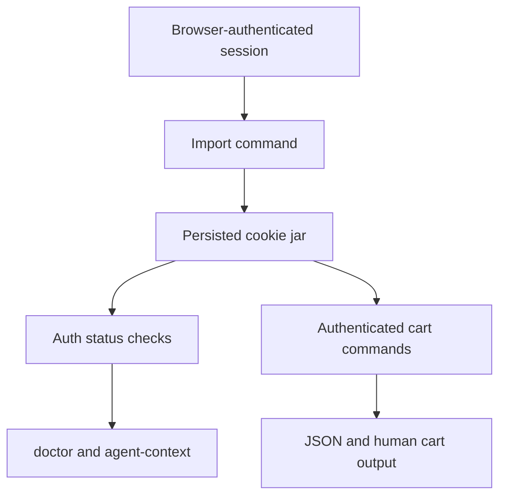

# feat: authenticated cart session import

## Summary

Add the first authenticated layer to `continente-pp-cli` by importing a real browser session, persisting that authenticated state safely, exposing session status, and supporting the cart operations that require a logged-in storefront session.

This plan deliberately stops before first-party credential login. The goal is authenticated cart usefulness with the lowest-risk architecture.

---

## Problem Frame

The CLI can already mutate a guest cart, but the useful shopper workflows on `continente.pt` extend beyond anonymous cart state. The full cart page, persisted account-tied cart behavior, and some shopper-specific cart surfaces depend on an authenticated browser session that the CLI cannot currently reuse.

The repository already has the hard part of the low-risk path in place:

- persisted cookie-jar support in `internal/client/`
- live-confirmed guest cart mutations in `internal/cli/cart.go`
- a real authenticated browser capture proving the storefront uses cookie-backed cart flows after login

What is missing is a safe way to import and reuse authenticated browser state, plus the cart commands that consume that state. That work is materially lower risk than building direct credential login and should stand on its own as a shippable slice.

---

## Requirements

### Session Import And State

- R1. The CLI must support importing authenticated browser session material into its persisted cookie jar without storing raw HAR data in the repo.
- R2. The imported session must be inspectable through a dedicated auth-status surface so users and agents can tell whether the current cookie jar appears authenticated.
- R3. Session import must preserve the existing guest-cart behavior rather than replacing it with an auth-only model.
- R4. Session handling must remain explicit about the domains involved in the authenticated flow, especially `www.continente.pt` and `login.continente.pt`.

### Authenticated Cart Workflows

- R5. The CLI must support the authenticated cart operations proven by the live storefront contract: mini-cart inspection, quantity update, line-item removal, and cart clear.
- R6. Cart operations must use the live wire shape already observed from the storefront, including line-item UUID-driven actions where required.
- R7. Cart outputs must surface enough line-item identity to let a user or agent safely perform follow-up cart mutations.

### Safety And Verification

- R8. The implementation must avoid writing secret-bearing browser captures into the repo or logs.
- R9. Verification must distinguish guest-cart behavior from authenticated-cart behavior and prove the authenticated happy path with imported session state.
- R10. The agent-facing CLI metadata must stop advertising auth as `none` once imported-session auth exists.

---

## Scope Boundaries

### In Scope

- Browser-session import into the persisted cookie jar
- Auth status detection and reporting
- Authenticated cart quantity update, remove, clear, and mini-cart inspection
- Agent-context and doctor updates that reflect cookie-session auth
- Documentation for how to import and verify an authenticated session

### Deferred To Follow-Up Work

- Direct username/password login
- MFA or OTP-aware login behavior
- Shopper benefits, coupons, or loyalty-specific workflows beyond core cart operations

### Outside This Plan

- Checkout
- Payment
- Order history
- Profile editing
- General account automation unrelated to cart state

---

## High-Level Technical Design

The plan extends the existing cookie-jar foundation into an explicit authenticated-session layer. Session import becomes the boundary between external browser state and CLI-owned state; the cart commands consume only the persisted jar and do not know how the session was acquired.

---

## Key Technical Decisions

- KTD1. Treat imported browser session state as the primary authenticated architecture for phase one.
  - Rationale: the login flow is feasible but more brittle. Session import gets authenticated utility quickly while reusing the proven cookie-jar foundation already in the repo.

- KTD2. Keep session acquisition separate from cart behavior.
  - Rationale: cart commands should operate on a persisted authenticated cookie jar regardless of whether the session came from guest browsing, browser import, or a future direct login flow.

- KTD3. Represent auth as session-backed capability, not bearer-token configuration.
  - Rationale: the observed storefront contract is cookie-driven across multiple domains, so the existing static auth-header shape is the wrong abstraction for this feature.

- KTD4. Use contract-proven cart parameters and line-item identifiers directly.
  - Rationale: the live storefront already defines the shape for quantity update and item removal. Reusing that shape minimizes guesswork and keeps behavior aligned with the site.

- KTD5. Surface authentication state conservatively.
  - Rationale: status should report whether the current session appears authenticated from live storefront behavior, not claim durable account identity from fragile heuristics.

---

## System-Wide Impact

- The config and client layers gain first-class authenticated session state, which affects all future account-aware features.
- The CLI surface expands from guest cart workflows to mixed guest/auth cart workflows, which changes how `doctor`, `agent-context`, and docs describe the tool.
- Cart output needs a more mutation-friendly shape because authenticated update and remove actions require stable line references, not just display-oriented mini-cart summaries.

---

## Risks & Dependencies

- **Session fragility:** imported browser cookies may expire quickly or depend on login-domain state.
  - Mitigation: add explicit auth-status checks and documentation that imported sessions are reusable but not guaranteed long-lived.

- **Multi-domain cookie handling:** the auth flow spans storefront and login domains.
  - Mitigation: make session import explicit about accepted domains and keep jar persistence domain-aware.

- **Secret leakage risk:** HAR files and cookie exports contain active session material.
  - Mitigation: never store them in the repo; document ephemeral local import only; avoid echoing sensitive values in output.

- **Cart contract drift:** line-item update and removal shapes may change.
  - Mitigation: fixture tests for known request assembly plus live smoke checks against imported sessions.

---

## Sources / Research

- Local code patterns:
  - `internal/client/client.go`
  - `internal/client/cookiejar.go`
  - `internal/cli/cart.go`
  - `internal/config/config.go`
  - `internal/cli/agent_context.go`

- Live storefront behavior observed on 2026-06-05:
  - `Cart-AddProduct`
  - `Cart-MiniCart`
  - `Cart-UpdateQuantity`
  - `Cart-RemoveProductLineItem`
  - `Cart-RemoveAllProductLineItems`
  - `/checkout/carrinho/` redirecting to login when session is not authenticated

- Browser-authenticated capture observed outside the repo on 2026-06-05:
  - authenticated storefront cart operations remain cookie-backed
  - quantity update and remove actions are line-item-driven and do not require a separate CSRF token in the observed flow

---

## Implementation Units

### U1. Add explicit auth session import and status commands

- **Goal:** let a user or agent import local browser session material and inspect whether the current cookie jar appears authenticated.
- **Requirements:** R1, R2, R4, R8, R10
- **Dependencies:** none
- **Files:** `internal/cli/auth.go`, `internal/cli/auth_import.go`, `internal/cli/auth_status.go`, `internal/cli/root.go`, `internal/config/config.go`, `internal/client/cookiejar.go`, `internal/cli/agent_context.go`, `internal/cli/auth_test.go`
- **Approach:** introduce a focused `auth` command group for importing browser session state and checking current status. Keep import inputs narrow and explicit, such as browser-exported cookies or a sanitized local capture, and hydrate the existing persisted jar rather than inventing a second session store.
- **Patterns to follow:** reuse the persisted-state conventions already present in `internal/config/config.go` and `internal/client/cookiejar.go`; keep CLI command ergonomics aligned with the existing promoted command set under `internal/cli/`.
- **Test scenarios:**
  - Happy path: importing valid browser cookies persists a jar that can be reloaded by a fresh CLI process.
  - Happy path: `auth status` reports authenticated when the imported session can reach an auth-gated storefront surface.
  - Edge case: importing cookies for only one of the participating domains yields a clear degraded-status response rather than a false authenticated success.
  - Error path: malformed cookie import input fails with a targeted usage error and does not corrupt the existing jar.
  - Error path: expired imported cookies produce a non-authenticated status without deleting otherwise valid guest-cart cookies.

### U2. Extend cart commands for authenticated mutation workflows

- **Goal:** support the cart mutations that depend on an authenticated session and expose the line-item data required to drive them safely.
- **Requirements:** R5, R6, R7, R9
- **Dependencies:** U1
- **Files:** `internal/cli/cart.go`, `internal/cli/cart_test.go`, `internal/cli/storefront_parsing.go`, `internal/cli/storefront_parsing_test.go`
- **Approach:** add authenticated cart update and remove commands on top of the observed storefront contract, and enrich mini-cart parsing or auxiliary cart parsing enough to expose line-item UUIDs and product identifiers needed for follow-up mutations.
- **Patterns to follow:** extend the current cart command group rather than creating a separate authenticated cart namespace; keep output compatible with existing `emitStructuredOutput` behavior.
- **Test scenarios:**
  - Happy path: quantity update assembles the live storefront request shape, including UUID and product identity, and returns structured cart output.
  - Happy path: remove line item assembles the observed remove request and returns structured cart output.
  - Happy path: mini-cart output exposes the line references needed for update/remove flows.
  - Edge case: a requested UUID is missing from the current cart state and the command fails with a cart-specific validation error before issuing a live mutation.
  - Error path: authenticated cart mutation against an expired session reports an auth/session failure distinct from a generic network error.

### U3. Update operator surfaces and docs for mixed guest/auth cart behavior

- **Goal:** make the CLI self-describing once session-backed auth exists.
- **Requirements:** R3, R9, R10
- **Dependencies:** U1, U2
- **Files:** `internal/cli/doctor.go`, `internal/cli/agent_context.go`, `README.md`, `docs/plans/2026-06-05-002-feat-authenticated-cart-session-plan.md`, `internal/cli/root_test.go`
- **Approach:** teach the CLI introspection surfaces to describe session-backed auth modes, document the local-only import workflow, and clarify which cart commands work as guest versus authenticated flows.
- **Patterns to follow:** preserve the generated CLI structure and keep new documentation concrete and runnable.
- **Test scenarios:**
  - Happy path: `agent-context` no longer reports `auth.mode = none` when session-backed auth is configured.
  - Happy path: doctor or equivalent status surfaces indicate whether the jar exists and whether the last auth check succeeded.
  - Edge case: a clean machine with no imported session still documents guest cart capability without implying authenticated readiness.
