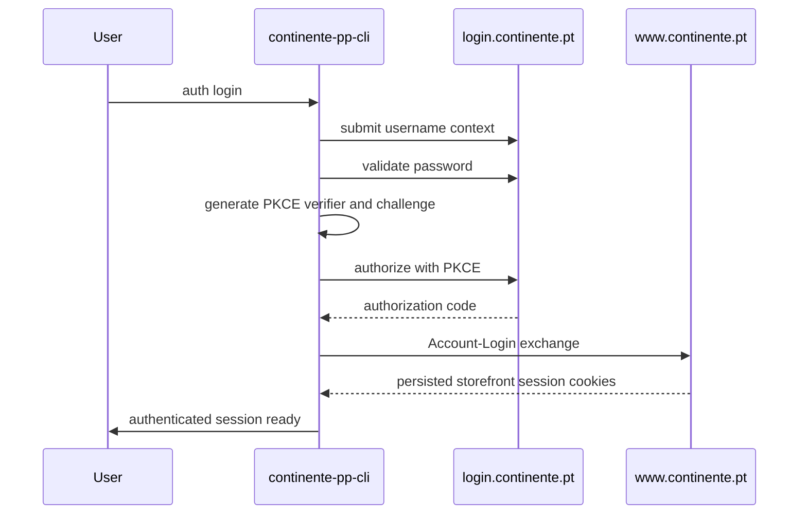

# feat: direct continente login

## Summary

Add first-party `auth login` to `continente-pp-cli` by reproducing the observed `continente.pt` credential flow: login-domain username and password validation, PKCE-backed authorization, and storefront session establishment.

This plan assumes the imported-session architecture already exists and treats it as the fallback path when direct login is unavailable or degraded.

---

## Problem Frame

Imported browser sessions are the pragmatic first authenticated slice, but they are not the end-state ergonomic bar for a CLI. A useful shopper CLI should be able to establish its own authenticated storefront session without requiring the user to export browser cookies every time.

The observed auth flow is now concrete enough to plan:

- username discovery on `login.continente.pt`
- password validation on the login domain
- PKCE-based authorization code acquisition
- storefront `Account-Login` exchange that turns that authorization result into `www.continente.pt` session state

That makes direct login feasible, but it is more fragile than session import because it depends on a JS-driven auth surface, cross-domain cookies, and potential future MFA or anti-bot steps. It deserves its own plan and its own verification bar.

---

## Requirements

### Direct Login Flow

- R1. The CLI must support direct credential login against the observed Continente auth flow without relying on a browser-exported session.
- R2. The login implementation must generate and manage the PKCE verifier and challenge required by the observed authorization step.
- R3. A successful direct login must end in a persisted storefront session that the existing cookie-jar-based cart layer can reuse.
- R4. The implementation must preserve the browser-session import path as a supported fallback rather than replacing it.

### Failure And Degradation

- R5. The CLI must distinguish invalid credentials, expired intermediate auth state, and unexpected flow changes as separate failure classes where the observed contract allows it.
- R6. If the live login flow introduces MFA, OTP, CAPTCHA, or other unsupported breakpoints, the CLI must fail clearly and direct the user to the browser-session import path.
- R7. The implementation must avoid logging credentials, authorization codes, or session cookies.

### Verification And Maintainability

- R8. The login code must be isolated enough that contract drift in the auth flow does not spill across the cart and session-management code.
- R9. Verification must prove the direct login happy path against the live flow and also cover degraded cases without embedding real secrets in tests.
- R10. The auth command surface must make the relationship between `auth login`, `auth import`, and `auth status` explicit for both humans and agents.

---

## Scope Boundaries

### In Scope

- Direct username/password login
- PKCE generation and authorization-code handling
- Storefront session establishment through the observed `Account-Login` exchange
- Failure handling that degrades to browser-session import when the flow cannot be completed

### Deferred To Follow-Up Work

- MFA-aware login completion
- OTP challenges
- FIDO2 or SSO-specific flows
- Long-lived refresh-token or device-trust semantics if the live site introduces them

### Outside This Plan

- Checkout and payment
- Non-cart account workflows
- Loyalty or benefits automation beyond what already depends on a logged-in storefront session

---

## High-Level Technical Design

Direct login should be implemented as a narrow auth-flow module that ends by hydrating the same persisted cookie jar used by imported sessions and cart commands.

---

## Key Technical Decisions

- KTD1. Build direct login on top of the same persisted cookie-jar architecture used by imported sessions.
  - Rationale: cart behavior should remain session-driven regardless of how the session was acquired, and duplicated session storage would create unnecessary divergence.

- KTD2. Isolate the login flow into a dedicated auth module rather than scattering the steps across generic client helpers.
  - Rationale: the login flow is a contract-sensitive sequence, not a general HTTP primitive. Isolation makes drift easier to reason about and test.

- KTD3. Treat browser-session import as the supported fallback for unsupported auth breakpoints.
  - Rationale: the live login surface may add MFA or anti-bot steps that are impractical for a CLI. Fallback behavior must be part of the design, not an afterthought.

- KTD4. Model login failures by stage.
  - Rationale: username step failure, password validation failure, authorization failure, and storefront exchange failure represent different operator actions and different debugging paths.

- KTD5. Keep secret handling one-way and minimal.
  - Rationale: credentials and intermediate auth artifacts are substantially more sensitive than the current read-oriented CLI state and must not bleed into logs, config, fixtures, or docs.

---

## System-Wide Impact

- The client layer gains an auth-flow subsystem that is more stateful than the rest of the generated request surface.
- The `auth` command family becomes the canonical entry point for all authenticated behavior, which affects docs, agent-context semantics, and user expectations.
- Direct login creates a stronger need for stage-specific error modeling and operator-safe debug output across the CLI.

---

## Risks & Dependencies

- **Contract drift:** the login SPA and backing endpoints may change independently of the storefront cart contract.
  - Mitigation: isolate the flow, verify live against stage boundaries, and preserve browser-session import as a fallback.

- **Unsupported auth challenges:** MFA, OTP, CAPTCHA, or FIDO2 may appear for some accounts or sessions.
  - Mitigation: detect unsupported stages where possible and fail toward documented browser import rather than looping or guessing.

- **Secret exposure:** login introduces passwords, authorization codes, and richer session material.
  - Mitigation: keep credentials ephemeral, avoid persistence outside the cookie jar, and design tests around mocked stage responses plus manual live verification.

- **Cross-domain cookie semantics:** login-domain and storefront-domain cookies interact in sequence-sensitive ways.
  - Mitigation: keep domain-aware cookie handling in the auth module and reuse the existing persisted jar once the storefront session is established.

---

## Sources / Research

- Local code patterns:
  - `internal/client/client.go`
  - `internal/client/cookiejar.go`
  - `internal/config/config.go`
  - `internal/cli/cart.go`
  - `internal/cli/agent_context.go`

- Browser-authenticated capture observed outside the repo on 2026-06-05:
  - `POST /api/username`
  - `POST /api/email/login/validate-password`
  - `GET /api/credentials/authorize` with PKCE parameters
  - `POST /on/demandware.store/Sites-continente-Site/default/Account-Login`

- Live storefront/auth discovery observed on 2026-06-05:
  - login page points at `https://login.continente.pt`
  - storefront login handoff uses `Account-Login`
  - the JS auth surface advertises multiple possible challenge branches, including OTP and FIDO2-related paths

---

## Implementation Units

### U1. Introduce a dedicated direct-login flow module

- **Goal:** model the observed auth handshake as an isolated flow that can establish a storefront session from credentials.
- **Requirements:** R1, R2, R3, R7, R8
- **Dependencies:** imported-session foundation from Plan 1
- **Files:** `internal/auth/login_flow.go`, `internal/auth/pkce.go`, `internal/auth/login_flow_test.go`, `internal/client/client.go`
- **Approach:** implement the login sequence as staged requests and responses with explicit handoff points between login-domain and storefront-domain behavior. Keep PKCE generation and stage assembly in the auth module rather than in generic request helpers.
- **Patterns to follow:** preserve the existing client as the underlying HTTP transport, but avoid turning auth-stage logic into generic client behavior.
- **Test scenarios:**
  - Happy path: a staged mocked login flow yields a storefront session persisted into the shared cookie jar.
  - Happy path: PKCE generation produces verifier and challenge values acceptable to the observed authorization step shape.
  - Error path: invalid credential response fails at the correct stage without attempting the storefront exchange.
  - Error path: missing or malformed authorization result yields a stage-specific auth error.
  - Error path: storefront exchange failure leaves no false authenticated status in the jar.

### U2. Add CLI auth-login ergonomics and fallback behavior

- **Goal:** expose direct login as a safe CLI command that coexists with session import and status inspection.
- **Requirements:** R4, R5, R6, R7, R10
- **Dependencies:** U1
- **Files:** `internal/cli/auth.go`, `internal/cli/auth_login.go`, `internal/cli/auth_status.go`, `internal/cli/root.go`, `internal/cli/auth_test.go`, `internal/cli/agent_context.go`
- **Approach:** add `auth login` with credential input patterns appropriate for a CLI, surface stage-specific failures, and explicitly route unsupported challenge branches toward session import rather than pretending they are generic auth errors.
- **Patterns to follow:** keep the `auth` command family cohesive and consistent with the existing CLI output and error-classification patterns.
- **Test scenarios:**
  - Happy path: `auth login` establishes a reusable storefront session visible to `auth status`.
  - Error path: invalid credentials produce a user-facing auth failure distinct from unsupported challenge flow.
  - Error path: an unsupported challenge branch returns a clear fallback message pointing to session import.
  - Safety case: credentials are accepted through a non-echoing or stdin-driven path and never persisted to config.

### U3. Strengthen verification and operational guidance for direct login

- **Goal:** prove the direct-login slice without baking real secrets or unstable live captures into the codebase.
- **Requirements:** R8, R9, R10
- **Dependencies:** U1, U2
- **Files:** `internal/auth/login_flow_test.go`, `internal/cli/auth_test.go`, `README.md`, `docs/plans/2026-06-05-003-feat-direct-auth-login-plan.md`
- **Approach:** keep automated coverage focused on deterministic stage behavior and use explicit manual live verification guidance for the final end-to-end check. Document when to prefer browser-session import over direct login.
- **Patterns to follow:** match the repo’s existing distinction between deterministic tests and live behavior verification.
- **Test scenarios:**
  - Happy path: deterministic auth-flow fixtures cover the complete staged handshake without real secrets.
  - Degraded case: simulated MFA or OTP branch surfaces the intended fallback path.
  - Manual verification case: a live direct login establishes a cart-usable session and can be validated by subsequent cart commands.
