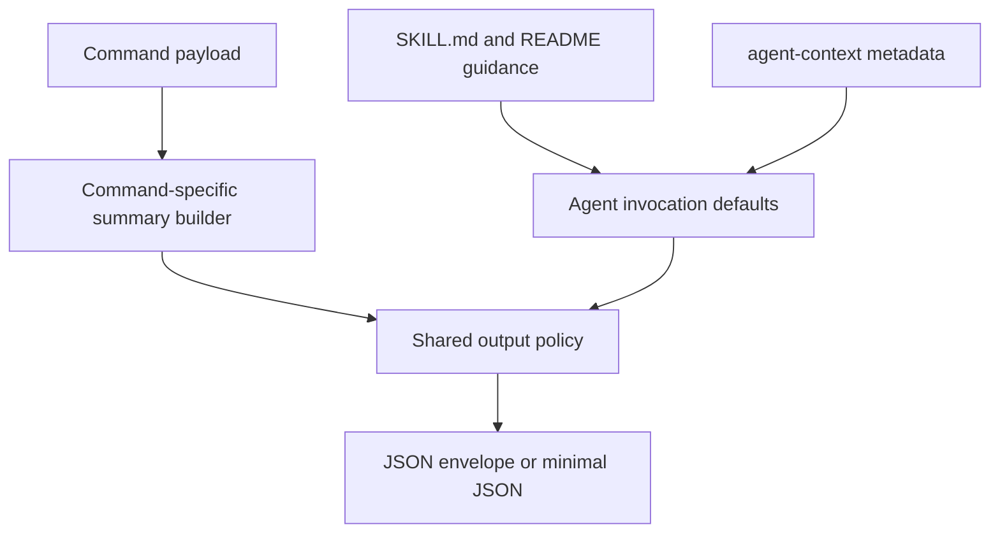

# perf: token-efficient CLI and agent output

## Summary

Reduce token waste across `continente-pp-cli` by making machine output an explicit product surface instead of a side effect of generic JSON wrapping. The plan covers both repo code and repo-local agent guidance: slimmer command payloads, stricter output modes, and clearer skill/README defaults so agents ask for smaller shapes on the first call.

---

## Problem Frame

The CLI already has the right intent signals for agent use: `--agent`, `--compact`, `--select`, JSON-by-default when piped, and a provenance envelope. The problem is that the current implementation still starts from rich payloads for many commands and trims them only after the fact. That works for broad compatibility, but it wastes tokens in the exact flows this repo now cares about: product search, cart mutation follow-ups, checkout inspection, and agent introspection.

The bloat shows up in three places:

- High-volume commands like `cart mini`, `cart add`, `checkout status`, `checkout stores`, and `checkout slots` keep rich top-level payloads even when the caller only needs a short operational summary.
- The shared output layer always wraps JSON in `meta/results`, which is useful for provenance but expensive when every agent hop already knows it is calling this CLI live.
- The repo-local skill still describes `--agent` mostly as "JSON + compact" instead of a more opinionated small-context contract, so agents are not guided toward the narrowest possible result shape up front.

This is not just a formatting problem. It is an interface-contract problem between the CLI, the repo-local skill, and any agent that consumes the CLI repeatedly inside a constrained context window.

---

## Requirements

### Machine Output Contract

- R1. The CLI must provide an explicit low-token machine output contract for agent use rather than relying only on generic `--compact` field stripping.
- R2. The low-token contract must preserve the operationally important fields for each high-volume command, even when the full payload is much richer.
- R3. Callers must be able to opt back into richer payloads without losing the existing JSON-capable surface.

### Metadata And Envelope Control

- R4. Provenance and other envelope metadata must remain available, but the CLI must support a cheaper default for agent flows where that metadata is redundant.
- R5. Output controls must be easy to compose with `--json`, `--select`, and existing command semantics rather than introducing a confusing parallel system.

### Agent Guidance

- R6. The repo-local skill and README must steer agents toward the lowest-cost invocation pattern for common tasks such as search, cart inspection, checkout inspection, and auth checks.
- R7. `agent-context` must advertise the output-shape contract clearly enough that an introspecting agent can discover the low-token path without reading source.

### Verification

- R8. Verification must prove both behavioral correctness and payload-size improvement for the most common agent-facing commands.
- R9. The plan must avoid silent regressions where a command appears compact but still carries large nested structures or redundant wrapper fields.

---

## Scope Boundaries

### In Scope

- Output-shape controls and defaults in `internal/cli/root.go`, `internal/cli/helpers.go`, and `internal/cli/storefront_parsing.go`
- Command-specific compact payload shaping for the highest-volume command families
- Repo-local skill and README guidance for low-token agent usage
- `agent-context` updates needed to advertise the new contract
- Tests that lock down compact output shape and size-sensitive regressions

### Deferred For Later

- Reworking the MCP server output contract independently of the CLI unless the CLI changes naturally simplify it
- Broader sync/store schema changes unrelated to output size
- Prompt tuning outside this repo's own `SKILL.md`, README, and CLI discovery surfaces

### Outside This Plan

- Replacing the underlying storefront acquisition model
- Large command-surface redesigns unrelated to output size
- Checkout/payment/product-scope feature expansion

---

## Key Technical Decisions

- KTD1. Introduce a first-class machine output profile instead of overloading generic `--compact` alone.
  - Rationale: `--compact` currently behaves like a shared field-pruning pass. That is too weak for commands whose expensive fields are command-specific. A named profile such as `agent`, `minimal`, or equivalent command-level contract gives the codebase a stable target to optimize around.

- KTD2. Keep provenance available, but make metadata emission policy explicit.
  - Rationale: some agent flows need `meta.source` and store context; many do not. Treating envelope richness as a policy choice instead of a universal wrapper lowers cost without deleting useful debugging data.

- KTD3. Prefer command-specific summary payloads over generic post-filtering for cart, checkout, `which`, and `agent-context`.
  - Rationale: these commands already know which fields matter operationally. Encoding that knowledge in the command path is both cheaper and more reliable than hoping a shared compactor infers the right fields.

- KTD4. Make the repo-local skill part of the product contract.
  - Rationale: if the skill still teaches agents to ask for larger shapes than necessary, CLI-side optimization alone will underperform. The lowest-cost path must be documented where agents actually discover usage patterns: `SKILL.md`, `README.md`, and `agent-context`.

- KTD5. Verify output reduction with shape-focused tests, not just behavioral tests.
  - Rationale: token-efficiency regressions are often structurally correct JSON. Tests must assert the absence of heavy fields and the presence of the minimum useful ones.

---

## High-Level Technical Design

The work splits into two interacting layers:

1. **CLI output contract**: introduce an explicit small-shape machine mode, command-aware compact payload builders, and configurable metadata wrapping.
2. **Agent guidance layer**: update the repo-local skill, README examples, and `agent-context` so agents request the small shape by default instead of discovering it accidentally.

---

## Implementation Units

### U1. Define the low-token machine output contract

- **Goal:** Add a stable, explicit output policy for machine callers so the CLI can distinguish full JSON from low-token JSON without relying only on generic compacting.
- **Files:** `internal/cli/root.go`, `internal/cli/helpers.go`, `internal/cli/storefront_parsing.go`
- **Patterns to follow:** existing `--agent`, `--compact`, `--select`, and provenance wrapping behavior in `internal/cli/root.go` and `internal/cli/helpers.go`
- **Plan:** introduce one coherent control surface for output shape and metadata policy. This can be a new flag, an extension of `--agent`, or a small policy enum, but it must avoid duplicating the current overlapping behavior of `--json`, `--compact`, `--plain`, and `--quiet`.
- **Test files:** `internal/cli/helpers_test.go`, `internal/cli/provenance_test.go`, `internal/cli/root_test.go`
- **Test scenarios:**
  - Agent-mode output uses the low-token contract by default.
  - Full JSON remains available when explicitly requested.
  - Provenance metadata can be emitted in full, minimally, or not at all according to the chosen policy.
  - `--select` still wins when the caller wants an even narrower subset.

### U2. Replace generic compacting with command-aware summaries on heavy commands

- **Goal:** Ensure the most verbose commands emit hand-picked compact payloads instead of sending full nested state through a shared compactor.
- **Files:** `internal/cli/cart.go`, `internal/cli/checkout.go`, `internal/cli/which.go`, `internal/cli/agent_context.go`, optionally `internal/cli/auth.go`
- **Patterns to follow:** existing `humanRows` summaries in `checkout` and `cart` commands; curated `which` envelope logic
- **Plan:** define compact payload builders for the highest-value agent commands. For example:
  - cart state should prefer item identity, quantity, price, and line UUIDs
  - checkout state should prefer store, shipment identity, selected slot, and slot references
  - `agent-context` should gain a compact discoverability shape rather than always returning the full command tree
- **Test files:** `internal/cli/cart_test.go`, `internal/cli/checkout_test.go`, `internal/cli/auth_test.go`, `internal/cli/agent_context_test.go`, `internal/cli/which_test.go`
- **Test scenarios:**
  - Compact cart output omits bulky action maps and irrelevant nested fields while preserving line UUIDs and totals.
  - Compact checkout output keeps slot refs and selected-state fields but omits repeated full page-derived metadata.
  - Compact `agent-context` returns enough structure for runtime discovery without the full recursive flag tree.
  - Full mode still returns the richer structures for debugging and manual inspection.

### U3. Align repo-local agent guidance with the new contract

- **Goal:** Make the low-token path discoverable and default in the places agents actually read.
- **Files:** `SKILL.md`, `README.md`, `internal/cli/agent_context.go`
- **Patterns to follow:** existing Agent Mode sections in `SKILL.md` and `README.md`
- **Plan:** update examples and wording so the documented default for agent usage is the new low-token contract, including concrete examples for search, cart, and checkout. `agent-context` should expose output-profile guidance or equivalent discovery hints.
- **Test files:** `internal/cli/agent_context_test.go`
- **Test scenarios:**
  - `agent-context` exposes the existence and intended use of the low-token contract.
  - README and skill examples demonstrate narrow-field invocation instead of broad JSON examples where a narrower one is better.

### U4. Add regression tests around payload size and shape

- **Goal:** Prevent future regressions where output remains valid but grows materially larger again.
- **Files:** `internal/cli/helpers_test.go`, `internal/cli/cart_test.go`, `internal/cli/checkout_test.go`, `internal/cli/agent_context_test.go`
- **Patterns to follow:** current provenance and parser tests; prefer shape assertions over brittle byte-for-byte snapshots unless a snapshot is the clearest fit
- **Plan:** add tests that assert:
  - presence of minimum required compact fields
  - absence of known-heavy fields in compact mode
  - relative size reduction for representative fixtures on targeted commands
- **Test files:** same as above
- **Test scenarios:**
  - compact output is materially smaller than full output for cart, checkout, and agent-context fixtures
  - low-token output remains parseable and operationally sufficient for downstream command chaining

---

## Risks & Dependencies

- **Flag sprawl:** adding another output knob could make the CLI harder to reason about.
  - Mitigation: define one policy surface that explains how it composes with `--json`, `--compact`, `--select`, and `--agent`, and document that surface clearly.

- **Compatibility drift:** existing consumers may already depend on today's wrapped JSON shapes.
  - Mitigation: preserve explicit full-output paths and treat the low-token contract as an additive or clearly gated behavior rather than a silent breaking change.

- **Over-pruning:** aggressive compacting can remove fields needed for follow-up operations.
  - Mitigation: build compact payloads from actual workflow requirements, especially cart line UUIDs, slot refs, scheduler IDs, and auth/session state.

- **Documentation lag:** CLI changes without skill/readme changes will leave agents using the old, more expensive path.
  - Mitigation: keep the documentation and `agent-context` changes in the same unit of work as the CLI contract changes.

---

## Acceptance Examples

- AE1. When an agent runs a product or cart inspection command in agent mode, the default JSON shape is small enough to support follow-up reasoning without first adding manual `--select` filters.
- AE2. When an agent needs debugging detail, it can request the richer JSON path explicitly and still receive provenance metadata and full nested structures.
- AE3. When an agent introspects the CLI via `agent-context`, it can discover the preferred low-token output contract without reading `SKILL.md`.
- AE4. When a human runs the same commands in a terminal, the human-friendly table behavior remains intact.

---

## Sources / Research

- Local code and docs:
  - `internal/cli/root.go`
  - `internal/cli/helpers.go`
  - `internal/cli/storefront_parsing.go`
  - `internal/cli/cart.go`
  - `internal/cli/checkout.go`
  - `internal/cli/which.go`
  - `internal/cli/agent_context.go`
  - `internal/cli/provenance_test.go`
  - `README.md`
  - `SKILL.md`
