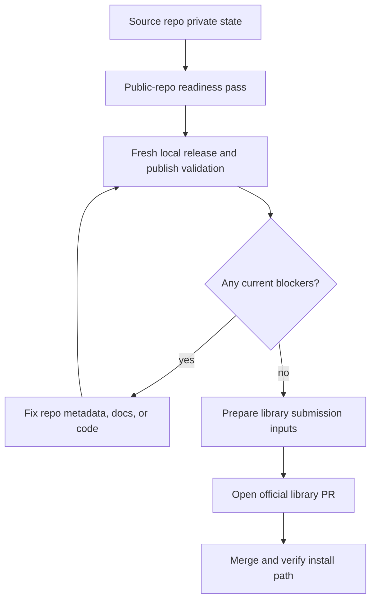

# chore: Publish continente to the official Printing Press library

## Summary

Take the `continente` CLI from a synced but still-private source repo to an accepted `printing-press-library` publication path. The work focuses on the remaining release gates: public-repo readiness, fresh local publish validation, library-facing metadata correctness, and the actual upstream publish PR flow.

---

## Problem Frame

The repo already has the core release scaffolding that the earlier hardening pass aimed for: contributor docs, CI, a release-readiness workflow, and Printing Press metadata files. The missing outcome is publication itself. Today the source repo remains private, the official library install path is still future-state documentation, and no accepted upstream library PR exists yet. The remaining work is therefore not product expansion; it is the final publish path from this repo into the public Printing Press ecosystem.

---

## Requirements

### Repo Visibility And Trust

- R1. The GitHub source repo must be safe to expose publicly: no staged or documented secrets, no misleading publication claims, and a clean explanation of what is source-available now versus library-published later.
- R2. The repo must preserve a reproducible public baseline through existing automation and documentation so an outside reviewer can build and validate it without chat history.

### Publication Gate Readiness

- R3. The current repo state must pass the local source-release gate documented in `docs/release-readiness.md`, including `make verify-release`.
- R4. The current repo state must pass the Printing Press publish validator documented in `docs/release-readiness.md`, including `make validate-publish`, or else every remaining blocker must be made explicit and fixed before publish proceeds.
- R5. `.printing-press.json`, `manifest.json`, proof artifacts, and public-facing documentation must describe the CLI as it actually exists today, including authenticated session-backed capabilities and the distinction between source checkout and library artifact.

### Official Library Submission

- R6. The publish flow must resolve the correct API slug, category, and library metadata for `continente` without relying on ad hoc operator memory.
- R7. The upstream publish PR to `mvanhorn/printing-press-library` must contain only the library-managed source files expected by the publish workflow, not generated library artifacts that the upstream bots regenerate post-merge.
- R8. After the upstream PR is prepared, maintainers must have a short, explicit checklist for the remaining human steps: public flip timing, PR review, merge, and post-merge install verification.

---

## Scope Boundaries

### In Scope

- Reconfirming public-repo readiness against the repo’s current state
- Revalidating and fixing any current publish-gate failures
- Tightening library-facing metadata and documentation where they still drift from reality
- Preparing the official Printing Press library submission path and maintainer handoff

### Deferred to Follow-Up Work

- New storefront product features or broader auth/cart capability work
- Automated release orchestration beyond the minimum publish path
- Library post-merge polish beyond verifying that install paths and docs resolve correctly

### Outside This Plan

- Rewriting generated CLI surfaces without a validator-driven need
- Expanding the CLI into deeper checkout or ordering automation
- Marketing or launch collateral outside the engineering publication path

---

## Key Technical Decisions

- KTD1. Treat this as a publish-execution plan, not another generic release-hardening pass: only touch code or metadata when the current readiness gates prove it is necessary.
- KTD2. Use the repo’s own documented separation of states as the control model: source-ready, public-repo-ready, and official-library-publish-ready stay distinct until each is explicitly verified.
- KTD3. Keep the source repo as the truth for product behavior and let the upstream `printing-press-library` automation own generated registry artifacts. The publish PR should avoid manual edits to upstream-generated files.
- KTD4. Re-derive publish decisions from live repo state and current metadata rather than trusting yesterday’s validator outcome. The repo already changed once after the earlier hardening plan; the final publish path needs a fresh pass.

---

## High-Level Technical Design

---

## System-Wide Impact

This work affects three external trust surfaces at once: the public GitHub repo, the official Printing Press library entry, and the downstream install paths that agents and humans will use after publication. Errors here do not just break local development; they create misleading public documentation, broken install commands, or upstream review churn.

---

## Implementation Units

### U1. Reconfirm the public source repo baseline

- **Goal:** Ensure the current repo can be made public without exposing local-only state or overstating publication status.
- **Requirements:** R1, R2
- **Dependencies:** None
- **Files:** `README.md`, `docs/release-readiness.md`, `.gitignore`
- **Approach:** Re-audit the current source repo against the repo’s own public-readiness checklist. Tighten only the files that define the external trust boundary: README publication language, the readiness doc, and ignore rules for local session or secret-bearing artifacts. The output of this unit is a repo that can be flipped public without ambiguity.
- **Patterns to follow:** Existing publication-status wording in `README.md`; the three-state framing already present in `docs/release-readiness.md`.
- **Test scenarios:**
  - Verify the docs distinguish source checkout status from official library publication status without claiming the latter prematurely.
  - Verify common local secret and session files remain ignored by git and are not described as committed setup requirements.
  - Verify an outside contributor can identify the supported local validation path from the repo docs alone.
- **Verification:** The repo can be reviewed as a public source repository without hidden local prerequisites or misleading publication claims.

### U2. Refresh the release and publish gates against current repo state

- **Goal:** Replace stale assumptions with a fresh, current pass of the repo’s documented readiness gates.
- **Requirements:** R3, R4, R5
- **Dependencies:** U1
- **Files:** `Makefile`, `.github/workflows/ci.yml`, `.github/workflows/release-readiness.yml`, `.printing-press.json`, `manifest.json`, `.manuscripts/20260604-223045/proofs/phase5-acceptance.json`, `.manuscripts/20260604-223045/proofs/phase5-skip.json`
- **Approach:** Use the existing `verify-release` and `validate-publish` surfaces as the authoritative gate. Any current failure should be fixed at its real source: Go code, metadata, workflow parity, or missing proof artifacts. Do not add bespoke validation paths that differ from the repo’s own documented contract.
- **Execution note:** Start with failing gate evidence and tighten only the specific surface each failure points to.
- **Patterns to follow:** Current Makefile target structure; existing GitHub workflow parity between local and CI validation.
- **Test scenarios:**
  - Verify the local source-release gate covers tests, vet, and both binaries without requiring undocumented setup.
  - Verify the publish validator accepts the current metadata and proof surface for `continente`.
  - Verify any fix for a validator failure preserves the documented behavior and does not silently downgrade authenticated CLI capabilities in metadata.
  - Verify CI still mirrors the local validation path after any readiness fixes.
- **Verification:** The repo’s own documented gates succeed on the current branch, or every remaining blocker is explicit and actionable.

### U3. Prepare the official library submission payload

- **Goal:** Convert a locally publish-ready repo into a clean upstream submission for `printing-press-library`.
- **Requirements:** R5, R6, R7
- **Dependencies:** U2
- **Files:** `.printing-press.json`, `manifest.json`, `README.md`, `SKILL.md`
- **Approach:** Confirm the API slug, category, display metadata, and library-facing behavior claims that the publish flow will project upstream. Keep source-repo docs aligned with the future library install path while ensuring the actual upstream PR only carries the library-managed files that the Printing Press publish flow expects. This is also where any last drift between readme copy and metadata should be removed.
- **Patterns to follow:** Current `continente` naming and install examples already used in `README.md`; existing metadata structure in `.printing-press.json` and `manifest.json`.
- **Test scenarios:**
  - Verify the metadata resolves the `continente` slug and expected display identity consistently across publish-facing files.
  - Verify the documented install examples describe post-merge library behavior rather than implying it already exists today.
  - Verify the upstream publish payload excludes generated registry artifacts that the library bots own.
- **Verification:** A maintainer can start the publish flow with one consistent set of repo and metadata inputs and no ambiguous library-facing claims.

### U4. Drive the upstream publish PR and maintainer handoff

- **Goal:** Finish with a concrete official-library submission and a short remaining-steps checklist for maintainers.
- **Requirements:** R6, R7, R8
- **Dependencies:** U3
- **Files:** `docs/release-readiness.md`, `README.md`, `docs/plans/2026-06-07-002-chore-release-hardening-publication-plan.md`
- **Approach:** Capture the maintainer-facing handoff for the exact sequence after the repo is locally ready: when to flip the source repo public, how to open the upstream library PR, what not to edit in that PR, and what to verify after merge. Keep this as a concise operational checklist rather than a script dump.
- **Patterns to follow:** Existing concise runbook tone in `docs/release-readiness.md`; the upstream publish workflow constraints documented in the Printing Press publish skill.
- **Test scenarios:**
  - Verify a maintainer can tell whether the next action is “flip public,” “fix gate failures,” or “open the library PR.”
  - Verify the handoff checklist warns against manual edits to upstream-generated library artifacts.
  - Verify post-merge validation includes at least one real install-path check for the published `continente` artifact.
- **Verification:** A maintainer can execute the final human steps to publication without reconstructing the process from chat or memory.

---

## Risks & Dependencies

- The source repo is still private today, so any publish sequence that assumes public visibility first must account for when that flip happens.
- The local validator contract may have drifted since the prior hardening pass even if the repo files look complete on inspection.
- The upstream library workflow owns generated registry and skill artifacts; manual edits to those files in a publish PR can cause automatic rejection.
- The current working tree contains unrelated untracked docs, so publication work should avoid pulling those files into readiness or publish commits accidentally.

---

## Sources & Research

- `README.md` — current publication-status language and post-publication install promises
- `docs/release-readiness.md` — current three-state release model and local publish gate
- `Makefile` — repo-native validation entry points
- `.github/workflows/ci.yml` — current public-facing CI baseline
- `.github/workflows/release-readiness.yml` — current publish-validation workflow
- `.printing-press.json` — current Printing Press metadata for `continente`
- `manifest.json` — current MCP/publication manifest
- `SKILL.md` — agent install contract that should stay aligned with library publication
- Current GitHub repo state for `emmassist-co/continente-pp-cli` on `2026-06-08` — repo visibility remains `private`
