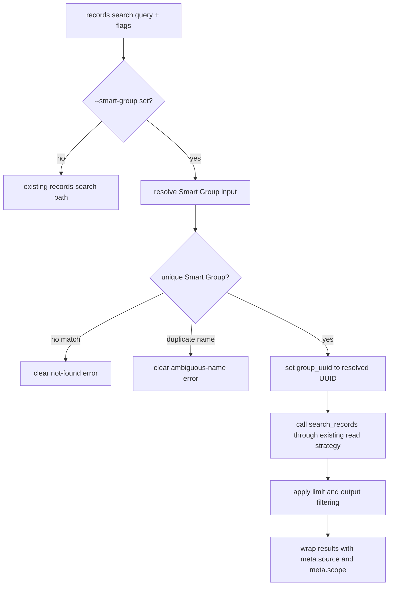

# feat: Add Smart Group scope resolution to records search

## Summary

Add `--smart-group` to `devonthink-pp-cli records search` so users and agents can scope a normal DEVONthink query to a Smart Group by UUID, exact name, or DEVONthink path. The command remains read-only, delegates the final record search through `search_records` with `group_uuid`, and enriches the normal provenance envelope with `meta.scope`.

---

## Problem Frame

Downstream tools need a stable CLI contract for searches such as reimbursement follow-up lists without embedding raw MCP calls or hand-resolving Smart Group UUIDs. The current command already accepts `--group` and maps it to MCP `group_uuid`, but Smart Groups are easier for humans to name and safer for agents to treat as a scoped search source than as a workflow-policy surface.

---

## Requirements

- R1. `records search <query> --smart-group <input>` accepts a Smart Group UUID and uses it as the search scope.
- R2. The same flag resolves an exact Smart Group name or DEVONthink path to one Smart Group UUID before running the record search.
- R3. Ambiguous exact-name matches fail clearly and list enough candidate context for the user or agent to disambiguate.
- R4. The final record search still calls the existing `search_records` path with `group_uuid`; Smart Group resolution must not create a separate result source.
- R5. `--agent`, `--json`, and `--select` preserve the existing result envelope and field-selection behavior.
- R6. Successful Smart Group scoped JSON output includes `meta.scope.type`, `meta.scope.input`, and `meta.scope.uuid`.
- R7. The feature remains read-only and documents Smart Groups as search scopes only, not action-workflow policy.
- R8. Generated-tree local customization intent is recorded under `.printing-press-patches/` so a future reprint can preserve the change.
- R9. Smart Group scoping fails clearly when the caller forces local cached data because cached records cannot reproduce DEVONthink Smart Group membership.

---

## High-Level Technical Design



---

## Key Technical Decisions

- KTD1. Keep Smart Group scoping on `records search`, not in maintenance workflows: this preserves the CLI as a local data access layer while leaving filing policy and action semantics to downstream tools.
- KTD2. Resolve by official MCP read tools before the final search: `search_records` already returns Smart Groups with `kind:smartgroup`, and the local adapter already routes reads through the official local MCP bridge.
- KTD3. Treat `--group` and `--smart-group` as mutually exclusive scopes: allowing both would make the final `group_uuid` source ambiguous.
- KTD4. Extend the provenance envelope with optional scope metadata: `wrapWithProvenance` is already the stable place where `meta.source` is emitted, and applying `--select` before wrapping keeps `meta.scope` intact for agent consumers.
- KTD5. Prefer exact matching over fuzzy matching: exact name and normalized path matches are deterministic, while fuzzy matching would make ambiguous Smart Groups harder to diagnose.
- KTD6. Treat Smart Group scope as live-only: local cached reads may still support ordinary `records search`, but Smart Group membership is dynamic DEVONthink state that must come from live local MCP.

---

## Implementation Units

### U1. Smart Group Resolution Helper

- **Goal:** Add a read-only resolver that turns the `--smart-group` input into a unique Smart Group UUID and human-readable candidate context.
- **Requirements:** R1, R2, R3, R7
- **Dependencies:** none
- **Files:** `internal/client/local_devonthink.go`, `internal/client/smart_group_scope.go`, `internal/client/smart_group_scope_test.go`
- **Approach:** Add a small client-side helper that uses existing local MCP read access. Direct UUID input should be accepted and verified as a Smart Group when record properties are available. Name and path input should search Smart Groups, filter exact matches, and return a typed not-found or ambiguous error with candidate `name`, `location`, `databaseName`, and `uuid` fields.
- **Patterns to follow:** Existing `localRecordSearch` MCP call shape in `internal/client/local_devonthink.go`; typed error and exit-code style in `internal/cli/helpers.go`.
- **Test scenarios:**
  - Happy path: UUID-shaped input for a Smart Group returns that UUID and records the original input.
  - Happy path: exact name input matching one Smart Group returns its UUID.
  - Happy path: path input matching `location + name` returns its UUID.
  - Edge case: two Smart Groups with the same exact name return an ambiguous error with both candidate UUIDs.
  - Error path: a UUID that resolves to a non-Smart Group returns a clear not-Smart-Group error.
  - Error path: a name/path with no Smart Group match returns a clear not-found error.
- **Verification:** Resolver tests prove deterministic UUID, name, path, duplicate, and no-match behavior without mutating DEVONthink.

### U2. Records Search Flag and Search Delegation

- **Goal:** Wire `--smart-group` into `records search` while preserving the existing query, limit, output, and source-selection behavior.
- **Requirements:** R1, R4, R5, R6, R7, R9
- **Dependencies:** U1
- **Files:** `internal/cli/records_search.go`, `internal/cli/records_search_test.go`, `internal/cli/helpers.go`, `internal/cli/root_test.go`
- **Approach:** Add a `--smart-group` string flag. When present, resolve it before `resolveReadWithStrategy`, set the existing search parameter that becomes MCP `group_uuid`, and attach scope metadata to the provenance value. Reject simultaneous `--group` and `--smart-group` as a usage error. Reject `--smart-group` with `--data-source local` because cached data cannot reproduce dynamic Smart Group membership. Keep `--select` applied to results before wrapping so `meta.scope` remains available.
- **Patterns to follow:** Current `records_search.go` output pipeline; `DataProvenance` and `wrapWithProvenance` in `internal/cli/helpers.go`; field projection tests in `internal/cli/root_test.go`.
- **Test scenarios:**
  - Happy path: `records search "tags:waiting/rueckerstattung" --smart-group "Offene Rückerstattungen" --agent --select uuid,name,item_link,tags,databaseName` emits JSON with `meta.source`, `meta.scope`, and filtered result rows.
  - Happy path: resolved Smart Group UUID is sent to the final search as the existing group scope parameter.
  - Edge case: `--select` does not remove `meta.scope`.
  - Error path: `--group` and `--smart-group` together exit as usage error.
  - Error path: ambiguous Smart Group name under `--agent` produces a machine-readable error envelope with candidate context plus clear stderr.
  - Error path: `--data-source local --smart-group <input>` exits before search with a clear unsupported-scope error.
- **Verification:** Command tests pin the downstream JSON contract and prove the final search still follows the existing read strategy.

### U3. Agent and MCP Discovery Parity

- **Goal:** Make the new flag discoverable to agents that inspect the CLI or its local MCP wrapper.
- **Requirements:** R5, R7
- **Dependencies:** U2
- **Files:** `internal/cli/agent_context.go`, `internal/mcp/tools.go`, `internal/mcp/tools_test.go`, `tools-manifest.json`, `internal/cli/which.go`, `internal/cli/which_test.go`
- **Approach:** Ensure Cobra flag introspection exposes `--smart-group` in `agent-context`. Update the CLI-provided MCP `records_search` tool registration and manifest if those surfaces do not derive the new flag automatically. Update `which` only if capability discovery cannot otherwise lead agents to `records search`.
- **Patterns to follow:** `records_search` manual registration in `internal/mcp/tools.go`; existing `whichIndex` test coverage in `internal/cli/which_test.go`.
- **Test scenarios:**
  - Happy path: `agent-context` lists `smart-group` under `records search`.
  - Happy path: the CLI MCP server advertises the Smart Group search scope input for `records_search`.
  - Edge case: existing `--group` discovery remains present and unchanged.
- **Verification:** Agent-facing discovery surfaces show the new scope option without changing command names.

### U4. Documentation and Reprint Guard

- **Goal:** Document the Smart Group scope contract and preserve the local generated-tree customization intent.
- **Requirements:** R6, R7, R8
- **Dependencies:** U2, U3
- **Files:** `README.md`, `SKILL.md`, `.printing-press-patches/2026-06-22-smart-group-search-scope.md`
- **Approach:** Add the downstream contract example to the compact search guidance and state that Smart Groups scope search only. Record the generated-tree patch rationale under `.printing-press-patches/` because the repo is printed output and future reprints can overwrite hand edits.
- **Patterns to follow:** Existing agent recipe style in `README.md` and `SKILL.md`; local customization rule in `AGENTS.md`.
- **Test scenarios:**
  - Documentation example uses `--smart-group`, `--agent`, and `--select uuid,name,item_link,tags,databaseName`.
  - Documentation states Smart Groups are search scopes only and do not imply maintenance action policy.
  - Patch ledger entry names the local generated-code intent and the files/classes of behavior to preserve.
- **Verification:** Docs give downstream tools the exact contract and future maintainers can recover the change during reprint.

---

## Acceptance Examples

- AE1. Given a unique Smart Group named `Offene Rückerstattungen`, when an agent runs:

  ```bash
  devonthink-pp-cli records search "tags:waiting/rueckerstattung" \
    --smart-group "Offene Rückerstattungen" \
    --agent \
    --select uuid,name,item_link,tags,databaseName
  ```

  Then stdout is valid JSON with normal `results` rows and `meta.scope.type == "smart_group"`, `meta.scope.input == "Offene Rückerstattungen"`, and `meta.scope.uuid` set.

- AE2. Given two Smart Groups with the same exact name, when the user resolves by name, then the command fails before search and reports the ambiguous candidates.
- AE3. Given `--select uuid,name`, when Smart Group scope is active, then result rows are filtered but `meta.scope` remains present.
- AE4. Given an existing Smart Group UUID, when passed to `--smart-group`, then the command scopes search with that UUID without requiring the caller to know the Smart Group path.

---

## Scope Boundaries

- In scope: resolving Smart Group UUID, exact name, and DEVONthink path for `records search`.
- In scope: preserving read-only CLI and agent JSON behavior.
- Out of scope: changing Smart Group definitions, executing maintenance actions, or making Smart Groups action workflow policies.
- Out of scope: fuzzy Smart Group matching, interactive disambiguation, and new maintenance-plugin commands.

### Deferred to Follow-Up Work

- Consider adding Smart Group-aware scopes to `context pack` only after `records search` has a stable resolver contract.
- Consider upstreaming the resolver pattern into Printing Press templates if future printed local-app CLIs need named dynamic scopes.

---

## System-Wide Impact

This changes an exported CLI contract and agent-facing discovery surfaces. Human users gain a friendlier search scope, while agents gain a deterministic bridge from curated DEVONthink Smart Groups to compact JSON search results. The local-only boundary remains unchanged: the CLI still talks to DEVONthink on this Mac through local automation and the official local MCP bridge.

---

## Risks & Dependencies

- **MCP availability:** Smart Group name/path resolution depends on the local official DEVONthink MCP server exposing readable record metadata. Mitigate by failing clearly when the resolver cannot read Smart Groups.
- **Duplicate names:** DEVONthink allows same-name Smart Groups across databases or folders. Mitigate by treating name duplicates as errors and asking callers to use a path or UUID.
- **Generated tree drift:** Manual edits may be overwritten by future Printing Press reprints. Mitigate with a `.printing-press-patches/` entry that records the behavioral intent.
- **Local fallback semantics:** The existing local SQLite fallback does not apply endpoint filters. Smart Group scoping should require live local MCP resolution and should not pretend cached data can reproduce Smart Group membership.

---

## Sources & Research

- `internal/cli/records_search.go` currently builds `/records/search` params, supports `--group`, and wraps JSON output with provenance.
- `internal/client/local_devonthink.go` maps the search `group` parameter to MCP `search_records` `group_uuid`.
- `internal/cli/helpers.go` owns `DataProvenance`, `wrapWithProvenance`, `--select` projection behavior, and typed CLI errors.
- `README.md` and `SKILL.md` already document compact agent search recipes and the response envelope.
- Runtime discovery showed the installed CLI has no `--smart-group` flag yet, while read-only MCP `search_records` can return Smart Groups via `kind:smartgroup`.
